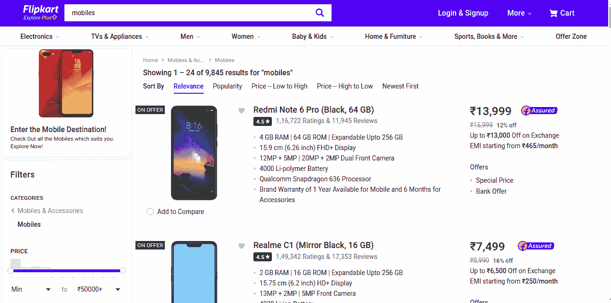
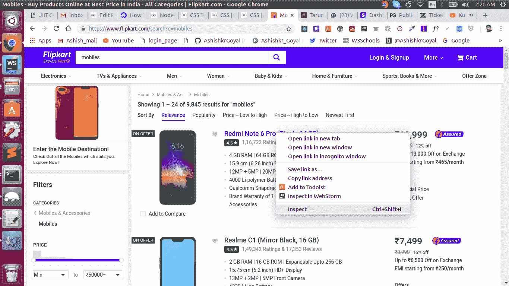
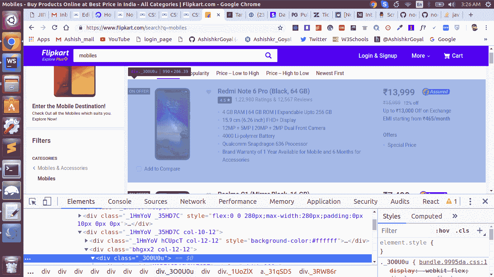
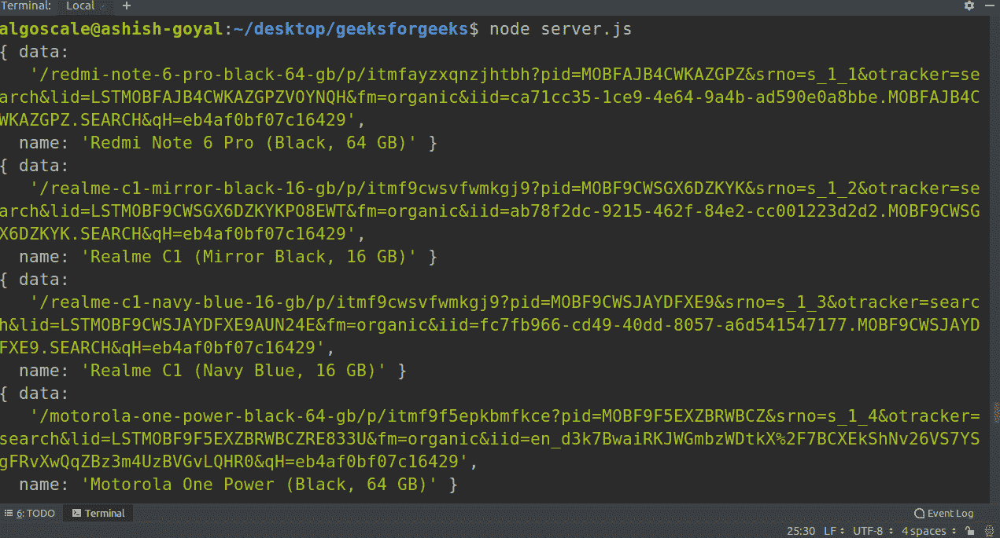

# Nodejs |使用 Cheerio 进行网络爬行

> 原文:[https://www . geesforgeks . org/nodejs-web-crawling-using-cheerio/](https://www.geeksforgeeks.org/nodejs-web-crawling-using-cheerio/)

通过向特定的网址发送 HTTP 请求，然后提取该网页的 HTML 来获取有用的信息，这就是所谓的爬行或网页抓取。

**用于在 Nodejs 中爬行的模块:**

1.  [请求](https://www.npmjs.com/package/request):向网址发送 HTTP 请求
2.  [cheerio](https://www.npmjs.com/package/cheerio) :用于解析 DOM 和提取网页的 HTML
3.  [fs](https://www.npmjs.com/package/fs) :用于将数据读取或写入文件

**安装这些模块:**
在 Nodejs 中安装模块最简单的方法就是使用 NPM。
可以通过两种方式完成:

1.  **全局安装:**如果我们在全局安装任何模块，那么我们可以在系统的任何地方使用它。
    可以通过以下命令完成:

```
npm i -g package_name
```

*   **Locally Installation:** If we install any module locally then we can use it only within that particular project directory.
    It can be done by the following command:

    ```
    npm i package_name
    ```

    对于此任务，我们将使用本地安装:

    **使用 Cheerio 进行网络爬行的步骤:**

    *   **第一步:为此项目创建文件夹**
    *   **Step 2: Open the terminal inside the project directory and then type the following command:

        ```
        npm init
        ```** 

        它将创建一个名为

        ```
        package.json
        ```

        它包含关于模块、作者、github 存储库及其版本的所有信息。
        如需了解更多 **package.json** 请访问此链接:
        [package . JSON](https://write.geeksforgeeks.org/nodejs-package-json-explained/)讲解

        **要使用 NPM 在本地安装模块，只需执行:**

        ```
        npm install request
        npm install cheerio
        npm install fs

        ```

        这也可以使用 NPM 在单行中完成:

        ```
        npm install request cheerio fs
        ```

        成功安装模块后，我们的 package.json 将具有如下结构:

        

        在这个截图中，我们可以看到我们所有的依赖项都在依赖项对象中列出，这意味着我们已经成功地将它们全部安装到了当前的项目目录中。

    *   **Step 3: Now we will code for crawler**

        **编码步骤:**

        1.  首先，我们将导入所有必需的模块
        2.  然后，我们将向 URL 发送一个 HTTP 请求，然后所需网站的服务器将会以网页进行响应，这将通过**请求**模块来完成
        3.  现在，我们有了网页的 HTML，我们的任务是从中提取有用的信息，所以我们将遍历 DOM 树并找出选择器
        4.  提取我们的信息后，我们会将其保存到一个文件中，这个任务将在 **fs** 模块的帮助下完成
        **Code for Crawler:**
    *   Create a file called **server.js** and add the following lines:

        ```
        const request = require('request');
        const cheerio = require('cheerio');
        const mongoose = require('fs');

        ```

        这几行代码的解释:
        在这三行中，我们将爬行和数据保存所需的这三个模块都导入到一个文件中。

    *   **We will hit the URL from where we want to crawl data:**
        Here we are going to crawl the list of smartphones from an e-commerce website Flipkart.

        在 flipkart 中显示智能手机列表的 url 如下

        ```
        const URL = "https://www.flipkart.com/search?q=mobiles";
        ```

        **在这个 URL 网页上看起来是这样的:**

        

        现在我们将在的帮助下点击这个网址

        ```
        request
        ```

        模块:

        ```
        request(URL, function (err, res, body) {
            if(err)
            {
                console.log(err, "error occured while hitting URL");
            }
            else
            {
                console.log(body);
            }
        });

        ```

        让我们来理解这段代码:
        这里我们使用 request 模块将 HTTP 请求发送到智能手机的 flipkart 的 URL，request 模块内的函数分别取三个参数 error、response、body。
        在这里，如果出现错误，我们会记录下来，否则我们会记录正文。

        为了测试它，我们将在什么时候运行脚本

        ```
        node server.js
        ```

        我们可以在控制台中看到页面的整个 HTML。
        是该网址网页的完整 HTML。

        现在我们的任务是提取有用的信息，因此我们将访问 DOM 树，并通过检查元素来找出选择器。
        为此，在网页上点击右键，进入检查元素，如下所示:

        

        现在我们将访问 DOM:
        

        现在，我们将更改我们的请求，根据检查结果点击网址:

        ```
        request(URL, function (err, res, body) {
            if(err)
            {
                console.log(err);
            }
            else
            {

                let $ = cheerio.load(body);  //loading of complete HTML body

                $('div._1HmYoV > div.col-10-12>div.bhgxx2>div._3O0U0u').each(function(index){
                    const link = $(this).find('div._1UoZlX>a').attr('href');
                    const name = $(this).find('div._1-2Iqu>div.col-7-12>div._3wU53n').text();
                    console.log(link);   //link for smartphone
                    console.log(name);   //name of smartphone
                });
            }
        });

        ```

    *   **Saving the data into the file**
        For doing it we will create an array and an object

        ```
        let arr = [];  //creating an array

        let object =   
        {
           link : link,
           name : name,
        }  //creating an object

         fs.writeFile('data.txt', arr, function (err) {
                    if(err) {
                        console.log(err);
                    }
                        else{
                            console.log("success");
                        }
                });

        ```

        在每一次迭代中，我们将把对象转换成字符串后推入数组；
        最后我们将整个数组写入文件。通过这种方法，我们的完整数据将成功保存在文件中！

        **现在我们整个代码都会喜欢:**

        ```
        // Write Javascript code here
        const request = require('request');
        const cheerio = require('cheerio');
        const fs = require('fs');

        const URL = "https://www.flipkart.com/search?q=mobiles";

        request(URL, function (err, res, body) {
            if(err)
            {
                console.log(err);
            }
            else
            {
                const arr = [];
                let $ = cheerio.load(body);
                $('div._1HmYoV > div.col-10-12>div.bhgxx2>div._3O0U0u').each(function(index){

                    const data = $(this).find('div._1UoZlX>a').attr('href');
                    const name = $(this).find('div._1-2Iqu>div.col-7-12>div._3wU53n').text();
                    const obj = {
                        data : data,
                        name : name
                    };
                    console.log(obj);
                    arr.push(JSON.stringify(obj));
                });
                console.log(arr.toString());
                fs.writeFile('data.txt', arr, function (err) {
                    if(err) {
                        console.log(err);
                    }
                        else{
                            console.log("success");
                        }
                });

            }
        });
        ```

        现在运行代码:

        ```
        node server.js
        ```

        运行代码时，您可以在终端上看到如下输出:

        

        成功运行代码后，有一个名为 data.txt 的文件，它也提取了所有的数据！我们可以在项目目录中找到这个文件。

        这是一个简单的例子，展示了如何使用 cheerio 模块在 nodejs 中创建一个 web 刮板。从这里，你可以尝试放弃你选择的任何其他网站。如有任何疑问，请在下方评论区发表。