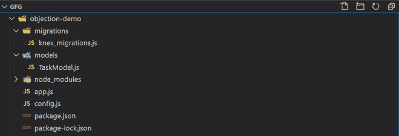

# Objection.js | SQL 友好 ORM for Node.js

> 原文:[https://www . geesforgeks . org/objection-js-SQL-friendly-ORM-for-node-js/](https://www.geeksforgeeks.org/objection-js-sql-friendly-orm-for-node-js/)

Node.js 有很多对象关系映射器(用于关系数据库)，我们可以从几个流行的映射器中选择:

1.  续集
2.  猫鼬还是普里西玛
3.  type shape(类型)
4.  反对. js(阅读完整文档[此处](http://vincit.github.io/objection.js/))

**为什么要考虑 Objection.js？**
所以这里有几个考虑使用它的理由:

*   定义模型和它们之间关系的简单方法。
*   使用节点的异步/等待创建查询。
*   在模型中使用紧急加载和事务。
*   在行中处理嵌套文档。
*   插入和向上插入对象图的强大机制。
*   TypeScript 支持和 JSON 模式验证。

**安装和使用 Objection.js 必须遵循以下步骤:**

因此，您安装它的方法是使用以下命令安装两个依赖项: **knex** 和 **objection** :

```js
npm i knex -g --save
npm i objection --save
```

Knex 是一个强大的 SQL 查询生成器(它被一大堆不同的表单使用)。所以在引擎盖下，反对使用 Knex。除了构建 SQL 查询，Knex 还用于建立数据库连接和池连接。它还用于通过迁移来管理数据库模式。

您可能还需要为您想要使用的任何 SQL 数据库安装一个数据库驱动程序。一些不同的选项可用，只需使用以下命令安装它们:

```js
npm i pg
npm i sqlite3
npm i mysql
npm i mariasql

```

**创建数据库:**
**文件名:app.js**

```js
const { Client } = require('pg');
const { db } = require('./config');
const client = new Client();

(async () => {
  await client.connect();
  await client.query(`CREATE DATABASE ${db.connection.database}`);
  await client.end();
})();
```

**创建迁移:**

*   迁移允许您以循序渐进的方式对数据库模式进行更改。
*   “向上”操作应用更改(创建表格、添加/修改列等)。).
*   “向下”操作应用了更改的相反操作(例如，如果迁移的“向上”操作创建了一个表，则相当于“向下”操作将删除该表)。
*   Knex 将创建一个迁移文件夹(除非它已经存在)。
*   然后，它会在迁移文件夹中为迁移创建一个文件。

```js
knex migrate:make create_tasks_table
```

生成迁移如下所示:

**文件名:empty_migration.js**

```js
exports.up = function (knex, Promise) {
};

exports.down = function (knex, Promise) {
};
```

现在我们可以执行某些操作，比如创建一个表:
**文件名:knex_migration.js**

```js
const tableName = 'tasks';

exports.up = knex => {

  // Create the tasks table
  return knex.schema.createTable(tableName, table => {
    table.increments('id').primary();
    table.string('name');
    table.date('due_by');
    table.boolean('is_done').defaultTo(false);
    table.timestamps(true, true);
    table.unique(['name']);
  });
};

exports.down = knex => {

  // Drop the tasks table
  return knex.schema.dropTableIfExists(tableName);
};
```

现在，如果您想要运行它们，那么下面的代码将执行它:

```js
knex migrate:latest
```

**车型:**

*   模型是数据库表的包装器。
*   它们有助于将业务逻辑封装在这些表中(关系、验证、索引、触发器)。
*   Objection.js 允许您使用 ES6 类创建模型。

一个非常简单的例子如下所示:
**文件名:TaskModel.js**

```js
// Task Model
const { MODEL } = require('objection');
const db = require('../db');

// Pass he knex connection to Objection
Model.knex(db);

class Task extends Model {

  // Tells objection what the db 
  // table is for the model
  static get tableName() {
    return 'tasks';
  }
}

module.exports = Task;
```

项目结构如下所示:



*   **Simple Select Query:**
    **Filename: select_query.sql**

    ```js
    SELECT * from tasks;
    ```

    可以用:
    **完成文件名:objection_select_query.js**

    ```js
    const tasks = await Task.query();
    ```

*   **Typical SELECT Query:**
    **Filename: standard_select_query.sql**

    ```js
    SELECT * from tasks WHERE is_done = false ORDER BY due_by asc;
    ```

    可以用:
    **文件名:objection _ standard _ select _ query . js**

    ```js
    const tasks = await Task.query()
        .where({is_done: false}).orderBy('due_by');
    ```

*   **Insert Query:**
    **Filename: insert_query.sql**

    ```js
    INSERT INTO tasks (name) VALUES ('Setup Code Coverage');
    ```

    可以用:
    **完成文件名:objection_insert_query.js**

    ```js
    await Task.query().insert({ name: 'Setup Code Coverage' });
    ```

*   **Update Query:**
    **Filename: update_query.sql**

    ```js
    UPDATE tasks SET is_done = true WHERE id = 1;
    ```

    可以用:
    **完成文件名:objection_insert_query.js**

    ```js
    await Task.query().patch({ is_done: true }).where({ id: 1 });
    ```

如果我们使用 objection_standard_query.js 文件来检查输出，那么输出将如下所示:


因此，异议查询非常强大且易于使用。