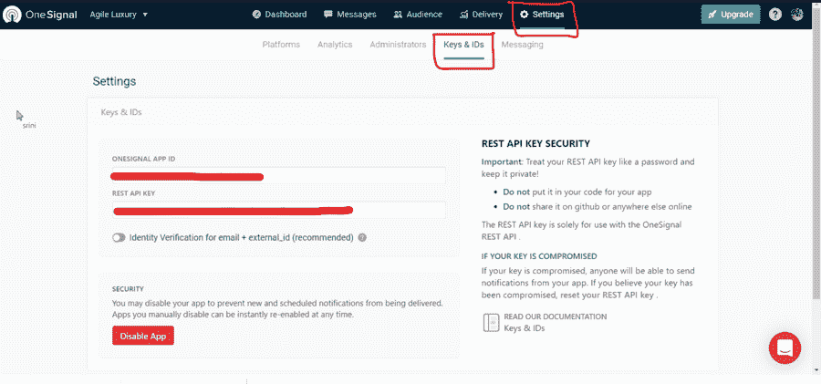
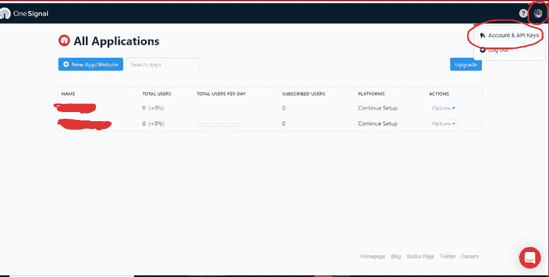
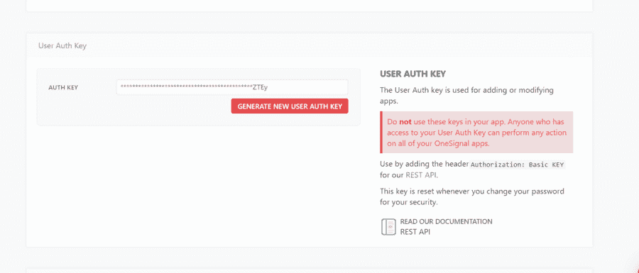

# 使用 Node.js 的 OneSignal API 集成

> 原文:[https://www . geesforgeks . org/one signal-API-integration-use-node-js/](https://www.geeksforgeeks.org/onesignal-api-integration-using-node-js/)

我们通常使用 OneSignal API 来传递通知、发送电子邮件、导出数据、创建和删除数据段等。我们将使用**单信号节点**模块在 NodeJS 中集成单信号应用编程接口。 **onesignal-node** 是 OneSignal API 的 Node.js 客户端库，将有助于我们这样做。

****整合步骤****

*   **步骤 1:** 确保 NodeJs 安装在您的计算机或项目中。如果需要安装，可以从[这里](https://nodejs.org/en/download/)进行安装。

*   **第二步:**打开终端，在你的项目中初始化 npm。

    ```
    npm init
    ```

    安装后，终端会询问项目的详细信息。根据您的需要更新它们。

    **注意:**完成后按回车键，会出现如下提示。

*   **步骤 3:** 使用以下命令安装**单信号节点**模块。

    ```
    npm install onesignal-node --save
    ```

*   **第 4 步:**使用以下代码开始使用**单信号节点**来要求模块。

    ```
    const OneSignal = require('onesignal-node');
    ```

*   **第五步:**使用客户端动作将你的应用整合到 **OneSignal** 中。

我们使用**一个信号。客户端**对于动作喜欢创建通知、添加设备、CSV 导出、创建片段等。为此，我们需要首先获得我们的 *appId* 和 *apikey* 。为此，请遵循以下步骤:

1.  打开您的一个信号帐户，进入设置。
2.  打开钥匙和身份证标签。
3.  您可以在这里访问您的一个信号应用程序标识和密钥。

之后，使用你的*一个信号中的身份证和钥匙。客户端*方法如下所示:

## script.js

```
// With default options
const client = new OneSignal.Client('appId', 'apiKey');

// With custom API endpoint
const client = new OneSignal.Client('appId', 'apiKey', 
{ apiRoot: 'https://onesignal.com/api/v2'});
```



对于查看应用程序、更新应用程序、创建应用程序等操作。等等，我们使用 **OneSignal.UserClient.** 为此，我们需要获取用户授权密钥:

可以在帐户中找到的用户授权密钥管理应用程序之外的操作。单击仪表板右上角的帐户下拉列表，向下滚动到用户身份验证密钥部分。它已经过了显示每个应用程序授权密钥的部分。

在一个信号中使用这个。用户客户端方法如下所示:

## script.js

```
// With default options
const userClient = new OneSignal.UserClient('userAuthKey');

// With custom API endpoint
const userClient = new OneSignal.UserClient('userAuthKey', 
{ apiRoot: 'https://onesignal.com/api/v2'});
```

 

现在，OneSignal API 与 NodeJs 集成在一起，您可以使用它来创建、取消和查看通知，创建、查看和更新应用程序，查看、添加和编辑设备，创建和删除段等。

**参考:**

*   [https://www.npmjs.com/package/onesignal-node](https://www.npmjs.com/package/onesignal-node)
*   [https://documentation.onesignal.com/docs/accounts-and-keys](https://documentation.onesignal.com/docs/accounts-and-keys)