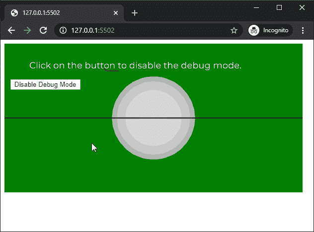

# p5.js | noDebugMode()功能

> 原文:[https://www.geeksforgeeks.org/p5-js-nodebugmode-function/](https://www.geeksforgeeks.org/p5-js-nodebugmode-function/)

p5.js 中的 **noDebugMode()函数**用于禁用 3D 草图中 DebugMode()函数启用的调试模式。

**语法:**

```
noDebugMode()
```

**参数:**此功能不接受任何参数。

下面的例子说明了 p5.js 中的 **noDebugMode()函数**:

**示例:**

```
let newFont;
let debugModeDisabled = false;

function preload() {
  newFont = loadFont('fonts/Montserrat.otf');
}

function setup() {
  createCanvas(600, 300, WEBGL);
  textFont(newFont, 18);

  // Enable debug mode
  debugMode();

  disableDebugButton = createButton("Disable Debug Mode");
  disableDebugButton.position(20, 80);

  disableDebugButton.mouseClicked(() => {
    debugModeDisabled = true;
  });
}

function draw() {
  background('green');
  text("Click on the button to disable "
        + "the debug mode.", -250, -100);
  orbitControl();
  lights();

  // If checkbox is checked
  // Disable debug mode
  if (debugModeDisabled) {
    noDebugMode();
  }
  noStroke();
  sphere(80);
}
```

**输出:**


**在线编辑:**[https://editor.p5js.org/](https://editor.p5js.org/)

**环境设置:**

**参考:**T2】https://p5js.org/reference/#/p5/noDebugMode