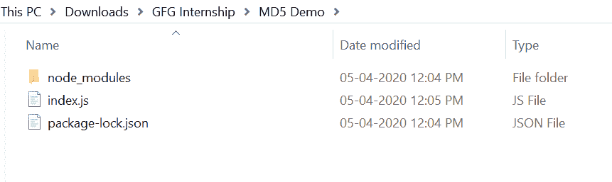
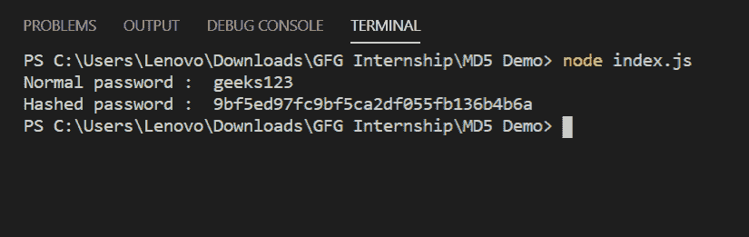

# 在 Node.js

中使用 MD5 模块进行密码哈希

> 原文:[https://www . geesforgeks . org/password-hashing-with-MD5-module-in-node-js/](https://www.geeksforgeeks.org/password-hashing-with-md5-module-in-node-js/)

node.js 中的 MD5 模块使用消息摘要算法，它是一个广泛使用的哈希函数，产生 128 位哈希值。密码散列是一个重要的概念，因为在数据库中，实际的密码不应该被存储，因为这是一种不好的做法，也使系统不太安全，所以密码以散列的形式存储在数据库中，这使系统更加安全。

**简介:**

1.  上手简单，使用方便。
2.  它是广泛使用和流行的密码散列模块。
3.  它产生一个 128 位的哈希值。

**安装 MD5 模块:**

1.  您可以访问链接[安装 MD5 模块](https://www.npmjs.com/package/md5)。您可以使用以下命令安装此软件包。

    ```
    npm install md5
    ```

2.  安装 multer 后，您可以使用命令在命令提示符下检查您的 md5 版本。

    ```
    npm version md5
    ```

3.  之后，您可以创建一个文件夹并添加一个文件，例如 index.js。

    ```
    node index.js
    ```

4.  **要求模块:**您需要使用这些行在您的文件中包含 md5 模块。

    ```
    var md5 = require('md5');
    ```

**文件名:index.js**

```
const md5 = require('md5')

var password = 'geeks123'

console.log('Normal password : ', password)
console.log('Hashed password : ', md5(password))
```

**运行程序的步骤:**

1.  项目结构会是这样的:
    
2.  确保您已经使用以下命令安装了 md5 模块:

    ```
    npm install md5
    ```

3.  Run index.js file using below command:

    ```
    node index.js
    ```

    

这就是如何使用 MD5 模块在节点 js 中散列密码。市场上还有其他哈希模块，如加密、加密等。