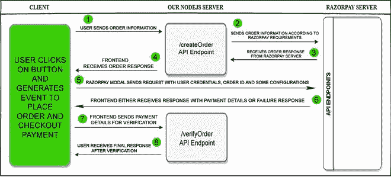
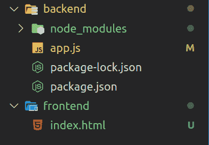
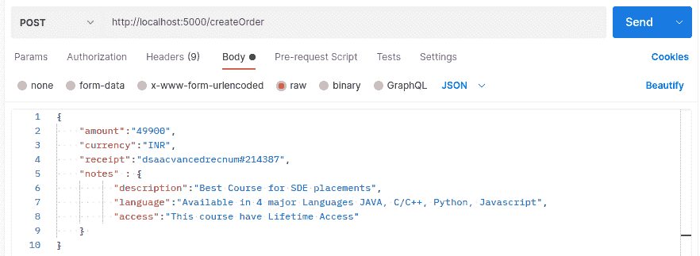
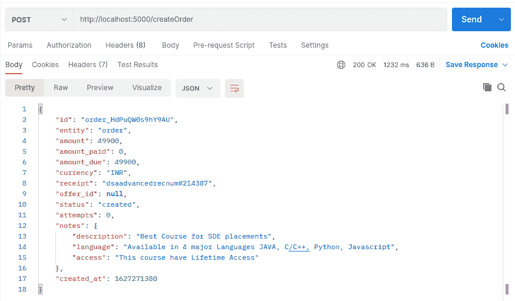
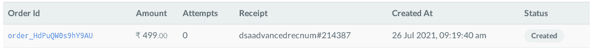
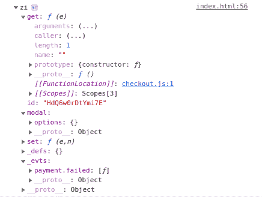
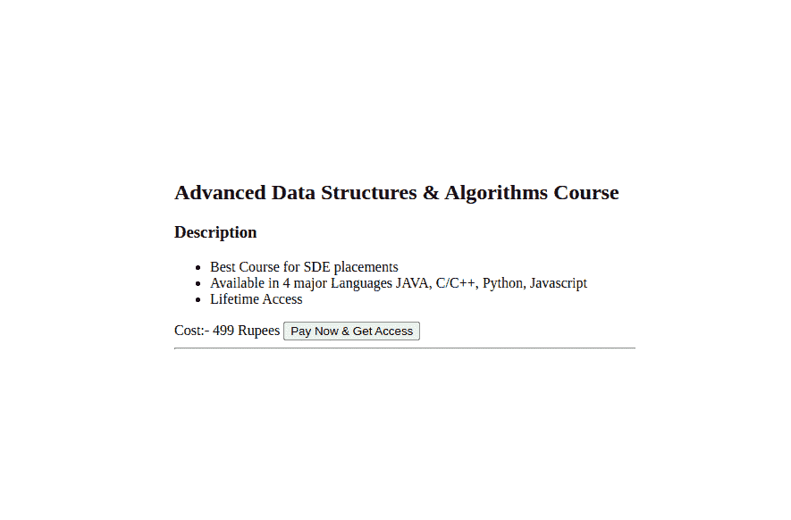
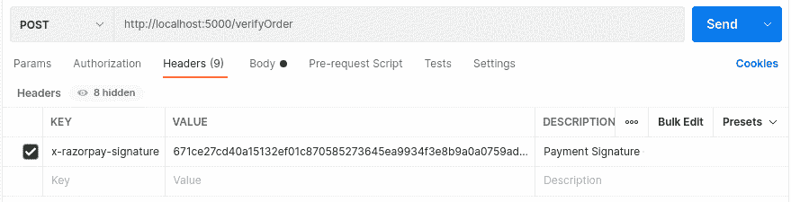
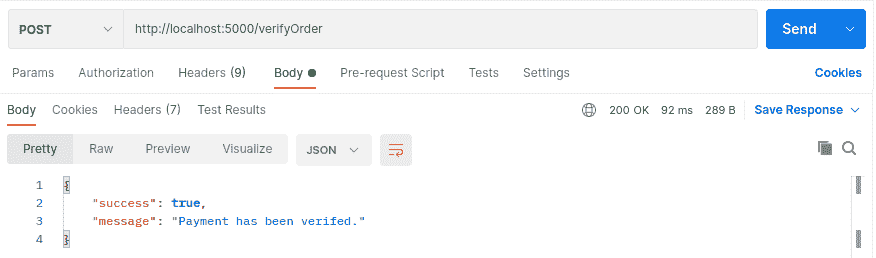
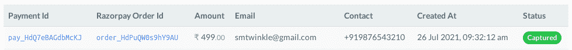

# 使用 Node.js 的 Razorpay 支付集成

> Original: [https://www.geeksforgeeks.org/razorpay-payment-integration-using-node-js/](https://www.geeksforgeeks.org/razorpay-payment-integration-using-node-js/)

支付网关是一种为与货币相关的交易提供在线解决方案的技术，它可以被认为是电子商务或任何在线业务的中间渠道，可以用于支付和接收任何目的的支付。

**示例问题陈述：**这是一个简单的超文本标记语言页面，我们有一个按钮来支付 499.00 卢比。 最终，用户会点击该按钮，不知何故，我们希望收到该金额，然后，我们可以决定如何授予访问权限，当然，但这不是我们文章讨论的部分。


**方法：**Razorpay 是流行的支付网关之一，它使我们能够访问所有支付模式，包括信用卡、借记卡、网上银行、UPI 以及其他钱包，如 Airtel Money、payZapp 等。它还提供了一个仪表盘，可以监控所有活动。虽然它可以与任何在线应用程序集成，并使在线企业与客户的互动变得更加容易，但 Razorpay 帮助我们提供了&处理所有基本功能，这里我们将讨论如何

### 服务器与前端通信流程图

这是所有内在事物如何相互作用的基本图表，如果从 1 到 8 的每一步都成功了，那么我们就可以成功地实现我们的目标。 从第 1 步到第 4 步，我们创建订单并接收响应，然后从第 5 步到第 6 步，我们收到该订单的付款，在最后两步，我们正在验证响应的真实性，无论它是否来自 Razorpay 服务器。)
箭头是根据时间设计的。



**分步实施：**

**步骤 1：**首先在您的终端中编写此命令，以创建一个 NodeJS 应用程序。

```js
npm init
```

这将要求您提供有关项目的一些配置，您可以相应地填写它们，也可以稍后从 Package.json 文件中进行更改。 然后为后端服务器创建一个**app.js**文件，为前端创建一个**index.html**文件。

**步骤 2：**现在，安装所需的模块

```js
npm install express         //To run nodejs server 
npm install razorpay        //To use razorpay utilities
```

**项目结构：**如下所示。



**步骤 3：**当您想要访问 Razorpay API 时，您必须需要密钥，因此转到 Razorpay 并注册自己，然后访问[仪表板](https://dashboard.razorpay.com/)部分中的设置，单击 Generate API Keys，然后您将获得 Key_id 和 Key_Secret，通过它们您可以获得 Razorpay 实例。


**步骤 4：**导入 Razorpay 并创建 Razorpay 的**个新实例**，此实例是从 Razorpay 访问任何资源所必需的。 向构造函数提供一个包含 KEY_ID 和 KEY_SECRET 的对象。

下面是**后端和前端的基本初始代码实现。**

## **App.js**

```js
// Inside app.js 
const express = require('express');
const Razorpay = require('razorpay'); 

// This razorpayInstance will be used to
// access any resource from razorpay
const razorpayInstance = new Razorpay({

    // Replace with your key_id
    key_id: rzp_test_fiIwmRET6CApc2,

    // Replace with your key_secret
    key_secret: YAEUthsup8SijNs3iveeVlL1
});

const app = express();
const PORT = process.env.PORT || '5000';

// Here we will create two routes one 
// /createOrder and other /verifyOrder 
// Replace these comments with the code 
// provided later in step 2 & 8 for routes

app.listen(PORT, ()=>{
    console.log("Server is Listening on Port ", PORT);
});
```

## **Index.html**

```js
<!-- Inside index.html -->
<!DOCTYPE html>
<html lang="en">

<head>
    <meta charset="utf-8" />
    <meta content=
        "This is a demo of Web integration 
        of Razorpay in NodeJS" 
        author="Mr. Twinkle Sharma" />
    <title>Razorpay Web-Integration</title>
</head>

<body>
    <hr/>
    <h2>Advanced Data Structures & Algorithms Course</h2>
    <h3>Description</h3>

    <ul>
        <li>Best Course for SDE placements</li>
        <li>
            Available in 4 major Languages JAVA, 
            C/C++, Python, Javascript
        </li>
        <li>Lifetime Access</li>
    </ul>

    <span> Cost:- 499 Rupees 
        <button id="pay-button" >
            Pay Now & Get Access
        </button> 
    </span>
    <hr/>

    <!-- Processing Payment Checkout -->
    <!-- We will write code for payment here, 
        Replace this comment with the code we 
        are explaining below in step 5 of the 
        article -->
</body>

</html>
```

****第五步：**将订单信息从前端发送到我们的 NodeJS 服务器。**

**在**app.js**中创建一条路由来接收来自用户请求的订单数据，这里我们使用 express，因为它更简单，并且被许多开发人员使用。 我们已经在 NodeJS 服务器 app.js 上设置了**‘/createOrder’**路由，以便从客户端接收数据，并从‘**请求发送订单数据。** **Body‘.**
为了简单起见，Postman 被用作客户端，您可以很容易地从前台以自己的方式发送 POST 请求。**

****注意：**确保每次与服务器交互之前都能成功运行该服务器。**

****

****第六步：**将订单信息从我们的 NodeJS 服务器发送到 Razorpay 服务器。**

**我们的服务器上有从**req.body**提取的订单信息，现在我们必须将其发送到 Razorpay 服务器进行进一步处理。 我们前面创建的 razorpayInstance 将用于从 Razorpay 访问 Orders API，Create 是一个创建 Order 的方法，它接受两个参数，第一个是 Options 对象，另一个是回调函数，该函数稍后会在失败时提供错误响应或在成功时提供 Order 响应。**

## **App.js**

```js
//Inside app.js
app.post('/createOrder', (req, res)=>{ 

    // STEP 1:
    const {amount,currency,receipt, notes}  = req.body;      

    // STEP 2:    
    razorpayInstance.orders.create({amount, currency, receipt, notes}, 
        (err, order)=>{

          //STEP 3 & 4: 
          if(!err)
            res.json(order)
          else
            res.send(err);
        }
    )
});
```

****步骤 7：****接收 Razorpay 对我们 NodeJS 服务器的订单响应。****

**然后，Razorpay 服务器处理收到的数据并从它的服务器发送订单响应，这里我们合并步骤 3 和 4，因为将它们分离在这样一个小项目中是没有意义的，当你要处理一个真正的数据库和足够大的项目时，分离可能是有用的。 以下是 Razorpay 服务器成功返回的响应。**

****

### ****说明**：**

**我们收到了来自 Razorpay 服务器的 JSON 响应，状态代码为 200，这意味着一切正常，订单已成功创建。 JSON 的描述如下：**

****id**：付款期间将使用唯一的订单 ID。
**Entity**：这是一个缩写，表示响应对应于任何订单。
**金额**：订单总金额，单位为货币子单位**。
**AMOUNT_Payed**：订单支付金额，部分付款时使用。
**AMOUNT_DUE**：合计金额-部分支付金额。
**币种**：金额币种，请在此处查看支持币种的完整列表。 收据
**收据**：是订单的收据。
**Offer_id**：用于获得某些优惠，当您有一些折扣或订单上的特殊优惠时使用。
**状态**：可以创建订单、尝试订单、支付订单的状态。
**尝试次数**：用户尝试付款的总次数。
**注释**：这是一个用于附加信息的简单对象。
**CREATED_AT**：它是创建订单的时间，采用 UNIX 时间格式。****

**下面是在 Razorpay 仪表板上创建的订单，状态 Created 表示订单刚刚创建，如果此订单上的任何进一步付款失败，则将尝试支付，如果成功，则将付款。**

****

**注意：-我们在单个 API 端点‘**/createOrder**’处理所有初始流程，但一旦项目增长，最好根据需要分离所有内容。**

****第八步：前端向 Razorpay 服务器发起支付抓取请求。****

**现在，我们已经创建了订单，可以继续结账以接收金额。 下面是 Razorpay 提供的在 index.html 内部使用的代码片段，它自己处理所有事情，从在前端呈现 Modal UI 到在其后端处理支付结账，它需要的是一些**配置、与银行/钱包相关的凭证&订单 ID**以及请求。**

## **Index.html**

```js
<!--Inside index.html -->
<script src="https://checkout.razorpay.com/v1/checkout.js"></script>
<script>
   var options = {
       "key": "rzp_test_fiIwmRET6CApc2", 
       "amount": "49900", 
       "currency": "INR",
       "name": "Dummy Academy",
       "description": "Pay & Checkout this Course, Upgrade your DSA Skill",
        "image": "https://media.geeksforgeeks.org/wp-content/uploads/
                  20210806114908/dummy-200x200.png",
       "order_id": "order_HdPuQW0s9hY9AU",  
       "handler": function (response){
           console.log(response)
           alert("This step of Payment Succeeded");
       },
       "prefill": {
          //Here we are prefilling random contact
         "contact":"9876543210", 
           //name and email id, so while checkout
         "name": "Twinkle Sharma",  
         "email": "smtwinkle@gmail.com"  . 
       },
      "notes" : {
         "description":"Best Course for SDE placements",
         "language":"Available in 4 major Languages JAVA, 
                     C/C++, Python, Javascript",
         "access":"This course have Lifetime Access"
       }, 
       "theme": {
           "color": "#2300a3"
       }
   };
   var razorpayObject = new Razorpay(options);
   console.log(razorpayObject);
   razorpayObject.on('payment.failed', function (response){
         console.log(response);
         alert("This step of Payment Failed");
   });

   document.getElementById('pay-button').onclick = function(e){
       razorpayObject.open();
       e.preventDefault();
   }
</script>
```

### ****说明：****

**第一个脚本标记从 Razorpay 服务器加载一个 js 文件。 它里面有一些代码，负责执行整个代码片段。 在第二个脚本标记中，我们创建了一个对象，该对象稍后将被发送到 Razorpay 服务器以继续付款。
这是对**选项**的说明，带***的字段是必填的**，其他字段是可选的，它们在 Razorpay 服务器上具有默认值。**

****1.key：**您从仪表板获取的 Razorpay key_id。
**2.金额：**应支付的金额。
**3.币种：**三个字符的币种字符串。
**4、名称：**公司名称，将显示在 UI MODEL 上。
**5、order_id：**必须是 Razorpay 生成的有效订单 id，我们将使用前面创建的订单 id。
**6.描述：**只是对购买的简单描述，也会在 MODEL 中显示。
**7.image：**LOGO 的链接，最小尺寸必须是 256×256&最大尺寸为 1MB 的公司要在 MODEL 上显示，在我们的示例中我们使用的是一个虚拟 LOGO。
**8.处理程序：**这是一个将在成功支付时执行的函数，我们只是做警报和控制台日志，但是可以非常容易地修改它以自定义功能。
**9.主题：**一个对象，可以根据您的应用程序 UI 设置模式的主题，例如-您可以使用十六进制代码设置 COLOR 和 BACKROP_COLOR。
**10.预填：**您希望在呈现 UI 时预填入的详细信息，例如-您可以预填入电子邮件和名称，这样用户就不会询问它，此外，如果您能以某种方式知道用户的历史记录，您还可以根据用户的偏好预填入付款模式。
**11.注意：**这是一个用于附加信息的简单对象。**

**Razorpay 有比这里使用的更多选项，您可以根据它们定制您的应用程序。 现在，在所有这些之后，我们调用 Razorpay 函数，该函数在第一个脚本标记包含的文件中声明，它接受一个对象作为参数，并返回一个 Razorpay 对象，该对象将具有一些预定义的和一些用户定义的功能，这就是为什么 Razorpay 要求我们配置的选项。 让我们来看看我们从那里得到了什么，使用 console.log 查看这些详细信息。**

****

**我们有很多数据作为返回，比如，在我们单击与之相关的按钮后将在屏幕上呈现的模式、注册了事件“payment.ailed”的函数(稍后我们将看到如何使用它)、id 以及其他必需的内容。 现在回到代码解释，在获得 Razorpay 对象之后，我们注册了一个回调函数，我们正在对事件‘**payment.ailed**’执行该函数，这是由 Razorpay 配置的。 随后，我们使用了一个基本的 Web API 来按 id 获取元素，该 API 选择与该 id 相关联的按钮并执行一个函数。 **razorpayObject.open()；**打开一个窗口，其中包含一个模式，该模式包含所有用于结账的基本功能。 *
**e.PrevenentDefault()；**阻止事件浏览器的默认配置。**

### **产出：**

****

****上述输出说明：****

*   **用户点击与付款关联的按钮**
*   **Razorpay 提供的 Modal 将在窗口中央打开，您是否注意到公司名称、描述、我们在发送请求之前设置的徽标已在此处呈现，联系电话和电子邮件也已预先填写。**
*   **即使我们已经预先填写了一些细节，那么我们也可以在付款过程中更改它们。**
*   **然后，我们可以继续付款，假设我们已经选择了卡方式，在这里我们输入了一个虚拟的卡详细信息“卡号 4111 1111 1111 1111”，到期日可以是任何未来的月/年，CVV 可以是任何三位数的数字，持卡人的姓名也可以在这里预先填写，但您可以在继续之前对其进行编辑。**
*   **然后，Razorpay 将立即处理付款。**
*   **完成后，Razorpay 再次询问您是否同意付款，单击成功继续付款或单击失败拒绝付款。**

****步骤 9：****接收 Razorpay 对前端的支付响应。****

**步骤 8 成功后，我们会收到来自 Razorpay 的响应，其中包括前端的支付 id、签名、订单 id 等。 否则，响应将是失败的，并带有一些失败的原因。 下面是成功返回的响应的 console.log。**

****

****步骤 10：****将支付响应从前端发送到我们的 NodeJS 服务器****

**我们已经在服务器上创建了**‘/verifyOrder’**API 端点来接收支付数据。 这里使用 Postman 作为客户端发送数据，您可以按照自己的方式发送 POST 数据请求。
从支付响应接收到的签名是通过**自定义头部**“x-razorpay-Signature”发送的，在头部名称前加“x-”是惯例，Payment_id 和 order_id 是从**请求正文发送的。****

****

### **步骤 11、验证真实性，并向用户发送相应的响应**

**虽然我们已经捕获了付款，但在没有验证的情况下无法向用户发送响应。 这就是验证步骤，正如您所知道的，我们已经获得了一些信息，比如 razorpay_payment_id、razorpay_order_id、razorpay_sign 以及其他一些关于成功付款的信息。 现在，您如何才能知道此信息对应于有效支付，并且它一定已在您的 Razorpay 仪表盘中捕获？ 因为可能在某些情况下，任何人都可以发送虚假响应，而您将认为该付款是被捕获的。 因此，为了验证，请使用已完成支付的 order_id 和响应返回的 razorpay_payment_id 在您的服务器中创建签名，同样在此步骤中，您将需要之前在生成 API 密钥时从仪表板获得的 key_ret。**

**现在使用**SHA256 算法，**它是一个密码函数，它接收一些参数并返回密码散列，稍后可以使用该散列根据作为参数给出的密码来验证某些东西。 根据**预定义的 Razorpay 语法**构造一个**HMAC 十六进制**摘要：**

```js
generated_signature = **HMAC-SHA256(order_id + "|" + razorpay_payment_id, secret);**
//HMAC-SHA256:- This is just a naming convention, HMAC-X means the X cryptographic 
//function has been used to calculate this hash 

if (**generated_signature === razorpay_signature**) {
   //payment is successful, and response has been came from authentic source. 
}
```

**注意：-如果你的应用程序足够大，而且你不想每次都这么做来验证，有一个简单的方法可以在 Razorpay 仪表板上设置 WebHook(WebHook 是一种基于实时发生的事件向另一个应用程序发送信息的方式)，你可以探索一下。**

## **App.js**

```js
//Inside app.js
app.post('/verifyOrder',  (req, res)=>{ 

    // STEP 7: Receive Payment Data
    const {order_id, payment_id} = req.body;     
    const razorpay_signature =  req.headers['x-razorpay-signature'];

    // Pass yours key_secret here
    const key_secret = YAEUthsup8SijNs3iveeVlL1;     

    // STEP 8: Verification & Send Response to User

    // Creating hmac object 
    let hmac = crypto.createHmac('sha256', key_secret); 

    // Passing the data to be hashed
    hmac.update(order_id + "|" + payment_id);

    // Creating the hmac in the required format
    const generated_signature = hmac.digest('hex');

    if(razorpay_signature===generated_signature){
        res.json({success:true, message:"Payment has been verified"})
    }
    else
    res.json({success:false, message:"Payment verification failed"})
});
```

### **产出：**

**这是我们从 verifyOrder API 得到的响应，因为我们的支付是真实的，它返回了一个成功的响应，如果状态码为 200，则表示一切正常。**

****

**至此，我们已经成功创建了订单，收到了付款，并验证了真实性。
这是仪表板上显示的付款和订单**分类帐**，捕获的状态表示我们已成功收到付款，已付款表示订单金额已支付。**

****

**你可能已经注意到，我们是分开做所有事情的，这只是为了解释这些事情是如何独立工作的，你可以很容易地将它们结合在一起，与现实世界的项目一起工作。 另外，请注意，Razorpay 有很多**API 端点**，您可以使用它们来自定义您的电子商务应用程序。**