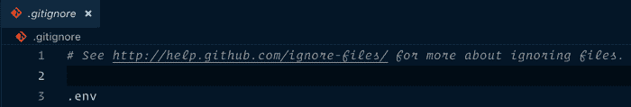

# 从 Node.js 读取环境变量

> 原文:[https://www . geesforgeks . org/reading-environment-variables-from-node-js/](https://www.geeksforgeeks.org/reading-environment-variables-from-node-js/)

**环境变量:**任何编程语言的两个基本概念是**变量**和**常量**。正如我们所知，常量和变量都代表了唯一的内存位置，其中包含程序在计算中使用的数据。

存在于代码之外的变量是您的**服务器环境**的一部分，并且可以通过简化运行脚本和应用程序的过程并使其更加安全来帮助您。

在应用程序初始化期间，这些变量被加载到 **process.env** 中，并通过在变量名称后面加上后缀来访问。

后端应用程序中的环境变量依赖于操作系统的命令来定义环境变量及其值。系统管理员可以通过外壳脚本而不是命令行界面来定义它。环境变量通常不能在整个操作系统中全局访问，它们通常是特定于会话的。

**读取环境变量:** Node.js 在核心模块即**进程**下提供 **env** 属性，该属性承载进程启动时设置的所有环境变量。

下面的例子讲述了如何访问 **NODE_ENV** 环境变量，默认设置为开发。

**注意:****流程**模块不需要 *require()* 方法，因为它是自动可用的。

```js
process.env.NODE_ENV // "development"
```

现在在脚本运行之前将其设置为 Production，它将告诉 Node.js 哪个是生产环境。在这里，我们可以访问由我们设置的或者已经在环境中设置的任何类型的自定义变量。

**如何在 Node.js 中设置自己的环境变量？**

我们可以使用以下简单步骤在 Node.js 中设置自己的环境变量:

**第一步:**打造我们自己的**。env 文件**将所有环境变量包含在一个地方。只是确保不要将它们放在源代码管理中，否则，您的历史记录将包含对您的文件的引用。

```js
NODE_ENV=development
PORT=8626  // You can add port no. as your preferences
# Set your database/API connection information here
API_KEY=**************************
API_URL=**************************
```

1.  **第二步:**现在创建我们自己的**。gitignore 文件**并添加*。如下图和*所示。gitignore* 将告诉源代码管理忽略我们将要列出的文件(或文件模式)。*



**注意:**添加*时要小心。env* 到你的*。gitignore* 文件，在您添加您的*之前，该文件会发生变化。env* 文件，否则您将面临提交早期版本的*的风险。env* 源码控制。