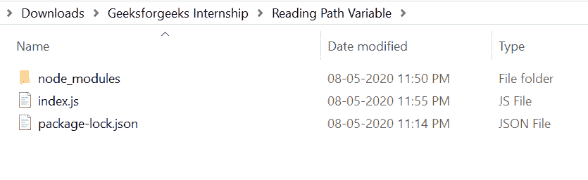
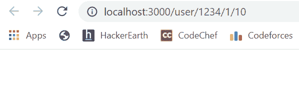
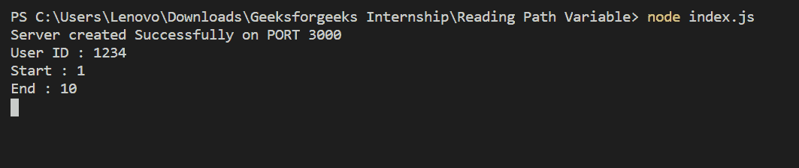

# 读取 Node.js 中的路径参数

> 原文:[https://www . geesforgeks . org/reading-path-parameters-in-node-js/](https://www.geeksforgeeks.org/reading-path-parameters-in-node-js/)

路径参数是一个变量，允许用户在其资源点(API 端点)中添加一个参数，该参数的值可以更改。路径参数为用户提供了控制资源表示的独特机会。

只需创建一个文件夹并添加一个文件，例如 index.js。

```js
node index.js
```

**文件名:index.js**

```js
const express = require("express")
const path = require('path')
const app = express()

var PORT = process.env.port || 3000

// View Engine Setup
app.set("views", path.join(__dirname))
app.set("view engine", "ejs")

app.get("/user/:id/:start/:end", function(req, res){

    var user_id = req.params['id']
    var start = req.params['start']
    var end = req.params['end']

    var user_id = req.params['id'] // Or req.params.id
    var start = req.params['start'] // Or req.params.start
    var end = req.params['end'] // Or req.params.end
})

app.listen(PORT, function(error){
    if (error) throw error
    console.log("Server created Successfully on PORT", PORT)
})
```

**运行程序的步骤:**

1.  项目结构会是这样的:
    
2.  确保您已经安装了“查看引擎”，就像我使用“ejs”一样，并使用以下命令安装 express 模块:

    ```js
    npm install express
    npm install ejs
    ```

3.  使用以下命令运行 index.js 文件:

    ```js
    node index.js
    ```

4.  打开浏览器，输入此网址“http://localhost:3000/user/1234/1/10”，如下图:
    
5.  回到控制台，可以看到如下所示的路径参数值:
    

这就是如何在 Node.js 中使用路径参数，它为用户控制资源的表示提供了一个独特的机会。