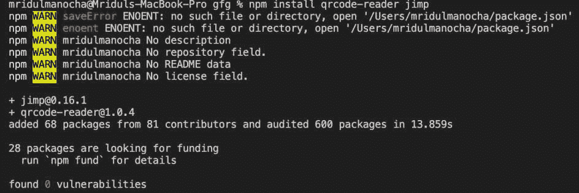
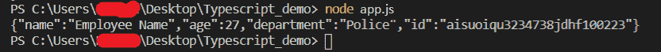

# 使用 Node.js 读取二维码

> 原文:[https://www . geesforgeks . org/reading-QR-codes-use-node-js/](https://www.geeksforgeeks.org/reading-qr-codes-using-node-js/)

当我们使用 [Node.js](https://www.geeksforgeeks.org/nodejs-tutorials/) 构建任何应用程序时，我们可能希望我们的应用程序与提供二维码来传递信息的外部应用程序或支付网关进行交互。在本文中，我们将看到如何在 node.js 应用程序中解码二维码。

让我们通过执行以下命令来设置我们的工作空间:

**创建目录:**

```js
npm init -y
mkdir src
cd src
nano app.js
```


**安装包装:**

我们需要安装一个 [npm](https://www.geeksforgeeks.org/node-js-npm-node-package-manager/) 包才能继续工作。

为了使用二维码阅读器，我们还需要一个图像解析器。 [Jimp](https://www.geeksforgeeks.org/nodejs-jimp/) 模块用于图像解析。

```js
npm install qrcode-reader jimp
```



假设我们在源代码所在的目录中有一个二维码的图像。我们需要图像中嵌入的数据。

*   首先导入 app.js 中的所有包

```js
var Jimp = require("jimp");
var fs = require('fs')
var QrCode = require('qrcode-reader');
```

*   现在我们需要加载我们的二维码:

```js
// Read the image and create a buffer  
// (Here image.png is our QR code)
var buffer = fs.readFileSync(__dirname + '/image.png');
```

*   使用 Jimp 模块解析图像，并使用二维码阅读器包的 decode()方法:

```js
// Parse the image  
Jimp.read(buffer, function(err, image) {
   if (err) {
       console.error(err);
   }
   let qrcode = new qrCode();
   qrcode.callback = function(err, value) {
       if (err) {
           console.error(err);
       }
       console.log(value.result);
   };
   qrcode.decode(image.bitmap);
});
```

这里我们可以读取字符串格式的数据。

**Index.js**

## java 描述语言

```js
//Importing jimp module
var Jimp = require("jimp");
// Importing filesystem module
var fs = require('fs')
// Importing qrcode-reader module
var qrCode = require('qrcode-reader');

// Read the image and create a buffer
// (Here image.png is our QR code)
var buffer = fs.readFileSync(__dirname + '/image.png');

// Parse the image using Jimp.read() method
Jimp.read(buffer, function(err, image) {
    if (err) {
        console.error(err);
    }
    // Creating an instance of qrcode-reader module
    let qrcode = new qrCode();
    qrcode.callback = function(err, value) {
        if (err) {
            console.error(err);
        }
        // Printing the decrypted value
        console.log(value.result);
    };
    // Decoding the QR code
    qrcode.decode(image.bitmap);
});
```

使用以下命令运行 **index.js** 文件:

```js
node index.js
```

**输出:**



输出数据