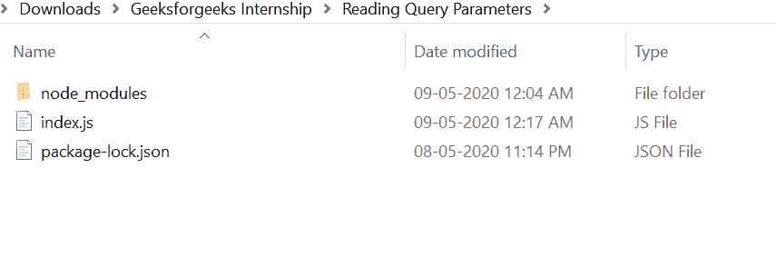
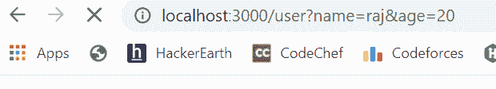
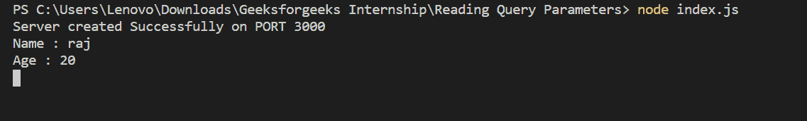

# 读取 Node.js

中的查询参数

> 原文:[https://www . geesforgeks . org/reading-query-parameters-in-node-js/](https://www.geeksforgeeks.org/reading-query-parameters-in-node-js/)

查询参数是一个变量，其值在 URL 中以键值对的形式传递，位于 URL 末尾的问号(？).比如*<u>www.geeksforgeeks.org？name=abc</u>* 其中，‘name’是查询参数的关键字，其值为‘ABC’。

我们只需创建一个文件夹并添加一个文件作为 index.js。

```js
node index.js
```

**文件名:index.js**

```js
const express = require("express")
const path = require('path')
const app = express()

var PORT = process.env.port || 3000

// View Engine Setup
app.set("views", path.join(__dirname))
app.set("view engine", "ejs")

app.get("/user", function(req, res){

    var name = req.query.name
    var age = req.query.age

    console.log("Name :", name)
    console.log("Age :", age)
})

app.listen(PORT, function(error){
    if(error) throw error
    console.log("Server created Successfully on PORT", PORT)
})
```

**运行程序的步骤:**

1.  项目结构会是这样的:
    
2.  确保您已经安装了“查看引擎”，就像我使用“ejs”一样，并使用以下命令安装 express 模块:

    ```js
    npm install express
    npm install ejs
    ```

3.  使用以下命令运行 index.js 文件:

    ```js
    node index.js
    ```

4.  打开浏览器，输入这个网址“http://localhost:3000/user？名称=raj&age=20 "如下所示:
    
5.  回到控制台，可以看到查询参数键，值如下所示:
    

这就是在 Node.js 中读取查询参数的方法