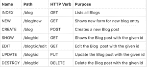
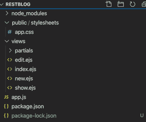

# 节点 js 中的 RESTful 路由

> 原文:[https://www.geeksforgeeks.org/restful-routes-in-node-js/](https://www.geeksforgeeks.org/restful-routes-in-node-js/)

**路由:**路由是网站或 web 应用程序中最重要的部分之一。快递中的路由是基本的、可适应的和健壮的。路由是将请求(由网址和 HTTP 方法指定)路由(定向)到处理它们的代码的机制。

**什么是 RESTful 路由？**
**REST** 代表表征状态转移，它提供了一种将 HTTP 动词(获取、发布、放置、删除)和 CRUD 动作(创建、读取、更新、删除)映射在一起的方法。这是一个定义路线的惯例，当某物遵循休息原则时，它被称为 **RESTFUL。**

RESTful 路由也依赖于 HTTP 动词和 URL，而不是仅仅依赖于 URL 来指示要访问的站点。

这意味着，当您的应用程序收到一个 HTTP 请求时，它会对该请求进行反思，并识别 HTTP 方法和 URL，将其与具有该方法和 URL 的相应控制器操作连接，执行该操作中的代码，并确定哪个响应被发送回客户端。

如果没有一个处理网址的惯例，互联网将是一个非常混乱的地方——删除一张脸书的照片可能是 www.facebook.com/delete-this-photo,，但在 Instagram 上，可能是 www.instagram.com/remove-this-post.。如果没有一个特定的惯例可循，创建新内容、编辑内容和删除内容将是困难的。RESTful 路由提供了一种允许轻松操作数据的设计模式。

要使路线完全安静，必须执行以下操作:

*   将客户机与服务器分开。
*   请求之间不保持状态(即，响应请求所需的所有信息在每个请求中都可用:服务器从一个请求到另一个请求不保持任何数据或状态)。
*   使用 HTTP 和 HTTP 方法。
*   可靠(例如，大多数应用编程接口在指定身份验证和重要网址的过程时遵循 restful 路由模式)。

当创建一个与服务器交互的应用程序或 web 服务时，有 7 种不同的 restful routes 模式可以遵循。

**示例:**对于博客网站，这些路线将被定义为:


确保安装了[节点](https://nodejs.org/en/)、 [npm](https://www.npmjs.com/get-npm) 和 [mongoDB](https://docs.mongodb.com/guides/server/install/) 。

**安装包并创建模式:**

```
npm install express
npm install method-override
npm install mongoose

```

**文件名:app.js**

```
var express = require('express');
var app = express();
var methodOverride = require("method-override");

// APP config
mongoose.connect("mongodb://localhost/restful_blog_app");
app.set("view engine", "ejs");
app.use(express.static("public"));
app.use(methodOverride("_method"));

// Creating the schema
var blogSchema = new mongoose.Schema({
    title: String,
    image: String,
    body: String,
    created: {type: Date, default: Date.now}
});

var Blog = mongoose.model("Blog", blogSchema);

app.listen(process.env.PORT, process.env.IP, function() {
    console.log("SERVER IS RUNNING!");
})
```

**名称:索引**

```
app.get("/blogs", function(req, res) {
    Blog.find({}, function(err, blogs) {
        if (err) {
            console.log("ERROR!");
        } else {
           res.render("index", {blogs: blogs}); 
        }
    });
 });
```

**名称:新**

```
app.get("/blogs/new", function(req, res) {
     res.render("new");
 });
```

**名称:创建**

```
app.post("/blogs", function(req, res) {

     // create blog

     Blog.create(req.body.blog, function(err, newBlog) {
         if (err) {
             res.render("new");
         } else {
             //then, redirect to the index
             res.redirect("/blogs");
         }
     });
 });
```

**名称:SHOW**

```
app.get("/blogs/:id", function(req, res) {
    Blog.findById(req.params.id, function(err, foundBlog) {
        if (err) {
            res.redirect("/blogs");
        } else {
            res.render("show", {blog: foundBlog});
        }
    })
 });
```

**名称:编辑**

```
app.get("/blogs/:id/edit", function(req, res) {
    Blog.findById(req.params.id, function(err, foundBlog) {
        if (err) {
            res.redirect("/blogs");
        } else {
            res.render("edit", {blog: foundBlog});
        }
    });
})
```

**名称:更新**

```
app.put("/blogs/:id", function(req, res) {
 req.body.blog.body = req.sanitize(req.body.blog.body)

 Blog.findByIdAndUpdate(req.params.id, 
   req.body.blog, function(err, updatedBlog) {
      if (err) {
          res.redirect("/blogs");
      }  else {
          res.redirect("/blogs/" + req.params.id);
      }
 });
});
```

**名称:破坏**

```
app.delete("/blogs/:id", function(req, res) {
   //destroy blog
   Blog.findByIdAndRemove(req.params.id, function(err) {
       if (err) {
           res.redirect("/blogs");
       } else {
           res.redirect("/blogs");
       }
   })
   //redirect somewhere
});
```

**项目结构会是这样:**



本文主要关注 app.js 文件。造型可以根据你的喜好来做。

最后，根据您的偏好创建路线并添加样式后，在命令行上运行以下命令:

```
node app.js
```

这是对什么是 RESTful 路由以及它在网站上的实际用途的非常简单的描述。