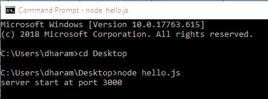

# 节点 js 中的路由

> 原文:[https://www.geeksforgeeks.org/routing-in-node-js/](https://www.geeksforgeeks.org/routing-in-node-js/)

**什么是路由？**
路由定义了应用程序端点处理客户端请求的方式。

**在 Node.js 中实现路由:**在 node.js 中实现路由有两种方式，列举如下:

*   通过使用框架
*   不使用框架

**使用框架:** Node 有很多框架可以帮助你启动和运行你的服务器。最受欢迎的是 Express.js.
**节点内带快递的路由:** Express.js 有一个对应 HTTP 的“app”对象。我们使用这个“app”对象的方法来定义路由。此应用程序对象指定了一个回调函数，当收到请求时会调用该函数。对于不同类型的请求，我们在 app 对象中有不同的方法。

*   **对于 GET 请求，使用 app.get()方法:**

    ```
    var express = require('express')
    var app = express()

    app.get('/', function(req, res) {
        res.send('Hello Sir')
    })

    ```

*   **对于开机自检请求，使用 app.post()方法:**

    ```
    var express = require('express')
    var app = express()

    app.post('/', function(req, res) {
        res.send('Hello Sir')
    })

    ```

*   **用于处理所有 HTTP 方法(即 GET、POST、PUT、DELETE 等)。)使用 app.all()方法:**

    ```
    var express = require('express')
    var app = express()

    app.all('/', function(req, res) {
        console.log('Hello Sir')
        next()   // Pass the control to the next handler
    })

    ```

next()用于将控件交给下一个回调。有时我们使用 app.use()来指定中间件函数作为回调。

因此，要使用 Express.js 执行路由，您只需加载 Express，然后根据需求使用 app 对象来处理回调。

**无框架路由:**使用框架有利于节省时间，但有时这可能不适合这种情况。因此，开发人员可能需要构建自己的服务器，而不需要其他依赖关系。
现在使用创建任意名称的文件。js 扩展，并按照以下步骤从头开始执行路由:

*   这里我们将使用 node.js 的内置模块，即 http。所以，首先加载 http:

    ```
    var http = require('http');
    ```

*   现在通过添加以下几行代码来创建服务器:

    ```
    http.createServer(function (req, res) {
        res.write('Hello World!'); // Write a response
        res.end(); // End the response
    }).listen(3000, function() {
        console.log("server start at port 3000"); // The server object listens on port 3000
    });
    ```

*   现在在上面的函数中添加以下代码行来执行路由:

    ```
    var url = req.url;
    if(url ==='/about') {
        res.write(' Welcome to about us page'); 
        res.end(); 
     } else if(url ==='/contact') {
        res.write(' Welcome to contact us page'); 
        res.end(); 
     } else {
        res.write('Hello World!'); 
        res.end(); 
     }

    ```

**例:**结合以上代码的路由完整代码。

```
var http = require('http');

// Create a server object
http.createServer(function (req, res) {

    // http header
    res.writeHead(200, {'Content-Type': 'text/html'}); 

    var url = req.url;

    if(url ==='/about') {
        res.write(' Welcome to about us page'); 
        res.end(); 
    }
    else if(url ==='/contact') {
        res.write(' Welcome to contact us page'); 
        res.end(); 
    }
    else {
        res.write('Hello World!'); 
        res.end(); 
    }
}).listen(3000, function() {

    // The server object listens on port 3000
    console.log("server start at port 3000");
});
```

**输出:**

