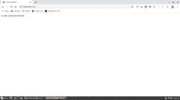

# 从 Node.js

使用 PythonShell 运行 Python 脚本

> 原文:[https://www . geesforgeks . org/run-python-script-using-python shell-from-node-js/](https://www.geeksforgeeks.org/run-python-script-using-pythonshell-from-node-js/)

如今，Node.js 是全球开发者在后端开发领域最具吸引力的技术。如果有人希望使用类似使用 python 模块的 Web screen 这样的东西，或者运行一些具有机器学习算法的 python 脚本，那么就需要知道如何将这两者结合起来。

我们将通过对 leetcode 的网页抓取来获取用户的一些数据。那么，让我们开始吧。

现在，首先设置 Node.js 服务器代码。

## java 描述语言

```js
//Import express.js module and create its variable.
const express=require('express');
const app=express();

//Import PythonShell module.
const {PythonShell} =require('python-shell');

//Router to handle the incoming request.
app.get("/", (req, res, next)=>{
    //Here are the option object in which arguments can be passed for the python_test.js.
    let options = {
        mode: 'text',
        pythonOptions: ['-u'], // get print results in real-time
          scriptPath: 'path/to/my/scripts', //If you are having python_test.py script in same folder, then it's optional.
        args: ['shubhamk314'] //An argument which can be accessed in the script using sys.argv[1]
    };

    PythonShell.run('python_test.py', options, function (err, result){
          if (err) throw err;
          // result is an array consisting of messages collected
          //during execution of script.
          console.log('result: ', result.toString());
          res.send(result.toString())
    });
});

//Creates the server on default port 8000 and can be accessed through localhost:8000
const port=8000;
app.listen(port, ()=>console.log(`Server connected to ${port}`));
```

现在，Python 脚本。(确保您已经安装了 bs4 模块和 csv 模块。)

## 蟒蛇 3

```js
# code
import sys
import requests
from bs4 import BeautifulSoup
from csv import writer
# bs4 module for web scraping and requests for making HTTPS requests using Python.
response = requests.get('https://leetcode.com / shubhamk314')
soup = BeautifulSoup(response.text, 'html.parser')
main_content = soup.select(
    '# base_content>div>div>div.col-sm-5.col-md-4>div:nth-child(3)>ul')
list_items = main_content[0].select('li')
items = ['Solved Question', 'Accepted Submission', 'Acceptance Rate']
n = 0

# It will create csv files named progress.csv in root folder once this is script is called.
with open('progress.csv', 'w') as csv_file:
  csv_writer = writer(csv_file)
  headers = ['Name', 'Score']
  csv_writer.writerow(headers)
  while(n < 3):
    name = items[n]
    score = list_items[n].find('span').get_text().strip()
    csv_writer.writerow([name, score])
    n = n + 1
print("csv file created for leetcode")
```

保存两个文件后，从其根文件夹运行以下命令:

```js
node test.js
```

现在，通过浏览器中的 localhost:8000 发送请求。

如果一切顺利，那么输出将是:

消息:为 leetcode 创建的 csv 文件。



## 结论

这是如何使用 Node.js 运行 python 脚本的简单实现，在您有一个 Node.js 应用程序堆栈并且想要运行一个简单的 python 脚本的情况下，这可能会很有用。如果您想了解更多关于 PythonShell 模块的信息，请浏览给定的链接。

link(链接)