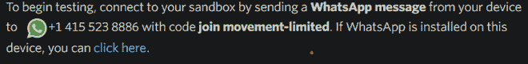
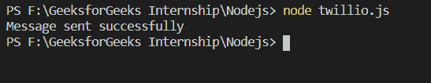
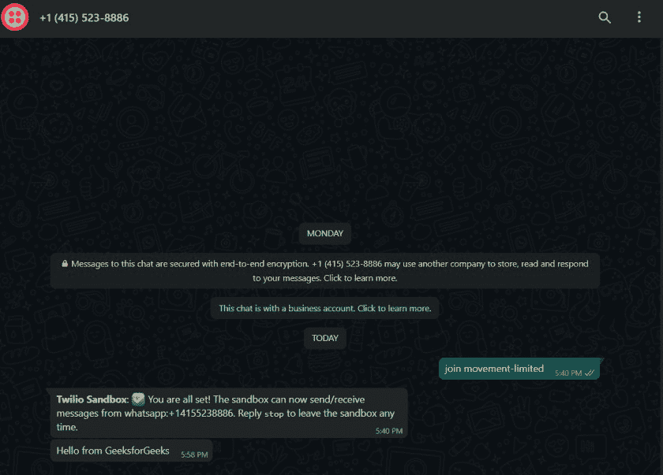

# 使用 Node.js 中的 Twilio 向 WhatsApp 发送消息

> 原文:[https://www . geesforgeks . org/send-message-to-whatsapp-using-twilio-in-node-js/](https://www.geeksforgeeks.org/send-message-to-whatsapp-using-twilio-in-node-js/)

我们在日常生活中都使用 WhatsApp 互相发送短信。我们可以使用以下方法在 NodeJS 中使用 Twilio API 发送 WhatsApp 消息。

**Twilio 的特点:**

1.  广泛使用的发送短信模块。
2.  支持多种语言。
3.  也可用于发送可编程语音消息。

**步骤 1:创建 Twilio 账户**

创建一个 Twilio 账号，进入 WhatsApp 沙盒部分，你可以在[上找到 WhatsApp 沙盒部分，这里](https://www.twilio.com/console/sms/whatsapp/learn)。

**第二步:链接你的 WhatsApp 号**

将 Twilio 定义的消息从您的 WhatsApp 号码发送到+14155238886，以设置 Twilio 沙盒。

下图中提到的代码是**加入运动限制**



需要发送的代码

沙箱成功设置后，我们会收到一条成功消息，如下图所示。


成功链接 WhatsApp 号码时显示的成功消息。

**第三步:设置我们的文件。**

为了设置我们的项目，我们首先需要添加一个 **package.json** 文件来跟踪我们的依赖关系。package.json 文件使用以下命令初始化。

```js
npm init --y
```

**注意:**y 标记将“是”作为所有问题的默认答案。

**步骤 4:安装 Twilio 模块。**

一旦我们的号码成功链接，我们就可以开始发送 WhatsApp 消息。但是首先，我们需要安装 Twilio 模块。您可以在这里了解更多关于 Twilio 模块[的信息。我们可以使用以下命令安装 Twilio 模块。](https://www.npmjs.com/package/twilio)

```js
npm i twilio
```

**第五步:创建文件**

用创建文件。同一 npm 存储库中的 js 扩展。我们可以使用以下命令运行该文件。

```js
node filename.js
```

**第 6 步:导入 Twilio 模块。**

要使用 Twilio，我们必须导入它。我们可以使用以下命令导入 Twilio 模块。

```js
const twilio = require('twilio')
```

**第 7 步:从我们的 Twilio 账户获取授权令牌和 id。**

当我们成功链接我们的 WhatsApp 号码时，我们会获得身份验证令牌和 id。要找到自己的身份验证令牌和 id，请访问 Twilio 网站上 WhatsApp 的单向消息部分。

**第八步:发送 WhatsApp 消息。**

我们可以通过传递 id 和 auth token 创建一个客户端对象来发送 WhatsApp 消息，并使用 *message.create* 函数发送消息。(一个 JavaScript 承诺)。您可以在这里了解更多[承诺。](https://www.geeksforgeeks.org/javascript-promises/)

下面的代码用于从 Twilio 沙盒发送 WhatsApp 消息。

## java 描述语言

```js
const id = 'Provide your id';
const token = 'Provide your token';

// Importing the Twilio module
const twilio = require('twilio');

// Creating a client
const client = twilio(id, token);

// Sending messages to the client
client.messages
    .create({

        // Message to be sent
        body: 'Hello from Geeks for Geeks',

        // Senders Number (Twilio Sandbox No.)
        from: 'whatsapp:+14155238886',

        // Number receiving the message
        to: 'whatsapp:Provide your number'
    })
    .then(message => console.log("Message sent successfully"))
    .done();
```

**第九步:执行**

确保您在创建文件的同一目录中。使用以下命令执行上述代码。

```js
node twilio.js
```

**注意:这里提供的文件名是 twilio.js.**

成功执行后，我们会在控制台中获得一条消息，如下图所示。



收到的 WhatsApp 消息如下图所示。

