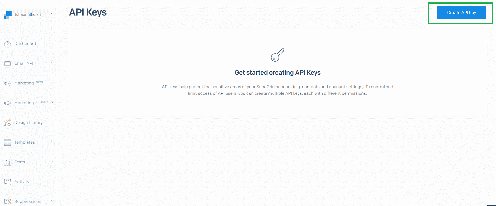
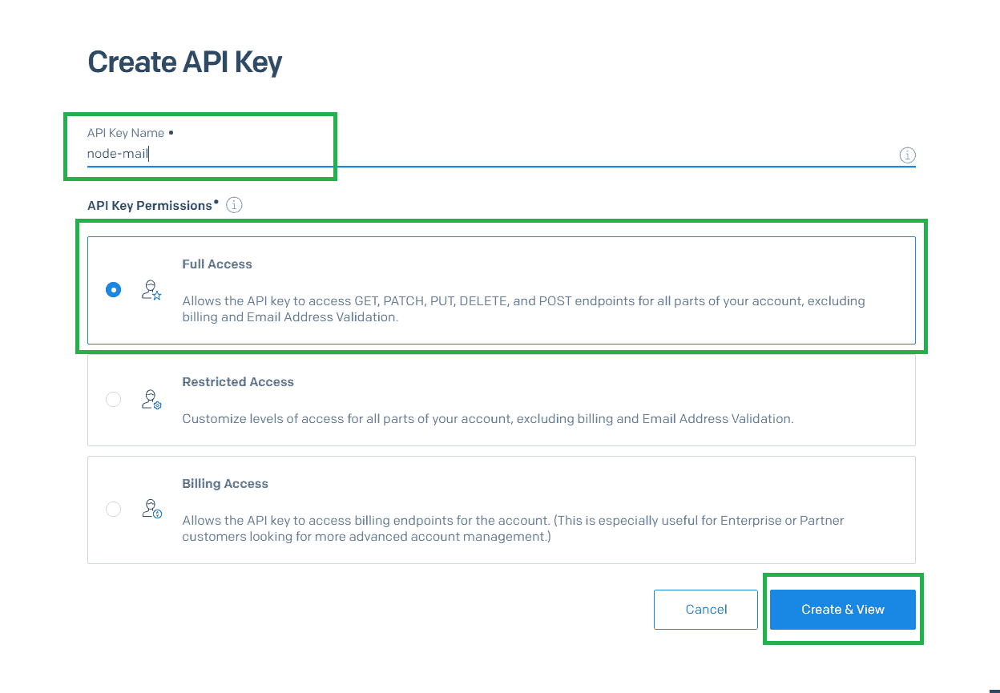
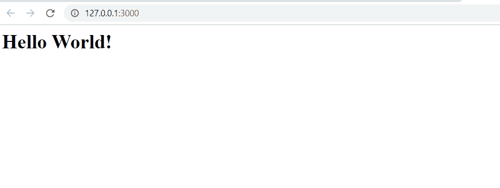
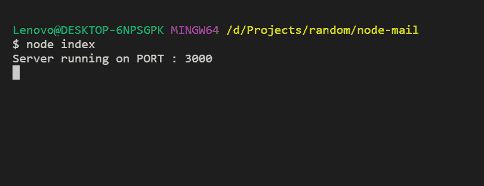

# 使用发送网格应用编程接口

在 Node.js 中发送批量邮件

> 原文:[https://www . geesforgeks . org/sending-bulk-emails-in-node-js-using-send grid-API/](https://www.geeksforgeeks.org/sending-bulk-emails-in-node-js-using-sendgrid-api/)

**什么是 SendGrid API？**
发送网格是一个向客户发送交易和营销电子邮件的平台。它提供了可伸缩性、可靠性和可交付性，这对组织来说是一个重要的问题。
**使用 SendGrid API 的好处:**

*   如果你使用的是带有 Gmail 的节点邮件，那么你每天只能发送一定数量的邮件。
*   还有就是**不需要设置自己的 SMTP 服务器**。
*   SMTP 不提供**送达功能**，即邮件可以发送，也可以不发送。

**使用 SendGrid API 发送电子邮件的步骤:**

1.  **设置应用编程接口密钥:**
    *   转到 sendgrid [仪表盘](https://app.sendgrid.com/settings/api_keys)，点击**创建 api 键**按钮。
        
    *   Name the API-key as you want, for this tutorial we’ll name it **node-mail**
        

        复制应用编程接口密钥，因为出于安全原因，您可能无法再次看到它。

2.  **设置节点. js app:**
    *   使用命令创建一个空的 **NPM** 包。(通过的–**y**标志用于使用生成器中的默认值，而不是提问)

        ```js
        npm init -y
        ```

    *   创建一个名为 index.js 的文件，并添加一个锅炉板代码。

        ## 

        ```js
        // Importing http library
        const http = require("http");

        const PORT = 3000; // Defining PORT

        http.createServer((req, res) => {

            // Output Hello World on HTML page
            res.write("<h1>Hello World!</h1>");
            res.end();
        })

        // Initializing server
        .listen(PORT,() => console.log(`Server running on PORT : ${PORT}`));
        ```

    *   现在使用节点索引命令运行代码，并转到 127.0.0.1:3000 链接。您将看到输出。
        
    *   而在控制台

        
3.  **安装发送网格库:**通过运行以下命令

    ```js
    npm i @sendgrid/mail
    ```

    安装**发送网格**库
4.  **使用库发送邮件:**

    ## java 描述语言

    ```js
    const http = require("http");

    const PORT = 3000;

    http.createServer((req, res) => {

        // Initializing sendgrid object
        const mailer = require("@sendgrid/mail");

        // Insert your API key here
        mailer.setApiKey("<your-api-key>");

        // Setting configurations
        const msg = {
          to: ["youremail@gmail.com", "your.second.email@gmail.com"],
          from: "noreply@example.com",
          subject: "Message sent for demo purpose",
          html:
            "<h1>New message from Geeksforgeeks</h1> 

    <p>Some demo text from geeksforgeeks.</p>
    "
        };

        // Sending mail
        mailer.send(msg, function(err, json) {
          if (err) {
            console.log(err);

            // Writing error message
            res.write("Can't send message sent");
          } else {

            // Writing success message
            res.write("Message sent");
          }
        });

        res.end();
      })
    .listen(PORT, () => console.log(`Server running on PORT : ${PORT}`));
    ```

现在使用节点索引再次运行该应用程序，并在浏览器中转到 127.0.0.1:3000，检查您的两封电子邮件，您将看到如下输出。
