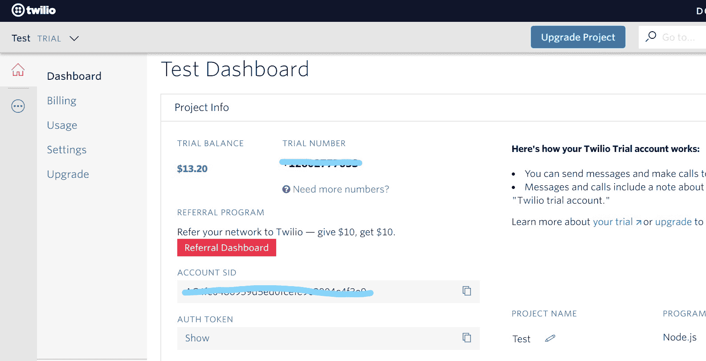
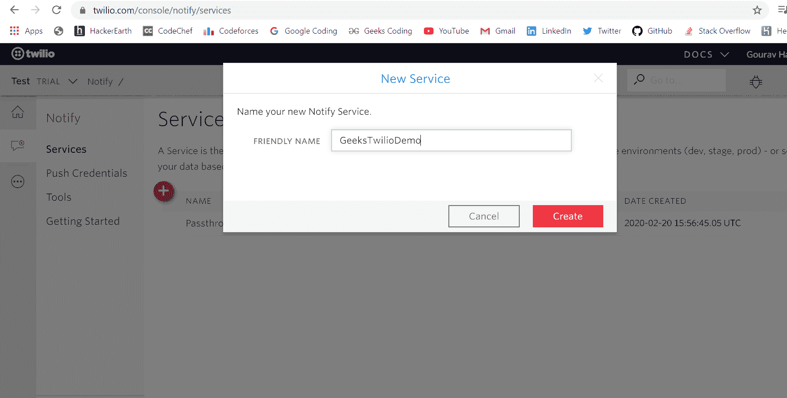
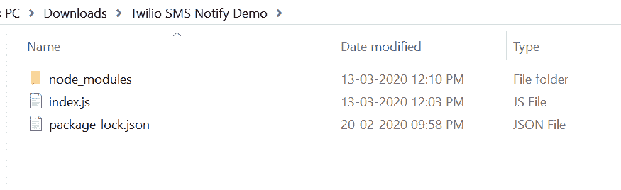
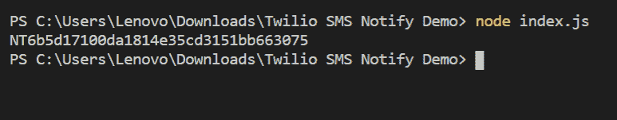

# 使用 Twilio

在 Node.js 发送批量短信

> 原文:[https://www . geesforgeks . org/sensing-bulk-SMS-in-node-js-using-twilio/](https://www.geeksforgeeks.org/sending-bulk-sms-in-node-js-using-twilio/)

短信是手机之间发送短信的常用方法，但这些短信可以使用 Twilio notify 服务一次发送给多个用户。使用 Twilio 可以一次向用户发送大量短信。

**简介:**

1.  上手简单，使用方便。
2.  广泛用于发送批量短信。
3.  用户可以快速高效地向所需的手机号码发送短信。

**Twilio 模块安装:**

1.  您可以访问[安装 twilio 模块](https://www.npmjs.com/package/twilio)的链接。您可以使用以下命令安装此软件包。

    ```js
    npm install twilio
    ```

2.  安装 twilio 后，您可以使用命令在命令提示符下检查您的 twilio 版本。

    ```js
    npm version twilio
    ```

3.  之后，您可以创建一个文件夹并添加一个文件。比如`index.js`。要运行此文件，您需要运行以下命令。

    ```js
    node index.js
    ```

4.  **Requiring module:** You need to include twilio module in your file by using these lines.

    ```js
    const client = require('twilio')(YOUR_ACCOUNT_SID, YOUR_AUTH_TOKEN);
    ```

    **获取您的帐户号、授权号和服务号的步骤:**

    1.  去 Twilio 官网创建你的账号。登录后，转到您的仪表板，您可以获得您的 auth_token 和 account_sid。
        
    2.  现在转到控制台/通知/服务，创建您自己的通知服务。
        
    3.  现在选择一个消息服务 sid，如果它没有显示，那么您必须创建一个消息服务 sid 并添加一个电话号码，然后您可以在下拉列表中看到该消息服务 sid，如下所示。
        
    4.  复制您的 service_sid 并单击保存按钮。

    **文件名:index.js**

    ```js
    ACCOUNT_SID = 'Your_Account_Sid'
    AUTH_TOKEN = 'Your_Auth_Token'
    SERVICE_SID = 'Your_Service_Sid'
    const client = require('twilio')(ACCOUNT_SID, AUTH_TOKEN);

    // User-defined function to send bulk SMS to desired
    // numbers bypassing numbers list as parameter
    function sendBulkMessages(messageBody, numberList)
    {
        var numbers = [];
        for(i = 0; i < numberList.length; i++)
        {
            numbers.push(JSON.stringify({ 
                binding_type: 'sms', address: numberList[i]}))
        }

        const notificationOpts = {
          toBinding: numbers,
          body: messageBody,
        };

        client.notify
        .services(SERVICE_SID)
        .notifications.create(notificationOpts)
        .then(notification => console.log(notification.sid))
        .catch(error => console.log(error));
    }

    // Sending our custom message to all numbers
    // mentioned in array.
    sendBulkMessages('Greeting from geeksforgeeks',
          ['number1', 'number2']) // Example +919999999999
    ```

    **运行程序的步骤:**

    1.  项目结构会是这样的:
        
    2.  确保使用以下命令安装了 twilio:

        ```js
        npm install twilio
        ```

    3.  Run *index.js* file using following command:

        ```js
        node index.js
        ```

        

    4.  短信成功发送到作为参数传递的所有号码。
        