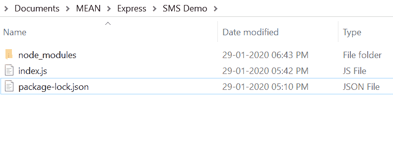
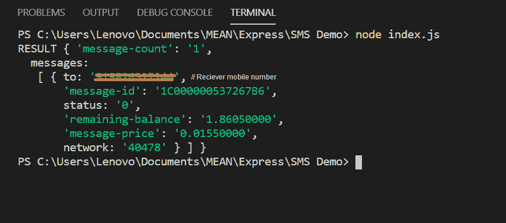
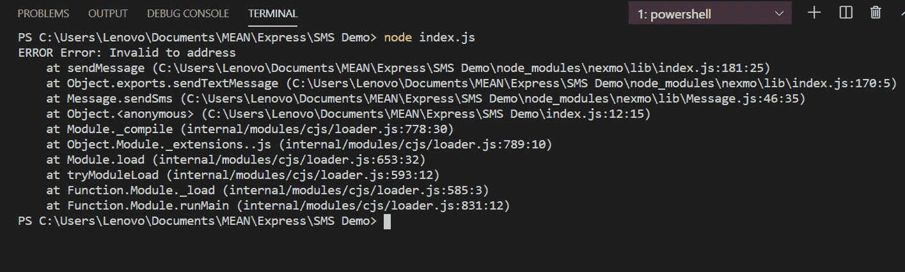

# 在 Node.js

中使用 NEXMO API 发送短信

> 原文:[https://www . geesforgeks . org/sensing-SMS-using-nexmo-API-in-node-js/](https://www.geeksforgeeks.org/sending-sms-using-nexmo-api-in-node-js/)

**简介:**短信是手机之间发送短信的常用方式，但这些短信可以使用 Node.js 中的 API 发送，现在市场上有很多 API 向用户发送类似 Twilio、Exotel 等短信，但其中比较流行的是 Nexmo。

**NEXMO 的特性:**在代码中集成这个模块非常简单高效。使用 Nexmo 模块，用户可以发送短信，也可以使用 Nexmo 语音 API 发送语音呼叫。

**简介:**

1.  上手简单，使用方便。
2.  它是广泛使用和流行的发送短信模块。
3.  用户可以快速高效地向所需的手机号码发送短信。

**安装 Nexmo 模块:**

1.  您可以访问[安装 nexmo 模块](https://www.npmjs.com/package/nexmo)的链接。您可以使用以下命令安装此软件包。

    ```
    npm install nexmo
    ```

2.  安装 nexmo 后，您可以使用命令在命令提示符下检查您的 nexmo 版本。

    ```
    npm version nexmo
    ```

3.  之后，您可以创建一个文件夹并添加一个文件。例如 *index.js* 。要运行此文件，您需要运行以下命令。

    ```
    node index.js
    ```

4.  **Requiring module:** You need to include nexmo module in your file by using these lines.

    ```
    const Nexmo = require('nexmo');
    ```

    **文件名:index.js**

    ```
    // Include nexmo module
    const Nexmo = require('nexmo');

    const nexmo = new Nexmo({
        apiKey: 'YOUR_API_KEY',
        apiSecret: 'YOUR_API_SECRET_KEY',
    });

    // Initialize with sender and reciever
    // mobile number with text message
    const from = 'sender_name';
    const to = 'reciever_number';
    const text = 'Greetings from Geeksforgeeks';

    nexmo.message.sendSms(from, to, text,
                    function(error, result) {   

        // If some error occured
        if(error) {
            console.log("ERROR", error)
        }

        // If message is sent successfully
        else {
            console.log("RESULT", result)
        }
    });
    ```

    **运行程序的步骤:**

    1.  项目结构会是这样的:
        
    2.  确保您已经使用以下命令安装了 nexmo】
    3.  Run *index.js* file using below command:

        ```
        node index.js
        ```

        

    4.  如果出现错误，将显示以下信息:
        