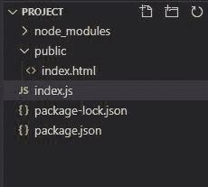
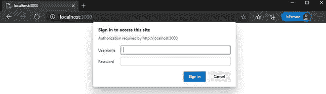
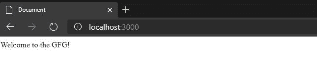
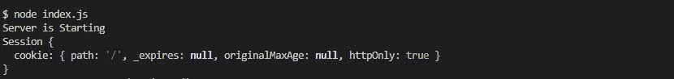
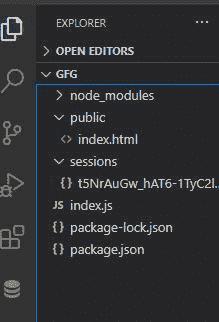
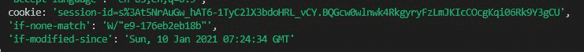
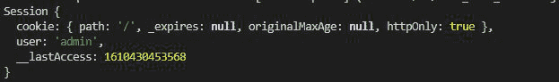

# node . js 中的会话 Cookies】

> 原文:[https://www.geeksforgeeks.org/session-cookies-in-node-js/](https://www.geeksforgeeks.org/session-cookies-in-node-js/)

[**HTTP 协议**](https://www.geeksforgeeks.org/http-full-form/#:~:text=HTTP%20is%20IP%20based%20communication,current%20request%20and%20response%20period.) **:** 它是互联网的主干，来自客户端的每一个请求都包含几个 HTTP 头，并包含请求的所有信息。该协议是互联网上数据交换的基础，但是 HTTP 协议是无状态协议，这意味着该协议不能保持特定客户端过去对服务器的请求。这意味着我们必须给出一次又一次的授权请求，以便前进到 web 应用程序特定页面的下一页，然后如何克服这个问题。答案是饼干和会话。Cookies 和会话使 HTTP 协议成为有状态协议。

**会话 cookie**:会话 cookie 是主要在服务器端生成的临时 cookie。这些 cookies 的主要用途是跟踪客户端特定会话发出的所有请求信息。当用户关闭浏览器会话并自动销毁它时，会话会暂时存储。在本文中，我们将使用外部文件存储来存储会话 cookies。会话 cookie 的例子会话 cookie 最常见的例子是电子商务网站。当新用户启动特定电子商务网站时，所有电子商务网站都会初始化一个会话。成功授权后创建会话时，会在客户端以 cookie 的形式创建一个唯一的会话 id。因此，在第一个请求之后，客户端生成的 cookie 将有助于通过客户端的会话对用户进行身份验证，并且会话会跟踪所有新请求的信息，并将过去跟踪的信息响应给客户端。

**安装模块:**

*   [**express.js**](https://www.geeksforgeeks.org/working-of-express-js-middleware-and-its-benefits/) **:用于处理多个请求的** Express.js 框架。

```
npm install express
```

*   [**cookie 解析器:**](https://www.geeksforgeeks.org/express-cookie-parser-signed-and-unsigned-cookies/) 用于解析传入 cookie 的 cookie 解析器模块。

```
npm install cookie-parser
```

*   [**【快递会话】**](https://www.geeksforgeeks.org/session-management-using-express-session-module-in-node-js/) **:** 此快递会话模块用于 NodeJS 中的会话管理。

```
npm install express-session
```

*   **会话-文件存储:**该模块有助于为新会话创建新的文件存储。

```
npm session-file-store
```

**项目结构:**我们的项目结构会是这样的:



**文件名:index.js**

## java 描述语言

```
// Importing express module
const express = require("express")

// Importing express-session module
const session = require("express-session")

// Importing file-store module
const filestore = require("session-file-store")(session)

const path = require("path")

// Setting up the server
var app = express()

// Creating session 
app.use(session({
    name: "session-id",
    secret: "GFGEnter", // Secret key,
    saveUninitialized: false,
    resave: false,
    store: new filestore()
}))

// Asking for the authorization
function auth(req, res, next) {
    // Checking for the session
    console.log(req.session)

    // Checking for the authorization
    if (!req.session.user) {
        var authHeader = req.headers.authorization;
        console.log(authHeader);
        var err = new Error("You are not authenticated")
        res.setHeader("WWW-Authenticate", "Basic")
        err.status = 401
        next(err)

        var auth = new Buffer.from(authHeader.split(' ')[1],
            "base64").toString().split(":")

        // Reading username and password
        var username = auth[0]
        var password = auth[1]
        if (username == "admin2" && password == "password") {
            req.session.user = "admin2"
            next()
        }
        else {
            // Retry incase of incorrect credentials
            var err = new Error('You are not authenticated!');
            res.setHeader("WWW-Authenticate", "Basic")
            err.status = 401;
            return next(err);
        }
    }
    else {
        if (req.session.user === "admin2") {
            next()
        }
        else {
            var err = new Error('You are not authenticated!');
            res.setHeader("WWW-Authenticate", "Basic")
            err.status = 401;
            return next(err);
        }
    }
}

// Middlewares
app.use(auth)
app.use(express.static(path.join(__dirname, 'public')));

// Server setup
app.listen(3000, () => {
    console.log("Server is Starting")
})
```

使用以下命令运行 **index.js** 文件:

```
node index.js
```

*   在私人窗口中打开任何带有***http://localhost:3000***位置的浏览器(以免保存密码和用户名)。地址栏附近会弹出一个窗口。如下所示，填写代码中提到的用户名和密码:



*   如果输入的用户名和密码与 index.html 将在浏览器上显示的提及位置相匹配。



**说明:**

*   当我们使用 node index.js 命令键入 Run **index.js** 文件时，我们会发现新用户的响应如下:



*   填写匹配的密码和用户名后，在目录中会生成一个新的会话，用于跟踪客户端发出的所有成功请求。



*   该会话文件包含所有会话记录，即客户端发出第一个请求时特定客户端的信息，以及如下所示的更多信息:

```
{"cookie":{"originalMaxAge":null,
  "expires":null,"httpOnly":true,"path":"/"},
"user":"admin","__lastAccess":1610430510130}
```

*   服务器对客户端为该特定会话设置 cookie 的响应。所以当客户端向服务器发出另一个请求时。请求头包含一个 cookie，其中包含已经在服务器端创建的会话 id。请求标题如下所示:



*   成功匹配 cookie 会话 id 和文件存储会话 id 后，服务器返回跳过上述代码中的授权，将***【index.html】***文件渲染给用户。成功匹配的会话 id 如下所示:

