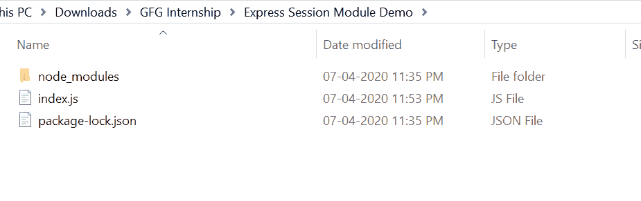
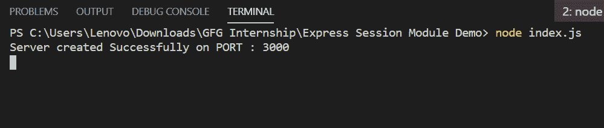
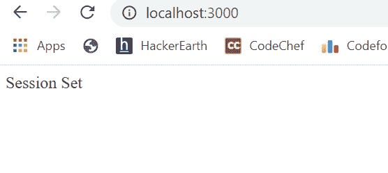
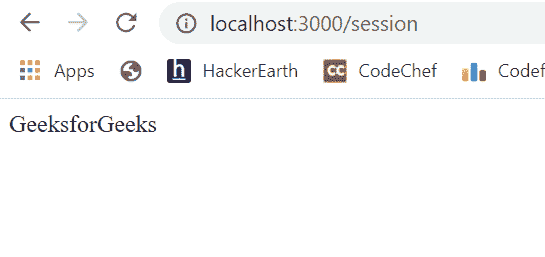

# 使用 Node.js 中的快速会话模块进行会话管理

> 原文:[https://www . geesforgeks . org/session-management-use-express-session-module-in-node-js/](https://www.geeksforgeeks.org/session-management-using-express-session-module-in-node-js/)

会话管理可以通过使用 express-session 模块在 node.js 中完成。它有助于以键值形式保存数据。在这个模块中，会话数据并不保存在 cookie 本身中，只是会话 ID。

**快速会话模块安装:**

1.  您可以访问链接[安装快速会话模块](https://www.npmjs.com/package/express-session)。您可以使用此命令安装此软件包。

    ```
    npm install express-session
    ```

2.  安装快速会话后，您可以使用命令在命令提示符下检查您的快速会话版本。

    ```
    npm version express-session
    ```

3.  之后，您可以创建一个文件夹并添加一个文件，例如 index.js。

    ```
    node index.js
    ```

**文件名:index.js**

```
const express = require("express")
const session = require('express-session')
const app = express()

// Port Number Setup
var PORT = process.env.port || 3000

// Session Setup
app.use(session({

    // It holds the secret key for session
    secret: 'Your_Secret_Key',

    // Forces the session to be saved
    // back to the session store
    resave: true,

    // Forces a session that is "uninitialized"
    // to be saved to the store
    saveUninitialized: true
}))

app.get("/", function(req, res){

    // req.session.key = value
    req.session.name = 'GeeksforGeeks'
    return res.send("Session Set")
})

app.get("/session", function(req, res){

    var name = req.session.name
    return res.send(name)

    /*  To destroy session you can use
        this function 
     req.session.destroy(function(error){
        console.log("Session Destroyed")
    })
    */
})

app.listen(PORT, function(error){
    if(error) throw error
    console.log("Server created Successfully on PORT :", PORT)
})
```

**运行程序的步骤:**

1.  项目结构会是这样的:
    
2.  确保您已经使用以下命令安装了快速和快速会话模块:

    ```
    npm install express
    ```

    ```
    npm install express-session
    ```

3.  Run index.js file using below command:

    ```
    node index.js
    ```

    

4.  Now to set your session, just open browser and type this URL:

    ```
    http://localhost:3000/
    ```

    

5.  Till now, you have set session and to see session value, type this URL:

    ```
    http://localhost:3000/session
    ```

    

这就是如何使用 express-session 模块在 node.js 中进行会话管理。