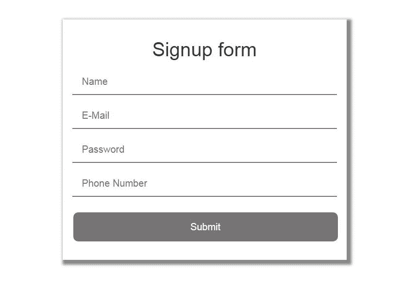
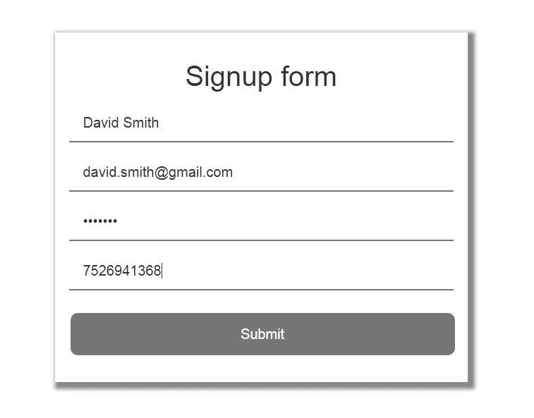

# 使用 Node.js 和 MongoDB 的注册表单

> 原文:[https://www . geesforgeks . org/registration-form-use-node-js-and-MongoDB/](https://www.geeksforgeeks.org/signup-form-using-node-js-and-mongodb/)

**安装**
首先，我们需要为我们的 Nodejs 应用程序包含几个包。

```js
npm install express --save
```

Express 允许我们设置中间件来响应 HTTP 请求。

```js
npm install body-parser --save
```

如果你想读取 HTTP POST 数据，你必须使用“正文解析器”节点模块。

```js
npm install mongoose --save
```

Mongoose 是一个对象文档建模(ODM)层，位于 Node 的 MongoDB 驱动程序之上。

**app.js** 这是主可执行应用文件

## app.js

```js
var express=require("express");
var bodyParser=require("body-parser");

const mongoose = require('mongoose');
mongoose.connect('mongodb://localhost:27017/gfg');
var db=mongoose.connection;
db.on('error', console.log.bind(console, "connection error"));
db.once('open', function(callback){
    console.log("connection succeeded");
})

var app=express()

app.use(bodyParser.json());
app.use(express.static('public'));
app.use(bodyParser.urlencoded({
    extended: true
}));

app.post('/sign_up', function(req,res){
    var name = req.body.name;
    var email =req.body.email;
    var pass = req.body.password;
    var phone =req.body.phone;

    var data = {
        "name": name,
        "email":email,
        "password":pass,
        "phone":phone
    }
db.collection('details').insertOne(data,function(err, collection){
        if (err) throw err;
        console.log("Record inserted Successfully");

    });

    return res.redirect('signup_success.html');
})

app.get('/',function(req,res){
res.set({
    'Access-control-Allow-Origin': '*'
    });
return res.redirect('index.html');
}).listen(3000)

console.log("server listening at port 3000");
```

## index.html

```js
<!DOCTYPE html>
<html>
<head>
    <title> Signup Form</title>

<link rel="stylesheet" 
href=
"https://maxcdn.bootstrapcdn.com/bootstrap/3.3.7/css/bootstrap.min.css" 
integrity=
"sha384-BVYiiSIFeK1dGmJRAkycuHAHRg32OmUcww7on3RYdg4Va+PmSTsz/K68vbdEjh4u" 
crossorigin="anonymous">    

<link rel="stylesheet" type="text/css" href="style.css">

</head>
<body>

    <br>
    <br>
    <br>
    <div class="container" >
        <div class="row">
        <div class="col-md-3">

        </div>

        <div class="col-md-6 main">

            <form action="/sign_up" method="post">

            <h1> Signup form </h1>

            <input class="box" type="text" name="name" id="name" 
            placeholder="Name"  required /><br>

            <input class="box" type="email" name="email" id="email" 
            placeholder="E-Mail " required /><br>

            <input class="box" type="password" name="password" 
            id="password" placeholder="Password " required/><br>

            <input class="box" type="text" name="phone" id="phone"  
            placeholder="Phone Number " required/><br>
                        <br>
            <input type="submit" id="submitDetails"  
            name="submitDetails" value="Submit" /><br>

            </form>

        </div>

        <div class="col-md-3">
        </div>

    </div>
    </div>
</body>
</html>    
```

## 注册成功 _

```js
<!DOCTYPE html>
<html>
<head>
    <title> Signup Form</title>
<link rel="stylesheet" 
href=
"https://maxcdn.bootstrapcdn.com/bootstrap/3.3.7/css/bootstrap.min.css" 
integrity=
"sha384-BVYiiSIFeK1dGmJRAkycuHAHRg32OmUcww7on3RYdg4Va+PmSTsz/K68vbdEjh4u" 
crossorigin="anonymous">

<link rel="stylesheet" type="text/css" href="style.css">
</head>
    <body>
    <br>
    <br>
    <br>
    <div class="container" >
        <div class="row">
        <div class="col-md-3">
        </div>

        <div class="col-md-6 main">

            <h1> Signup Successful</h1>

        </div>

        <div class="col-md-3">
        </div>

        </div>
    </div>
</body>
</html>
```

## style.css

```js
.main{
    padding:20px;
    font-family: 'Helvetica', serif;
    box-shadow: 5px 5px 7px 5px #888888;

}
.main h1{
    font-size: 40px;
    text-align:center;
    font-family: 'Helvetica', serif;

}
input{
    font-family: 'Helvetica', serif;
    width: 100%;
    font-size: 20px;
    padding: 12px 20px;
    margin: 8px 0;
    border: none;
    border-bottom: 2px solid #767474;
}
input[type=submit] {
    font-family: 'Helvetica', serif;
    width: 100%;
    background-color: #767474;
    border: none;
    color: white;
    padding: 16px 32px;
    margin: 4px 2px;
    border-radius: 10px;
}
```

启动 MongoDB。
运行 app.js 文件

```js
node app.js
```

转到浏览器，打开 http://127.0.0.1:3000/


**填写上表**


这将在 MongoDB 中添加一个名为“大卫·史密斯”的记录。
让我们在 MongoDB 中查看相同的记录。
该记录现在保存在“详细信息”集合中的“gfg”数据库中。
T3】