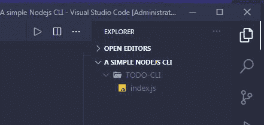
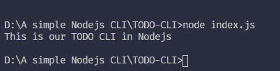

# 使用 Node.js 的简单任务管理器 CLI

> 原文:[https://www . geesforgeks . org/simple-task-manager-CLI-use-node-js/](https://www.geeksforgeeks.org/simple-task-manager-cli-using-node-js/)

在使用 NodeJS 创建一个简单的任务管理器 CLI 之前，让我们通过以下简单的步骤运行我们的第一个基本 Node.js 应用程序:

**注意:**您可以从 href = " https://nodejs . org/en/"
**下载并安装 Node.js 应用程序第一步:**为我们的任务管理器 CLI 创建一个名为 **TODO-CLI 的目录，**您可以给出自己选择的名称。


写:mkdir<filename></filename>

**第二步:**在该目录中创建一个名为 **index.js** 的 JavaScript 文件，如下所示:



制作一个 index.js 文件

**第三步:**这个文件包含了一些运行程序的 JavaScript 代码，现在我们可以编写如下所示的一些示例代码:


**步骤 4:** 在 index.js 文件中写入代码后，使用以下命令运行该文件:

```js
node index.js
```

运行该命令后，您将看到以下输出。因此，现在我们确认我们的 index.js 文件运行没有任何问题。



**步骤 5:** 使用以下命令安装用于该应用程序的以下模块:

```js
npm install yargs
npm install lodash
```

*   **loadsh:** 一个现代的 JavaScript 实用程序库，帮助处理数组、数字、字符串、对象和字符串。
*   **yargs:** 它是一个交互式命令行模块，有助于读取用户输入。

**步骤 6:** 创建一个名为 **todo.js** 的新文件，并在其中写下以下代码:

**档案名称:全部. js**

## java 描述语言

```js
console.log("todo.js is running !!");

const fs = require('fs');

// Add a todo item 
var addTodo = (title) => {
    var todos = fetchTodos();
    var todo = {
        title
    };

    var duplicatetodos = todos.filter(
        (todo) => todo.title === title);

    if (duplicatetodos.length === 0) {
        todos.push(todo);
        saveTodos(todos);
        return todo;
    }
};

// Delete a todo item 
var deleteTodo = (title) => {
    var todos = fetchTodos();
    var filteredtodos = todos.filter(
        (todo) => todo.title !== title);
    saveTodos(filteredtodos);

    return todos.length !== filteredtodos.length;
};

// Read a todo item 
var readTodo = (title) => {
    var todos = fetchTodos();
    var filteredTodos = todos.filter(
        (todo) => todo.title === title);
    return filteredTodos[0];
};

// List all todo items 
var listTodos = () => {
    return fetchTodos();
};

// Utility functions
var fetchTodos = () => {
    try {
        var todosString = 
            fs.readFileSync('tasks-data.json');
        return JSON.parse(todosString);
    } catch (e) {
        return [];
    }
};

var saveTodos = (todos) => {
    fs.writeFileSync('tasks-data.json', 
        JSON.stringify(todos));
};

var logTodo = (todo) => {
    console.log('## ---## --- ##');
    console.log(`It's title is: ${todo.title}`);
};

// Exporting function
module.exports = {
    addTodo,
    deleteTodo,
    readTodo,
    listTodos,
    logTodo
};
```