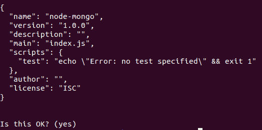
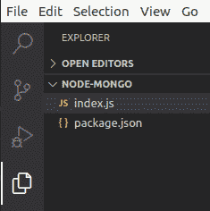
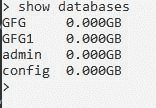
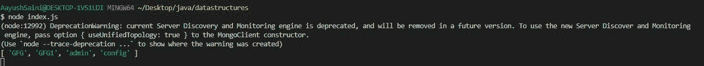

# 使用 Node.js

对 MongoDB 数据库进行升序排序(ASCII 值)

> 原文:[https://www . geesforgeks . org/sorting-MongoDB-databases-按升序-ascii-value-use-node-js/](https://www.geeksforgeeks.org/sorting-mongodb-databases-in-ascending-order-ascii-value-using-node-js/)

**MongoDB** ，最受欢迎的 NoSQL 数据库，是一个开源的面向文档的数据库。术语“NoSQL”的意思是“非关系的”。这意味着 MongoDB 不是基于类似表的关系数据库结构，而是提供了一种完全不同的数据存储和检索机制。这种存储格式称为 BSON(类似于 JSON 格式)。

**MongoDB 模块**:node . js 的这个模块用于连接 MongoDB 数据库，也用于操作 MongoDB 中的集合和数据库。mongodb.connect()方法用于连接在您的计算机上的特定服务器上运行的 mongodb 数据库。(参考[这篇](https://www.geeksforgeeks.org/how-to-connect-mongodb-server-with-node-js/)文章)。

**安装模块:**

```js
npm install mongodb
```

**Project Structure:**

*   创建一个新的文件夹，让我们把它命名为“NODE-MONGO”。

    ```js
    mkdir NODE-MONGO
    ```

    *   移到这个目录。

    ```js
    cd NODE-MONGO
    ```

    *   Let’s create a new NPM package for our project.

    ```js
    npm init
    ```

    

    NPM 套餐详情

    

    文件夹结构

    **在本地 IP 上运行服务器:数据是 MongoDB 服务器所在的目录。**

    ```js
    mongod --dbpath=data --bind_ip 127.0.0.1
    ```

    

    **蒙古数据库:**

    

    “显示数据库”的输出

    **Index.js**

    ## java 描述语言

    ```js
    const MongoClient = require("mongodb"); 
    const url = 'mongodb://localhost:27017/'; 
    const databasename = "GFG";// database name 
    MongoClient.connect(url).then((client) => { 

        //use admin request
        const connect = client.db(databasename).admin(); 
        connect.listDatabases((err,db)=>{
        if(!err) {
                var arr=[]; //creating an empty array  
                db.databases.forEach(element => {
                    arr.push(element.name) //push the name in the array
                });
                arr.sort() //sort the array
                console.log(arr); //printing the array
             }
        })
    })
    .catch((err) => { 
        // Printing the error if there's any 
        console.log(err); 
    })
    ```

    **使用以下命令运行 index.js 文件:**

    ```js
    node index.js
    ```

    **控制台输出:(根据 ASCII 值对数据库进行排序)**

    

    输出