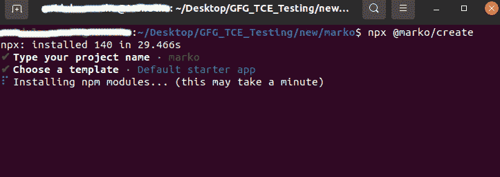
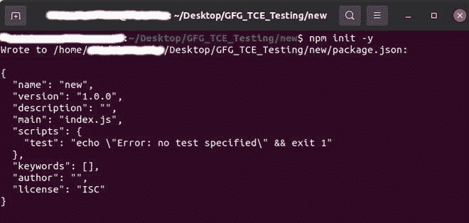

# 通过节点 js 中的 Marko.js 进行模板渲染

> 原文:[https://www . geesforgeks . org/template-rendering-via-Marko-js-in-node-js/](https://www.geeksforgeeks.org/template-rendering-via-marko-js-in-node-js/)

**马尔科:**马尔科使得使用类似于 *HTML* 的语法来表示你的用户界面变得很容易。这是一个友好且超快的用户界面库，使得构建网络应用变得有趣。它非常像 *HTML* ，你可以用它来代替模板语言，比如车把、小胡子或者哈巴狗。

然而，Marko 不仅仅是一种模板语言。它是一种语言，允许您通过描述应用程序视图如何随着时间的推移和对用户操作的响应而变化来声明性地构建应用程序。在浏览器中，当代表你的 UI 的数据发生变化时，Marko 会自动高效地更新 DOM 以反映变化。

**安装:**如果您从零开始，可以使用 Marko 的 cli 命令快速创建一个入门应用程序:

```
npx @marko/create
```



Marko 编译器运行在 Node.js 上，可以使用 npm 安装:

```
npm init -y *// The -y installs the default package.json*
```



我们需要安装以下必需的库:

```
npm install express --save *// install express module*
npm install marko --save  *// install marko module*
***or using yarn:***
yarn add marko
```

**示例:** **文件名:template.marko**

## 超文本标记语言

```
<!doctype html>
html
    head
        title -- Hello World
    body
        h1 -- Hello, ${data.fname} ${data.lname}
        h3 -- Welcome to, ${data.host}'s bar.
           p -- We offer you
               b -- ${data.drinks[0]}, ${data.drinks[1]}, ${data.drinks[2]}.
```

**模板的等价代码. marko:**

## 超文本标记语言

```
<!doctype html>
<html>
<head>
    <title>Hello World</title>
</head>
<body>
    <h1>Hello, ${data.fname} ${data.lname}</h1>
      <h3>Welcome to, ${data.host}'s bar.</h3>

<p>
    We offer you ${data.drinks[0]},
    ${data.drinks[1]}, ${data.drinks[2]}.
  </p>

</body>
</html>
```

**文件名:index.js**

## java 描述语言

```
// Node.js program to implement the
// marko.js template

// Allow Node.js to require and load
// `.marko` files
require("marko/node-require");

// Importing express module
var express = require("express");

// Importing marko module
var markoExpress = require("marko/express");

// Importing template module
var template = require("./template.marko");

var app = express();

// Enable res.marko(template, data)
app.use(markoExpress());

// Routing
app.get("/", function(req, res) {
  console.log("Routing done all fine...");
  res.marko(template, data={
    fname: "Devanshi",
    lname: "awasthi",
    host: "Vikas",
    drinks : ["Wine", "Beer", "Champagne"]
  });
});

// Listening on 2020 port number
app.listen(2020, ()=>{
    console.log("Server started at port: 2020...");
});
```

在 cmd 中使用以下代码运行 **index.js** 文件:

```
node index.js 
```

**输出(控制台中):**

> 服务器在端口 2020 启动…
> 路由一切正常…

**在浏览器中:**


在端口 2020 运行本地主机

**注意:**在控制台运行服务器后，会自动创建一个文件 **template.marko.js** ，该文件对所有模板文件都有引用。

**参考:**T2】https://markojs.com/docs/getting-started/