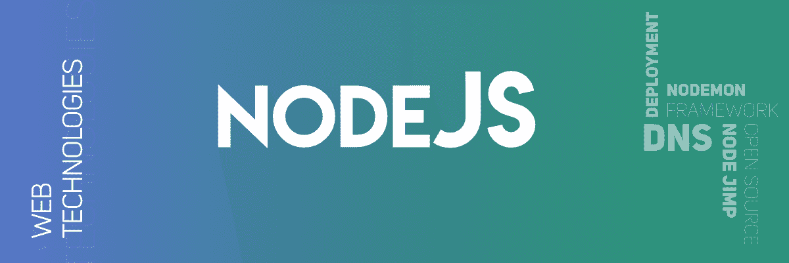

# 关于 Node 你必须知道的事情。JS

> 原文:[https://www . geesforgeks . org/things-you-know-on-node-js/](https://www.geeksforgeeks.org/things-you-must-know-about-node-js/)

如果您不清楚 Node.js 是什么，并且您是来学习 Node.js 中的新内容的，那么让我们从对它的简单介绍开始。
Node.js 由 Ryan Dahl 于 2009 年首创。这个运行时系统得到了广泛的增强，受到了程序员的欢迎，并被用来创建 API。当开发人员使用 Node.js 时，他们需要使用 JavaScript 开发一些实时的 web APIs。如果你对 JavaScript 有一定的了解，那么学习 Node.js 就不会花太多时间。

1.  **Node.js is all JavaScript:**
    If you are going to develop various applications for your web browsers then it is an essential thing that you have to study. Node.js is supported by JavaScript to handle the event loop mechanism, which is a perk of Node.js. JavaScript is very familiar now and it helps us to run smoothly in every OS environment.
2.  **JSON is still the best:**
    If you are a JavaScript developer then the most important thing you should know about JSON (JavaScript Object Notation). JSON is an accessible data exchange format. With JSON, people can quickly build APIs that allow Node.js. Previously JavaScript has not been used alone and that is still the case, we have to use JSON with JavaScript. This is currently a translation of JSON and now, even if we are using the Node.js framework, we have to consider the use of JSON.
3.  **Reinforced by JSON:**
    JSON provide developers with a robust and accessible data exchange format. It is considered a mainstay of JavaScript, as it is simple and allows developers to build APIs quickly. Earlier, programmers had to pay extra attention when manipulating dynamic data in JavaScript in the browser. JSON gave birth to the NoSQL database, intended for JS only.

4.  **Powered by Google Chrome:**
    Powered by Google’s V8 engine, Node.js works on the backend. It takes the same runtime in Google Chrome to execute the front-end of JavaScript. However, the development team of Node.js at Google made it one of the fastest and most dynamic runtimes compared to advanced JavaScript. Also, Google lists Node.js among other system engine powers. Besides, using Google Developer Tools, developers can go for debugging with the Node.js debugging feature, which allows for eliminating errors in both the front-end and the backend.
5.  **Node.JS has an extensive library of codes:**
    There is a massive library of dependencies on Node.js known as Node Package Manager. It helps us to manage things easily with reliable package management that lets the node ecosystem grow well. Smaller developers can use better packages made for their projects, which they have decided to make public, with developers doing much better in their smaller-scale projects. It will also make implementing Node.js much more comfortable than other systems.
6.  **Small modules working fast:**
    Node.JS is a framework divided into various smaller modules, two of which we can broadly call Node.JS application and Node.JS Core. Although we can use both of these together. It is not always necessary to use them together at the end of the server or client, so it makes it lighter not including the core or application collectively in all locations goes. Due to such benefits, many companies have taken up the task of providing Node.js development services.
7.  **分享是免费的所以鼓励:**
    Node.js 对喜欢继续分享知识的开发者是有益的。当您在 Node.js 上工作时，您可以快速获得帮助，并且很容易在社区上分享。如果你有一些不同的包，你可以和不同的开发者，甚至原始开发者分享。因此，他们可以节省在其他类型的源和包上工作的时间。