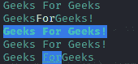

# 你应该尝试成为 Node.js 开发者的 Node.js 最佳包的前 3 名

> 原文:[https://www . geesforgeks . org/top-3-最佳节点包-你应该尝试的 js-成为节点-js-developer/](https://www.geeksforgeeks.org/top-3-best-packages-of-node-js-that-you-should-try-being-a-node-js-developer/)

Node.js 是一个开源的服务器端平台，建立在谷歌 Chrome 的 JavaScript 引擎(V8 Engine)之上。Node.js 有自己的名为 NPM( Node Package Manager)的包管理器，它有非常有用和不可思议的库和框架，让我们作为开发人员更容易使用 Node.js。

**作为开发者应该尝试的 Node.js 的 3 个最佳包是:**

1.  粉笔模块
2.  摩根模块
3.  快速模块

**粉笔模块:**粉笔是用来在你的终端中样式化输出的。作为一名开发人员，我们的大部分时间都花在查看终端上，查看登录到控制台的**成功和错误消息**以使我们的代码调试更容易，但是大部分时间看着终端上的纯文本，开发人员会感到厌烦，但是如果我们**根据成功和失败消息格式化**颜色，那么作为一名开发人员，这将使我们的生活更轻松。Node.js 引入了一个名为*粉笔*的包，帮助我们执行上述问题的解决方案。

**模块安装:**您可以使用此[链接](https://www.npmjs.com/package/chalk)下载粉笔模块，或者使用以下命令安装此模块:

```
npm install chalk
```

安装完粉笔模块后，您可以使用以下代码在文件中要求它:

```
const chalk = require('chalk');
```

**文件名:index.js**

## java 描述语言

```
// Requiring the module
const chalk = require('chalk');

// It is used style a string
console.log(chalk.red('Geeks For Geeks'));

// It is used to combine styled and normal strings
console.log(chalk.blue('Geeks') + 'For' + chalk.red('Geeks!'));

// Compose multiple styles using the chainable API
console.log(chalk.blue.bgRed.bold('Geeks For Geeks!'));

// It is used pass in multiple arguments
console.log(chalk.blue('Geeks', 'For', 'Geeks!'));

// It is used to nest the styles
console.log(chalk.red('Geeks', 
    chalk.underline.bgBlue('For') + 'Geeks'));
```

使用以下命令运行 **index.js** 文件:

```
node index.js
```

**输出:**



粉笔模块演示

**摩根模块:** **摩根**是一个很棒的日志记录工具，任何人都可以在 node 中使用 HTTP 服务器。它通常充当中间件，允许我们轻松地将请求、错误等记录到控制台。它以德克斯特·摩根的名字命名，他是一个虚构的角色，也是德克斯特系列图书的反英雄主角。

**模块安装:**您可以使用[链接](https://www.npmjs.com/package/morgan)下载该模块，或者使用以下命令安装该模块:

```
npm install chalk
```

安装完粉笔模块后，您可以使用以下代码在文件中要求它:

```
const morgan = require('morgan');
```

因为我们知道 morgan 是一个中间件，所以我们将它与一个 express 服务器一起使用，这将使过程更容易，而不是使用 Nodejs 中的内置 http 模块。

```
const express = require('express');
const morgan = require('morgan');
const app = express();

app.listen(5000, () => {
   console.debug('App listening on :5000');
});
```

为了使用 morgan，我们有一套预置，在 morgan 中是即插即用的。为了使用 morgan，我们编写 *morgan('tiny')* 根据这种情况，tiny 是我们正在使用的预定义格式字符串的名称。

为了将 morgan 与 express 一起使用，我们需要一个预定义的格式化字符串，通过使用以下代码，我们可以完成以下任务:

```
const app = express();
app.use(morgan(/* This is the  format string */));
```

morgan 使用的模板字符串称为格式字符串，如下所示:

```
':method :url :status :res[content-length] - :response-time ms'
```

**使用 morgan 创建自定义令牌:**可以使用 *morgan.token(名称，功能)*功能来实现。我们传递的第一个参数是令牌的名称，第二个参数是回调函数。每次使用令牌记录一些东西时，Morgan 都会运行。摩根将向函数传递两个参数，即*请求*和 *res* 。我们可以创建一个令牌，它显示请求通过的域。

```
morgan.token('host', function(req, res) {
  return req.hostname;
});
```

**Express 模块:** Express 是一个面向 node.js 的轻量级 web 应用框架，用于相对快速、轻松地构建 web 应用的后端。它提供了健壮的路由，并且它专注于高性能。它有超高的测试覆盖率。它还支持 14+模板引擎(车把，EJS 等)。

**模块安装:**您可以使用此[链接](https://www.npmjs.com/package/express)下载粉笔模块，或者使用以下命令安装此模块:

```
npm install express
```

安装 express 模块后，您可以使用以下代码在文件中要求它:

```
const express = require('express');
```

**文件名:index.js**

## java 描述语言

```
// Requiring the module
var express = require('express'); 

// Creating express app object
app = express(); 

// Handling /geek Request
app.get('/geek', function(req, res) { 
    res.send('Heyy GeeksforGeeks'); 
}); 

// Server setup
app.listen(3000, function() { 
    console.log('Server Listening to port 3000'); 
});
```

使用以下命令运行 **index.js** 文件:

```
node index.js
```

**输出:**

```
Server Listening to port 3000
```