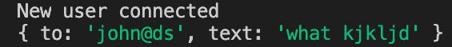
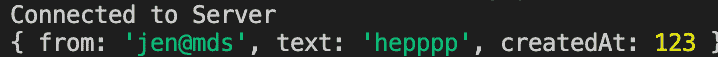

# 节点中的网络套接字

> 原文:[https://www.geeksforgeeks.org/web-socket-in-node-js/](https://www.geeksforgeeks.org/web-socket-in-node-js/)

**什么是 Web Socket？**
网络套接字是一种提供全双工(多路)通信的协议，即允许同时双向通信。这是一种现代网络技术，在这种技术中，用户的浏览器(客户端)和服务器之间有一个连续的连接。在这种类型的通信中，在 web 服务器和 web 浏览器之间，两者可以在任何时间点互相发送消息。传统上，在网络上，我们有一种请求/响应格式，其中用户发送一个 HTTP 请求，服务器对此做出响应。这在大多数情况下仍然适用，尤其是那些使用 RESTful API 的情况。但是感觉到服务器也需要与客户端通信，而不需要被客户端轮询(或请求)。服务器本身应该能够向客户端或浏览器发送信息。这就是网络套接字出现的地方。
为了利用 NodeJS 中的 Socket，我们首先需要安装一个依赖项，那就是 **socket.io** 。我们可以简单地通过在 cmd 中运行下面的命令来安装它，然后将这个依赖项添加到您的服务器端 javascript 文件中，还可以安装一个服务器端应用程序基本上需要的 express 模块

```
 npm install socket.io --save
 npm install express --save
```

**注意:**以上命令中的 npm 代表节点包管理器，我们从这里安装所有的依赖项。–在 Node 5.0.0 版本之后，不再需要保存标志，因为我们现在安装的所有模块都将被添加到依赖项中。
**在你的服务器端 JavaScript 文件中创建服务器:**

## java 描述语言

```
const express = require('express'); // using express
const socketIO = require('socket.io');
const http = require('http') 
const port = process.env.PORT||3000 // setting the port 
let app = express();
let server = http.createServer(app)
let io = socketIO(server)

server.listen(port);
```

现在我们需要建立一个从服务器端到客户端的连接，通过这个连接，服务器将能够向客户端发送数据。

```
// make a connection with the user from server side
io.on('connection', (socket)=>{
  console.log('New user connected');
});
```

同样，在客户端，我们需要添加一个脚本文件，然后连接到服务器，用户通过该服务器向服务器发送数据。

## java 描述语言

```
<script src="/socket.io/socket.io.js"></script>
<script>
var socket=io()
// make connection with server from user side
socket.on('connect', function(){
  console.log('Connected to Server')

});
</script>
```

现在，为了从服务器向用户发送消息或数据，我们在从服务器端建立的连接中生成一个套接字“socket.on()”。

## java 描述语言

```
// listener when server emit any message
socket.on('createMessage', (newMessage)=>{
    console.log('newMessage', newMessage);
  })
```

现在，任何一方都可以发送数据，从而在服务器和客户端之间建立连接。然后，如果服务器发出一条消息，那么客户端可以监听该消息，或者如果客户端发出一条消息，那么服务器可以监听该消息。因此，我们必须为服务器端和客户端的消息发送和消息侦听生成一个套接字。
**服务器端代码示例:**

## java 描述语言

```
const express=require('express');
const socketIO=require('socket.io');
const http=require('http')
const port=process.env.PORT||3000
var app=express();
var io=socketIO(server);

// make connection with user from server side
io.on('connection', (socket)=>{
  console.log('New user connected');
   //emit message from server to user
   socket.emit('newMessage', {
     from:'jen@mds',
     text:'hepppp',
     createdAt:123
   });

  // listen for message from user
  socket.on('createMessage', (newMessage)=>{
    console.log('newMessage', newMessage);
  });

  // when server disconnects from user
  socket.on('disconnect', ()=>{
    console.log('disconnected from user');
  });
});

server.listen(port);
```

**输出:**



**客户端代码示例:**

## java 描述语言

```
<!DOCTYPE html>
<html lang="en" dir="ltr">
  <head>
    <meta charset="utf-8">

    <title>ChatApp</title>
  </head>
  <body class="chat">
        <form id='message-form'>
          <input name='message' type="text"placeholder="Message"
                  autofocus autocomplete="off"/>
          <button >Send</button>
        </form>

<script src="/socket.io/socket.io.js"></script>
<script>
var socket=io()

// connection with server
socket.on('connect', function(){
  console.log('Connected to Server')

});

// message listener from server
socket.on('newMessage', function(message){
 console.log(message);
});

// emits message from user side
socket.emit('createMessage', {
  to:'john@ds',
  text:'what kjkljd'
});

// when disconnected from server
socket.on('disconnect', function(){
  console.log('Disconnect from server')
});
</script>
  </body>
</html>
```

**输出:**

