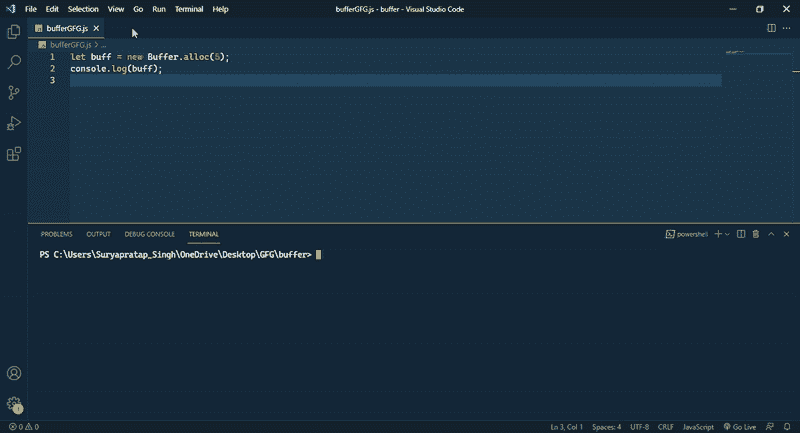
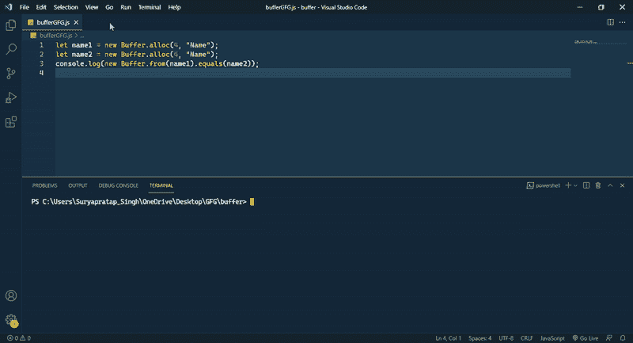
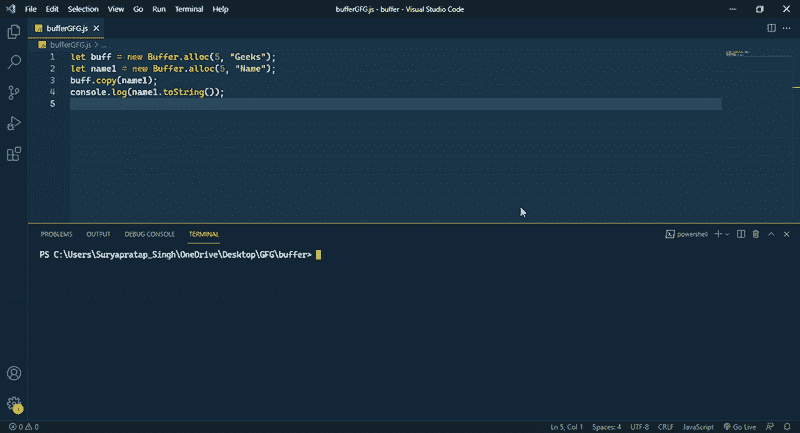
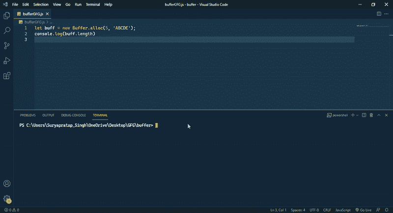
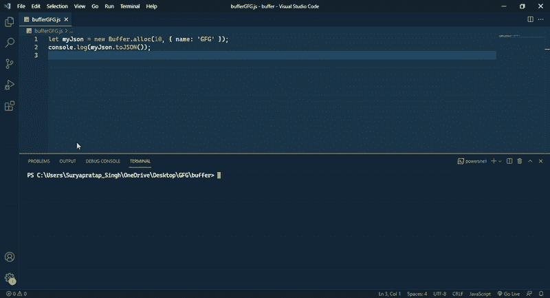

# node . js 中的缓冲区是什么？

> 原文:[https://www.geeksforgeeks.org/what-are-buffers-in-node-js/](https://www.geeksforgeeks.org/what-are-buffers-in-node-js/)

在本文中，我们将讨论什么是 Node.js 中的缓冲区，以及它使用什么。Node.js 是 javascript 最流行的运行时环境之一，并且 javascript 不能正确处理数据，因此 Node.js 提供了一个名为 Buffer 的全局模块。缓冲区也是一个全局对象，因此我们可以使用它，而无需编写任何其他代码来导入或要求。

**方法:**首先我们了解什么是缓冲区，然后我们将讨论什么是可以使用缓冲区的用例，最后我们将讨论缓冲区模块中的所有方法及其用途。

**Buffer:** 在 Node.js 中操纵一个二进制数据流，缓冲模块可以包含在代码中。但是，缓冲区在 Node.js 中是一个全局对象，因此不需要使用所需的方法在代码中导入它。

它是内存中的一个临时内存，管理一个数据块并将其发送进行处理，缓冲区是一个适合二进制数据的非常小的块，如果缓冲区已满，则直接发送数据进行处理。有时缓冲区被用作数据处理和传入之间的中间件，因为我们需要一个处理器来处理数据，但有时处理器忙于其他任务，所以我们需要将数据传输到某个地方，并需要重新定位。缓冲器满足了这一要求。Node.js 中的 Buffer 类提供了分配和使用缓冲区的权限。缓冲类是一个全局类，所以不需要导入。如果你想了解更多关于 Buffer 的信息，那就看看这篇[文章](https://www.geeksforgeeks.org/node-js-buffers/)。

**用例:**缓冲区是处理二进制数据流的全局对象，所以有很多用例我们可以使用它。

*   对于创建缓冲流，处理自定义用户二进制数据。
*   检查自定义二进制数据是否与实际二进制数据匹配。
*   将二进制数据转换为可读的字符串或 JSON。
*   用于重写现有的二进制数据流。

**缓冲模块的方法:**下面列出了缓冲模块的一些常用方法和属性。

**1。alloc()方法:**它创建一个给定长度的 Buffer 对象。

## java 描述语言

```
let buff = new Buffer.alloc(5);
console.log(buff);
```

**输出:**



**2。equals()方法:**它比较两个缓冲区对象。如果对象匹配，则返回 true，否则返回 false。

## java 描述语言

```
let name1 = new Buffer.alloc(4, "Name");
let name2 = new Buffer.alloc(4, "Name");
console.log(new Buffer.from(name1).equals(name2));
```

**输出:**



**3。copy()方法:**它复制缓冲区对象的给定字节数。

## java 描述语言

```
let buff = new Buffer.alloc(5, "Geeks");
let name1 = new Buffer.alloc(5, "Name");
buff.copy(name1);
console.log(name1.toString());
```

**输出:**



**4。length 属性:**以字节为单位返回缓冲区对象的长度。

## java 描述语言

```
let buff = new Buffer.alloc(5, 'ABCDE');
console.log(buff.length)
```

**输出:**



**5。方法:**它返回一个缓冲对象的字符串形式。

## java 描述语言

```
let name2 = new Buffer.alloc(3, "GFG");
console.log(name2);
console.log(name2.toString());
```

**输出:**


**6。toJSON()方法:**它返回一个缓冲对象的 JSON 形式。

## java 描述语言

```
let myJson = new Buffer.alloc(10, { name: 'GFG' });
console.log(myJson.toJSON());
```

**输出:**

