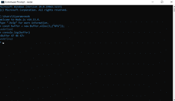
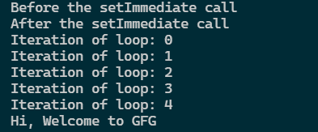
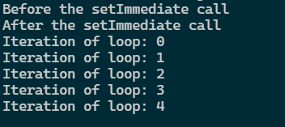
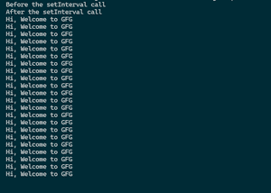
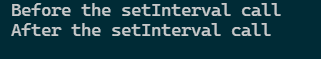
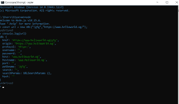
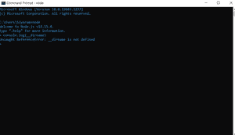
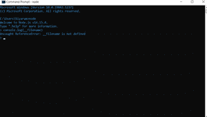

# node . js 的全局对象有哪些？

> 原文:[https://www . geesforgeks . org/什么是节点的全局对象 js/](https://www.geeksforgeeks.org/what-are-the-global-objects-of-node-js/)

Node.js 是一个基于开源项目的 JavaScript 框架，用于服务器端脚本。全局对象是那些存在于所有模块中的对象。全局对象可以直接在应用程序中使用，而无需导入任何模块。添加了全局对象，请记住这些是一些基本要求，您可以随时要求这些，所以最好保持它们是全局的，而不是为这些对象添加特定的模块。首先在构建框架时创建全局对象，之后可以根据需求进行更新。全局对象负责框架的基本功能，而不需要导入任何模块或创建任何函数来满足一些主要需求。

下面列出了一些 Node.js 全局对象:

1.  **Buffer** **类:**Buffer 类是一个全局可访问的类。缓冲区类主要用于处理二进制数据。缓冲区类的对象通常用于以字节序列的形式表示二进制数据。

    

2.  **控制台:**用于打印到 stdout & stderr，是无需导入任何模块即可访问的全局对象。

3.  **进程:**是 EventEmitter 的一个实例，用于接收当前进程的信息。它是一个内置的全局对象，也可以使用 require()显式访问。

4.  **global:** 它是一个命名空间，在这个命名空间内定义一个变量就成为了一个全局变量。

    ```js
    var myvar;
    ```

5.  **setImmediate()方法:**回调函数按照创建顺序对齐执行。回调队列在事件循环的每次迭代中处理回调。它会立即执行计划的回调。如果正在执行的回调由计时器绑定，则计时器将不会被触发，直到下一个循环迭代的实例化。

    ## java 描述语言

    ```js
    <script>
    function myFunction(website){
        console.log("Hi, Welcome to " + website);
    }

    console.log("Before the setImmediate call")
    let setID = setImmediate(myFunction, "GFG");
    console.log("After the setImmediate call")
    for(let i=0; i<5; i++){
        console.log("Iteration of loop: "+i);
    }
    </script>
    ```

    **输出:**

    

6.  **clearImmediate()方法:**通过停止对象对 setImmediate()方法返回的对象执行清除操作，即不执行该对象。

    ## java 描述语言

    ```js
    <script>
    function myFunction(website){
        console.log("Hi, Welcome to " + website);
    }

    console.log("Before the setImmediate call")
    let setID = setImmediate(myFunction, "GFG");
    console.log("After the setImmediate call")
    for(let i=0; i<5; i++){
        console.log("Iteration of loop: "+i);
    }
    clearImmediate(setID);
    </script>
    ```

    **输出:**

    

7.  **setInterval()方法:**如果间隔超过 int 数据类型的限制，即 2147483647 或者不是正整数，则间隔值设置为 1。它还将非整数延迟截断到最接近的整数，并以重复的间隔执行回调函数。

    ## java 描述语言

    ```js
    <script>
    function myFunction(website){
        console.log("Hi, Welcome to " + website);
    }

    console.log("Before the setInterval call")
    let setID = setInterval(myFunction, 3000, "GFG");
    console.log("After the setInterval call")
    </script>
    ```

    **输出:**

    

8.  **clearInterval()方法:**通过取消对象对 setInterval()方法返回的对象执行清除操作，即不允许 setInterval 执行哪怕一次。

    ## java 描述语言

    ```js
    <script>
    function myFunction(website){
        console.log("Hi, Welcome to " + website);
    }

    console.log("Before the setInterval call")
    let setID = setInterval(myFunction, 3000, "GFG");
    console.log("After the setInterval call")

    clearInterval(setID);
    </script>
    ```

    **输出:**

    

9.  **setTimeout()方法:**如果延迟超过 int 数据类型的限制，即 2147483647 或者不是正整数，则延迟值设置为 1。它还将非整数延迟截断到最接近的整数，并以重复的时间间隔执行回调函数，但不保证回调的精确定时。

    ## java 描述语言

    ```js
    <script>
    function greet(msg, name) {  
       console.log(msg + name);
    }
    setTimeout(greet, 1000, "Hi ", "Geek");
    </script>
    ```

    **输出:**

    ```js
    Hi Geek
    ```

10.  **clearTimeout()方法:**cleartime out()方法用于取消 setTimeout()方法返回的 timeoutObj，使 setTimeout 无法执行。

    ## java 描述语言

    ```js
    <script>
    console.log("setTimeout msg will not be printed")
    function greet(msg, name) {  
       console.log(msg + name);
    }
    let setID = setTimeout(greet, 1000, "Hi ", "Geeks");

    clearTimeout(setID);
    </script>
    ```

    **输出:**

    ```js
    setTimeout msg will not be printed
    ```

11.  **queueMicrotask()方法:**这是在回调函数退出并且如果 JavaScript 的执行栈为空之后执行的。此方法不会将控件返回到 JavaScript，并且微任务队列可以在循环中多次处理，因为事件循环会不断调用队列中的微任务。

12.  **URL 搜索参数:**这是一个对任意 URL 执行读写操作的 API。

    

    **语法:**

    ```js
     const myURL = new URL('https://www.register.com/?name=nodejs');

    //It prints nodejs
    console.log(myURL.searchParams.get('name'));

    myURL.searchParams.append('name', 'xyz');

    // It prints https://www.register.com/?name=nodejs&name=xyz
    console.log(myURL.href);
    ```

13.  **WebAssembly:** 这是现代浏览器支持的低级汇编语言，所以我们可以用它来排列浏览器上的对象。

    以下变量只存在于某些可能看起来是全局的模块的范围内。

    *   **require(id)方法:**可以返回非特定数据类型的对象，用于将模块导入脚本。

    ```js
    var express = require('express')
    ```

    *   **导出:**可用于将脚本中的模块导出到任何其他脚本。
    *   **模块:**它用于包含使用 require()方法的特定模块，这不是本地的，而是每个模块的本地的。
    *   **__dirname:** __dirname 不是全局对象，这可以通过运行以下命令而不添加任何脚本来证明，因为这将引发一个错误。已验证 __dirname 不是全局对象。

    ```js
    Create a test.js file
    Write the following condole.log statement:  
    console.log("__dirname : "+ __dirname);
    Run the test.js file
    ```

    

    *   **__filename:** __filename 不是全局对象，这可以通过运行以下命令而不添加任何脚本来证明，因为这将引发一个错误。已验证 __filename 不是全局对象。

    ```js
    *Create a test.js file*
    Write the following condole.log statement:  
    console.log("__filename : "+ __filename);
    Run the test.js file
    ```

    