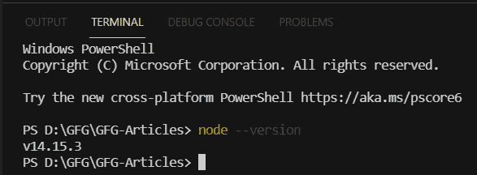
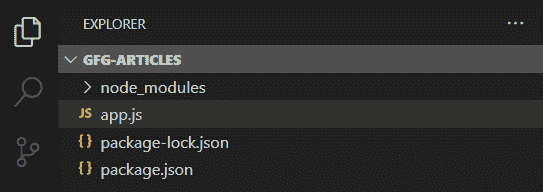
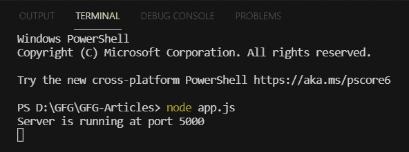
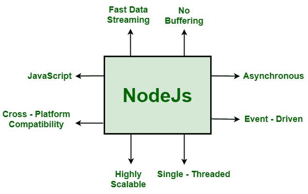

# node . js 的关键特性是什么？

> 原文:[https://www . geesforgeks . org/什么是节点的关键功能-js/](https://www.geeksforgeeks.org/what-are-the-key-features-of-node-js/)

[Node.js](https://www.geeksforgeeks.org/nodejs-tutorials/) 是一个跨平台的运行时环境，允许您创建服务器端和网络应用程序。Node.js 应用程序是用 JavaScript 编写的，并利用 Node.js 运行时在 OS X、微软视窗和 Linux 上运行。

Node.js 还附带了一个大型的 JavaScript 模块库，使得用它构建 web 应用程序变得更加容易。它增强了 Node.js 的功能。NodeJs 促进了编程语言与 API、其他语言和各种第三方库的集成。它专门用于 web 应用程序开发的“随处 JavaScript”范例，可以处理服务器端脚本和客户端编程。

网络开发是一个不断发展的过程，需要不断的创新和更新，以满足每年对改变游戏的技术的需求。大多数开发人员倾向于使用 JavaScript 进行前端编程，最近 NodeJS 为后端开发提供了支持。除了在线开发之外，NodeJS 还被用于移动应用程序开发。

```
NodeJs = Runtime Environment + Javascript library
```

**与 Nodejs 合作**

**步骤 1:** 在终端运行以下命令，验证是否安装了 node.js。这个命令将向我们的系统显示 NodeJs 的安装版本。

```
node --version    
```



**第二步:**使用以下命令创建 package.json 来存储项目的元数据。

```
npm init -y
```

**步骤 3:** 现在在终端中使用以下命令在根目录下安装 express。

```
npm install express --save
```

**第四步:**在根目录下创建 app.js 文件。我们的文件夹结构如下所示:



## java 描述语言

```
// app.js
const express = require('express'); // Importing express module  
const app = express(); // Creating an express object
const port = 5000;  // Setting an port for this application

// Handing the route to the server 
app.get('/', function (req, res) {
    res.send('Welcome to Geeksforgeeks Article');
});

// Starting server using listen function
app.listen(port, function (err) {
    if (err) {
        console.log("Error!!!");
    }
    else {
        console.log("Server is running at port " + port);
    }
});
```

**步骤 5:** 运行上述代码，并使用以下命令启动服务器。

```
node app.js
```

**输出:**



**node . js 的功能**

以下是 Node.js 可以执行的一些功能–

1.  从表单收集数据。
2.  数据库中的数据被添加、删除和更改。
3.  呈现网页的动态内容。
4.  服务器上的文件被创建、读取、写入、删除和关闭。

**node . js 的关键特性**



节点的主要特性

1.  **异步和事件驱动:**node . js 库的 API 本质上都是异步的(非阻塞的)。使用节点构建的服务器。JS 从不等待来自 API 的数据。来自一个应用编程接口。在访问一个应用编程接口后，服务器进入下一个应用编程接口。为了接收和跟踪以前的应用编程接口请求的响应，它使用了一种称为事件的通知机制。
2.  **单线程:** Node.js 采用了带有事件循环的单线程架构，使其具有很好的可扩展性。与典型的创建有限线程来处理请求的服务器相反，事件机制允许 node.js 服务器以非阻塞方式进行回复，并使其更具可扩展性。与传统服务器如 Apache HTTP 服务器相比，Node.js 使用单线程程序，可以处理大量请求。
3.  **可伸缩:** NodeJs 解决了软件开发中最紧迫的问题之一:可伸缩性。如今，大多数组织都需要可扩展的软件。NodeJs 还可以高效地处理并发请求。它有一个集群模块，管理所有活动的中央处理器内核的负载平衡。NodeJs 水平划分应用程序的能力是它最吸引人的特性。它通过使用子进程来实现这一点。这允许组织向不同的目标受众提供不同的应用版本，允许他们迎合客户的定制偏好。
4.  **代码的快速执行:** Node.js 利用了 V8 JavaScript Runtime 马达，谷歌 Chrome 也使用了这个马达。Hub 为 JavaScript 马达提供了一个包装器，这使得运行时马达更快。因此，Node.js 内部的请求准备也变得更快。
5.  **跨平台兼容性:** NodeJS 可以在各种系统上使用，包括 Windows、Unix、Linux、Mac OS X 和移动设备。它可以与适当的包配对以生成自给自足的可执行文件。
6.  **使用 JavaScript:** JavaScript 由 Node.js 库使用，从工程师的角度来看，这是 Node.js 的另一个重要方面。大多数工程师已经熟悉了 JavaScript。因此，熟悉 JavaScript 的设计师会发现使用 Node.js 要容易得多。
7.  **快速数据流:**当数据以多个流传输时，处理它们需要很长时间。Node.js 处理数据的速度非常快。它同时处理和上传文件，从而节省了大量时间。因此，NodeJs 提高了数据和视频流的整体速度。
8.  **无缓冲:**在 Node.js 应用程序中，数据从不缓冲。

**node . js 的缺点**

1.  对于 node.js 来说，api 并不稳定，而且一直在变化
2.  由于 NodeJs 的异步特性，大型应用程序的代码很复杂。
3.  没有强大的库支持系统

**node . js 的应用**

以下是 Node.js 被证明是有效的技术合作伙伴的一些领域

1.  单页应用程序
2.  数据密集型实时应用
3.  输入/输出绑定的应用程序
4.  基于 JSON 的应用程序接口
5.  数据流应用