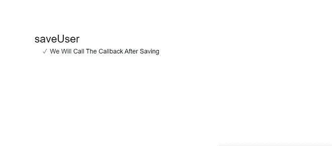
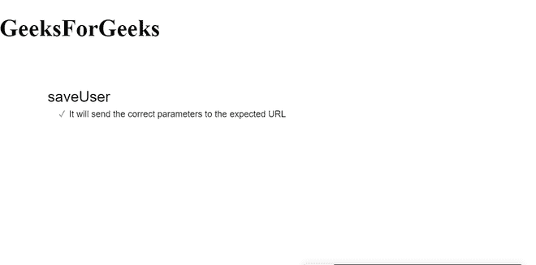

# node . js 中的存根是什么？

> 原文:[https://www.geeksforgeeks.org/what-is-a-stub-in-node-js/](https://www.geeksforgeeks.org/what-is-a-stub-in-node-js/)

一种小的程序例行程序，它代替一个较长的程序，该程序以后可能被装入或位于远处。

**存根的特征:**

*   存根可以是匿名的。
*   存根可以打包到现有函数中。当我们将一个存根打包到现有函数中时，原始函数不会被调用。
*   存根是影响组件或模块行为的函数或程序。
*   存根是测试的虚拟对象。
*   存根实现预编程的响应。

示例:

```
var fs = require('fs')
var writeFileStub = sinon.stub(fs, 
    'writeFile', function (path, data, cb) {  
        return cb(null)
})

expect(writeFileStub).to.be.called  
writeFileStub.restore()  
```

**什么时候用存根？**

1.  防止直接调用特定的方法。
2.  控制从测试到强制代码的特定路径上的方法行为。例如:错误处理。
3.  替换有问题的代码。
4.  测试异步代码很容易。

**创建引发异常的异步存根的示例:**

```
require("@fatso83/mini-mocha").install();

const sinon = require("sinon");
const PubSub = require("pubsub-js");
const referee = require("@sinonjs/referee");
const assert = referee.assert;

describe("PubSub", function() {
   it("Calling all the subscribers, 
     irrespective of exceptions.", function() {
       const message = "an example message";
       const stub = sinon.stub().throws();
       const spy1 = sinon.spy();
       const spy2 = sinon.spy();
       const clock = sinon.useFakeTimers();

       PubSub.subscribe(message, stub);
       PubSub.subscribe(message, spy1);
       PubSub.subscribe(message, spy2);

       assert.exception(()=>{
           PubSub.publishSync(message, "some data");      
           clock.tick(1);
       });

       assert.exception(stub);
       assert(spy1.called);
       assert(spy2.called);
       assert(stub.calledBefore(spy1));

       clock.restore();
   });
});
```

**输出:**

```
Calling all the subscribers, irrespective of exceptions.
```

**Stubs 的例子:**让我们考虑一个购买商品的电子商务网站的例子。如果我们成功了，我们将向客户发送一封邮件。

```
const purchaseItems(cartItems, user)=>{
   let payStatus = user.paymentMethod(cartItems)
   if (payStatus === "successful") {
     user.SuccessMail()
   } else {
     user.redirect("error_page_of_payment")
   }
 }
}

function() {

  // Mail will be send for successful payment.
  let paymentStub = sinon.stub().returns("successful")
  let mailStub = sinon.stub(
  let user = {
    paymentMethod: paymentStub,
    SuccessMail: mailStub
  }

  purchaseItems([], user)

  assert(mailStub.called)
}
```

**示例 1:** 执行存根的简单示例。

```
<!DOCTYPE html>
<html>

<head>
    <title>Page Title</title>
</head>

<body>
    <div id="mocha"></div>
</body>

</html>
```

```
<!DOCTYPE html>
<html>

<head>
    <script>
        mocha.setup('bdd');

        function saveUser(user, callback) {
            $.post('/users', {
                first: user.firstname,
                last: user.lastname
            }, callback);
        }

        describe('saveUser', function () {
            it('should call callback after saving',
            function () {

                // We'll stub $.post so a 
                // request is not sent
                var post = sinon.stub($, 'post');
                post.yields();

                // We can use a spy as the callback 
                // so it's easy to verify
                var callback = sinon.spy();

                saveUser({ firstname: 'Han', 
                    lastname: 'Solo' }, callback);

                post.restore();
                sinon.assert.calledOnce(callback);
            });
        });

        mocha.run();
    </script>
</head>

</html>
```

**输出:**


**例 2:**

```
<!DOCTYPE html>
<html>

<head>
    <title>Page Title</title>
</head>

<body>
    <h1>GeeksForGeeks</h1>
    <div id="mocha"></div>
</body>

</html>
```

```
<!DOCTYPE html>
<html>

<head>
    <script>
        mocha.setup('bdd');

        function saveUser(user, callback) {
            $.post('/users', {
                first: user.firstname,
                last: user.lastname
            }, callback);
        }

        describe('saveUser', function () {
            it(
'It will send the correct parameters to the expected URL',
            function () {

                // We'll stub $.post same as before
                var post = sinon.stub($, 'post');

                // We'll set up some variables to 
                // contain the expected results
                var expectedUrl = '/users';
                var expectedParams = {
                    first: 'Expected first name',
                    last: 'Expected last name'
                };

                // We can also set up the user we'll
                // save based on the expected data
                var user = {
                    firstname: expectedParams.first,
                    lastname: expectedParams.last
                }

                saveUser(user, function () { });
                post.restore();

                sinon.assert.calledWith(post, 
                    expectedUrl, expectedParams);
            });
        });

        mocha.run();
    </script>
</head>

</html>
```

**输出:**
