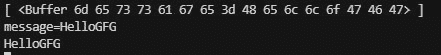

# node . js 中的组块是什么？

> 原文:[https://www.geeksforgeeks.org/what-is-chunk-in-node-js/](https://www.geeksforgeeks.org/what-is-chunk-in-node-js/)

数据是以流的形式从服务器到客户端对特定请求的传输。该流包含块。块是数据的一个片段，由客户端发送给服务器，所有的块概念相互关联，形成流的缓冲区，然后缓冲区被转换成有意义的完整数据。在本文中，我们将讨论如何将请求体中的块发送到服务器。请求对象用于处理数据块。

**语法:**

```js
request.on('eventName',callback)
```

**参数:**该函数接受以下两个参数:

*   **事件名称:**是触发的事件的名称
*   **回调:**是回调函数，即特定事件的事件处理程序。

**返回类型:**该方法的返回类型为空。

**示例:**用下面的代码创建一个 index.js 文件。

## index.js

```js
// Importing http libraries
const http = require('http');

// Creating a server
const server = http.createServer((req, res) => {
    const url = req.url;
    const method = req.method;

    if (url === '/') {
        // Sending the response
        res.write('<html>');
        res.write('<head><title>Enter Message</title><head>');
        res.write(`<body><form action="/message" method="POST">
    <input type="text" name="message"></input>
    <button type="submit">Send</button></form></body></html>`);
        res.write('</html>');
        return res.end();
    }

    // Handling different routes for different type request
    if (url === '/message' && method === 'POST') {
        const body = [];

        req.on('data', (chunk) => {

            // Storing the chunk data
            body.push(chunk);
            console.log(body)
        });

        req.on('end', () => {

            // Parsing the chunk data
            const parsedBody = Buffer.concat(body).toString();
            const message = parsedBody.split('=')[1];

            // Printing the data
            console.log(message);
        });

        res.statusCode = 302;
        res.setHeader('Location', '/');
        return res.end();
    }
});

// Starting the server
server.listen(3000);
```

使用以下命令运行 **index.js** 文件:

```js
node index.js
```

现在打开一个浏览器，转到 *http://localhost:3000，*你会看到如下输出。


**控制台输出:**

