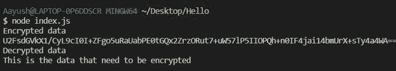

# node . js 中的加密模块是什么，如何使用？

> 原文:[https://www . geesforgeks . org/什么是节点中的加密模块-js-及其使用方法/](https://www.geeksforgeeks.org/what-is-crypto-module-in-node-js-and-how-it-is-used/)

Node.js 是一个开源的跨平台运行时环境，构建在 Chrome 的 V8 JavaScript 引擎上，用于在浏览器之外执行 JavaScript 代码。Node.js 支持大量第三方模块，帮助执行许多不同类型的任务。加密模块是帮助加密、解密或散列任何数据的第三方模块之一。我们希望从外部世界获得。该模块的主要功能是将纯文本或数据转换为不可读的加密格式(哈希、密文)。

crypto 和 bycrypto 两个第三方模块用于保护敏感数据。加密和加密模块之间的主要区别在于，与加密模块相比，加密模块执行强大的哈希运算。因此，如果我们想执行强大的散列，我们会更喜欢加密模块，否则使用加密模块。

**纯文本:**我们写的或者打出来的任何人类可以理解的东西都叫做纯文本。它可以包含任何字符(a-zA-Z0-9！,@,#….).我们的密码

**密文:** sdfasc1asT67W2sqWwsdfsadf 你能听懂这个词吗？这是一个密文，不可恢复和不可理解的文本，它是通过算法传递纯文本生成的。

**密码学中的机制:**

**哈希:**这是一种将纯文本转换为密文的机制。这是一个单向加密函数，即我们不能将密文转换为明文。它广泛用于身份验证系统，以避免在数据库中存储纯文本密码，但也用于验证文件、文档和其他类型的数据。消息摘要 5(MD5)、RSA、SHA 等是广泛使用的哈希算法。

**加密和解密:**加密算法接受输入和一个密钥，并生成一个看起来随机的输出，称为密文。这个操作是可逆的。解密与加密相反。该算法采用相同的密钥和密文，并返回原始纯文本。这在像 WhatsApp 等消息系统中被广泛使用。AES 等是广泛使用的加密和解密算法。

**node . js 中加密的特性**:

*   开始很容易
*   许多广泛使用的算法都有不同的版本
*   源代码更干净和一致。
*   它在任何地方都使用 JavaScript，所以你可以和 node.js 一起使用

**安装模块:**

```
npm install crypto-js --save
```

**项目结构:**


我们可以通过两种方式使用这个模块，要么用于散列，要么用于数据的加密和解密。有许多算法可用于哈希以及数据的加密和解密。

**使用加密模块散列数据:**

## index.js

```
// Importing module
var SHA256 = require("crypto-js/sha256");
 var plaindata = "GeeksForGeeks"
var hasheddata = SHA256(plainText).toString()
console.log(hasheddata)
```

使用以下命令运行 **index.js** 文件:

```
node index.js
```

**输出:**


**使用加密模块对数据进行加密和解密:**

我们将使用密钥对数据进行加密和解密。单个密钥可以用于数据的加密以及数据的解密过程。下面是使用单个密钥加密和解密数据的示例。

## index.js

```
// Importing the crypto module
const crypto=require("crypto-js")

var data = "This is the data that need to be encrypted"

var key = "password@111"

// Encrypte the data
var encrypted = crypto.AES.encrypt(data, key).toString();
console.log("Encrypted data")

// Printing the encrypted data
console.log(encrypted)
console.log("Decrypted data")

// Decrypting the data
var decrypted = crypto.AES.decrypt(encrypted, key)
    .toString(crypto.enc.Utf8)
console.log(decrypted)
```

使用以下命令运行 **index.js** 文件:

```
node index.js
```

**输出:**

