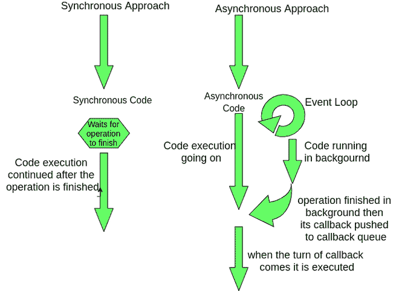
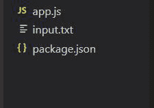
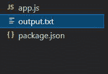

# node . js 中的文件系统模块是什么？

> 原文:[https://www . geesforgeks . org/什么是文件系统-节点中的模块-js/](https://www.geeksforgeeks.org/what-is-file-system-module-in-node-js/)

[Nodejs](https://www.geeksforgeeks.org/nodejs-tutorials/) 是一个开源的 javascript 运行时，在浏览器之外运行 javascript。它是后端开发的流行选择。像其他编程语言一样，Nodejs 也为我们提供了与系统或机器交互的内置库。在 Nodejs 中，我们称这些库为模块。

**模块基本分为 3 类:**

1.  节点核心模块
2.  本地模块
3.  第三方模块(如 npm 模块)。

**文件系统模块:**文件系统是节点用来与文件和文件夹交互的核心模块。它提供了各种事件和方法来访问和操作我们机器中的文件和文件夹。

**它为操作文件提供的一些操作有:**

*   创建和删除文件或文件夹。
*   访问和重命名文件或文件夹。
*   读取、写入和追加文件。
*   更改文件或文件夹的权限和所有者。

要在程序中使用文件系统模块，您需要 fs 节点核心模块:

**语法:**

```
const fs = require('fs')
```

**现在在使用 fs 模块之前，您需要了解使用 fs 模块方法有两种方法:-**

1.  使用同步方法
2.  使用异步方法

现在问题来了，我们应该选择同步方法还是异步方法。我们来讨论一下 fs 模块的同步方法和异步方法有什么区别。

**同步和异步方法:**

**同步方法**使用本质上是**阻塞的功能**。阻塞函数阻塞下一条指令或代码的执行，直到当前操作没有完成。**同步方法**等待**当前操作完成**，然后继续执行下一条指令。但是当当前操作花费大量时间时，这就产生了问题。

**示例:**假设我们的服务器在得到一个请求后需要创建一个文件，然后在里面写一些文字，然后回应该客户端。如果我们使用同步方法来创建和写入文件，那么对于每个即将到来的请求，我们将阻止执行，直到我们完成操作并响应该客户端。如果有很多请求聚集在一起，我们基本上会阻止其他用户，直到我们完成对第一个用户的访问。最后一个用户将不得不等待很长时间才能得到这个响应，这将是糟糕的。

**异步方法**本质上是非阻塞的，因为它们从不等待当前操作完成。在调用异步方法时，我们必须传递一个回调函数作为参数。当一个异步函数被调用时，它被 [**事件循环**](https://www.geeksforgeeks.org/node-js-event-loop/) 注册或推送到一个队列，并执行下一行代码。在后台，我们的异步函数被执行，当它完成时，我们作为参数传递的回调函数被推入回调队列，并在轮到它时被执行。

```
 Basically, the catch here is to understand that asynchronous methods do the operation in the background and do not block the 
 execution of code.
```



同步和异步代码执行

**文件系统为我们提供了同步以及** **异步版本的方法。**

**注意*****–***如果我们有选择的话，我们应该总是在代码中使用异步版本的方法。同步方法应该只在顶层代码中使用，因为顶层代码只执行一次，或者只在我们确信操作不会花费很长时间的情况下执行(轻量级操作)。

**文件操作:**

*   **读取文件–**读取文件最简单的方法就是使用 [**fs.readFile()**](https://www.geeksforgeeks.org/node-js-fs-readfile-method/) 方法。这个方法负责打开和关闭文件，并将文件内容加载到内存中，供我们在程序中使用。

**语法:**

```
fs.readFile(path,options,callback);
```

**参数:**

*   路径–我们要读取的文件的名称或路径
*   选项–这是一个可选参数，通常我们传递的编码是“ **utf-8** ”
*   回调–在我们读取文件后执行。它需要两个参数
    *   错误–如果出现任何错误
    *   数据–文件内容

**示例–**创建一个文件名 **app.js** 并创建一个文本文件 **input.txt**

**项目结构–**



## app.js

```
const fs = require("fs");
// Asynchronous version of readFile method
fs.readFile("input.txt", "utf-8", (error, data) => {

  // If the file doesnt exist then there 
  // is error then if condition will run
  if (error) {
    console.log("File not found");
  } else {

    // Data contains the content that we 
    // have read from file in case of 
    // error , data will output undefined
    console.log(data);
  }
});
```

使用以下命令运行 **app.js** :

```
node app.js
```

**输出:**

```
Hurrah, now you know how to read a file.
```

**示例 2:** 我们将使用同步版本，即[T3【fs . readfilesync()T5】。下面讨论的其他方法也有一个同步版本。要使用它，只需在函数名的末尾添加同步，并删除回调参数。](https://www.geeksforgeeks.org/node-js-fs-readfilesync-method/)

## java 描述语言

```
const fs = require("fs");

try {
  // If file not found then throws error
  //Reading file in asynchronous way
  const data = fs.readFileSync("input.txt", "utf-8");
  console.log(data);
} catch (error) {
  console.log(error);
}
```

**输出:**

```
Hurrah, now you know how to read a file synchronously.
```

*   **在文件中写入**–我们可以使用 [**fs.writeFile()**](https://www.geeksforgeeks.org/node-js-fs-writefile-method/#:~:text=The%20fs.,the%20functionality%20of%20the%20method.) 函数在文件中写入。该函数通过替换文件的现有内容将数据写入文件。此外，如果没有这样的文件，那么它会创建该文件并在其上写入数据。

**语法:**

```
fs.writeFile(path, data, options, callback)
```

**参数:**

*   **路径**–要写入的文件的名称或路径。
*   **数据**–要写入文件的内容
*   **选项**–可选，但我们通常指定编码–’**utf-8**。
*   **回调**–在我们写入文件后执行。
    *   错误–如果出现任何错误，

**示例**–创建一个空文本文件–**output . txt**以及 **app.js** 文件–

**项目结构:**



## app.js

```
const fs = require("fs");

const str = "Learning how to write to a file.";

fs.writeFile("output.txt", str, "utf-8", (error) => {

  // If there is error then this will execute
  if (error) {
    console.log(error);
  }
  else {
    console.log("Successfully written!!");
  }

  // Reading what we have written in file
  fs.readFile("output.txt", "utf-8", (error, data) => {
    if (error) {
      console.log(error);
    } 
    else {
      console.log(data);
    }
  });
});
```

使用命令运行 **app.js** 文件–

```
node app.js
```

**输出:**将创建一个名为 **output.txt** 的新文件，并在其上写入数据。但是文件已经存在，那么它的所有内容将被删除，并被我们写的数据所取代。

```
Successfully written!!
Learning how to write to a file.
```

*   **追加到文件中–**我们可以使用**[**fs . appendfile()**](https://www.geeksforgeeks.org/node-js-fs-appendfile-function/)将数据追加到文件中。与**不同，fs.writeFile()** 不会替换文件的内容，而是将数据添加到其中。如果找不到该文件，则创建该文件并将数据添加到其中。**

****语法:****

```
fs.appendFile(path, data, options, callback)
```

****参数–****

*   ****路径**–文件的名称或路径。**
*   ****数据**–要添加到文件中的内容。**
*   ****选项**–我们通常指定编码–’**utf-8****
*   ****回调**–在我们追加文件后执行

    *   错误–如果有错误** 

****示例–**创建一个文件 **app.js** 和一个空的 **output.txt** 文件–**

****项目结构:****

****

****output.txt:** 最初包含–**

```
Learning how to write to a file. (Previous content)
```

****app.js****

## **java 描述语言**

```
const fs = require("fs");

const data = "\nLearning how to append to a file. (New content)";
fs.appendFile("output.txt", data, "utf-8", (error) => {
  if (error) {
    console.log(error);
  } 
  else {
    console.log("Successfully written!!");
  }

  fs.readFile("output.txt", "utf-8", (error, data) => {
    if (error) {
      console.log(error);
    }
    else {
      console.log(data);
    }
  });
});
```

**使用以下命令运行 **app.js****

```
node app.js
```

****输出:**我们提供的数据将被追加到 **output.txt** 中，我们将得到以下输出–**

```
Successfully written!!
Learning how to write to a file. (Previous content)
Learning how to append to a file. (New content)
```

**fs 模块还有很多其他的方法用来对文件进行各种类型的操作–[fs . rename()](https://www.geeksforgeeks.org/node-js-fs-rename-method/)、 [fs.unlink()](https://www.geeksforgeeks.org/node-js-fs-unlink-method/) 、 [fs.open()、](https://www.geeksforgeeks.org/node-js-fs-open-method/)T6】fs . close()等。**

****让我们使用文件系统模块**创建一个离线裁判项目**

****一个离线判官的演示:**假设你有一个 JSON 文件**测试用例. json** 包含一个问题的所有输入测试用例及其输出。**

****项目结构–****

****

****测试用例****

```
{
  "problem": 121,
  "input": [
    [5, 3, 4, 2, 1],
    [8, 100, 47, 999, 504, 771, 21, 53, 45, 660, 9],
    [0, 0, 7, 1, 4, 7, 3, 5],
    [1],
    []
  ],
  "output": [3, 673, 19, 1, 10]
}
```

****问题陈述:**求奇数和偶数之和的差**

## **java 描述语言**

```
// Complete this function to find the 
// absolute difference of sum of even 
// and odd terms in arr
function diffOfOddEvenSum(arr) {

  // Write your code here
}
```

**现在，要创建一个离线法官，您需要创建一个 **app.js** 文件并编写代码–**

## **app.js**

```
const fs = require("fs");
const funct = require("./index");
function diffOfOddEvenSum(arr) {
  let odd = 0;
  let even = 0;

  arr.forEach((element) => {

    if (element % 2 == 1) {
      odd += element;
    } else even += element;
  });

  return odd - even;
}

// OFFLINE-JUDGE
// Since this is top level code we can
// use Synchronous version
// reading the data from json file
const jsonData = fs.readFileSync("test.json", "utf-8");

// The data we read from file is in json
// parsing the json to get the data
const testCases = JSON.parse(jsonData);

// Inputs is an array of input cases
const inputs = testCases.input;

// Exptected Output contains the correct
// output of the given problem number
const expectedOutput = testCases.output;

// To store the result of our input test cases
let result = "";

// Calling the diffOdOddEvenSum() function
// to get the output
inputs.forEach((input, index) => {
  const output = diffOfOddEvenSum(input);
  //  console.log(output)

  // Checking if the output is correct
  if (output == expectedOutput[index]) {
    result += `Test Case ${index + 1}- passed \n`;
  } else {
    result += `Test Case ${index + 1}- failed \n`;
  }
});

// We can use Synchronous version as it
// is top-level code
// writing the output to the file
fs.writeFileSync("result.txt", result, "utf-8");
```

**使用命令运行 **app.js****

```
node app.js
```

****输出**–在我们的 **result.txt** 文件中，我们有**

```
Test Case 1- passed 
Test Case 2- passed
Test Case 3- passed 
Test Case 4- passed 
Test Case 5- failed
```

**这样，我们可以简单地使用文件系统核心模块创建一个离线判断工具**