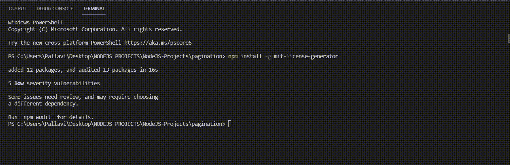
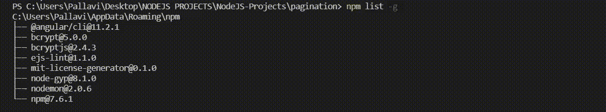

# 什么是 Node.js 中依赖项的全局安装？

> 原文:[https://www . geesforgeks . org/什么是节点中依赖项的全局安装-js/](https://www.geeksforgeeks.org/what-is-global-installation-of-dependencies-in-node-js/)

Node.js 中依赖项的全局安装是将全局包放在系统中的一个单独的位置，这完全取决于您的设置，而不管您在哪里运行命令**NPM install-g<package-name>**来安装依赖项。

*   安装本地依赖项意味着该模块仅适用于您在同一目录中安装的项目。
*   全局安装依赖项将模块放入您的节点。js 路径，它依赖于操作系统)，并且可以从任何项目访问，而不需要在进行设置时为每个项目单独安装它。
*   它们允许我们在本地计算机上的任何地方使用包装作为工具。

**先决条件:**

[**Node JS:**](https://www.geeksforgeeks.org/nodejs-tutorials/) Node.js 是一个开源的跨平台运行时环境，构建在 Chrome 的 V8 JavaScript 引擎之上，用于在浏览器之外执行 JavaScript 代码。你需要记住 NodeJS 不是一个框架，也不是一种编程语言。

[**React JS:**](https://www.geeksforgeeks.org/reactjs-tutorials/) React 是一个声明性的、高效的、灵活的 JavaScript 库，用于构建用户界面。是 MVC 中的‘V’。ReactJS 是一个开源的、基于组件的前端库，只负责应用程序的视图层。

**语法:**

```
run npm install -g <package-name>
```

其中 g 表示变量的全局模式。

**应用:**用于制作 Node 项目时，在系统中全局安装软件包。

**全局包在系统中的路径:**全局模块安装在标准系统中，位于系统目录/usr/local/lib/node_modules 项目目录的根位置。

命令打印系统上安装所有全局模块的位置。

```
npm root -g
```

**输出:**

```
C:\Users\Pallavi\AppData\Roaming\npm\node_modules
```

示例说明如何在系统中全局安装软件包。

将此命令写入控制台。

```
npm install -g mit-license-generator
```

**输出:**



**如何检查系统中全局安装了哪些包。**

```
npm list -g
```

**输出将是:**



**优势:**

*   全球安装时，我们不需要每次都安装一个模块。
*   因为只安装了一个副本，所以占用的内存更少。
*   我们可以。当包被全局安装时，js 脚本可以在任何地方运行，而无需在同一个目录中有 node_modules 文件夹。

**缺点:**

*   当我们在本地机器之外运行 Node 应用程序时，它会给出一个错误，因为它需要 package.json 中的包，即本地包。
*   不能使用 Node 应用程序中的 require()直接导入全局部署的包。