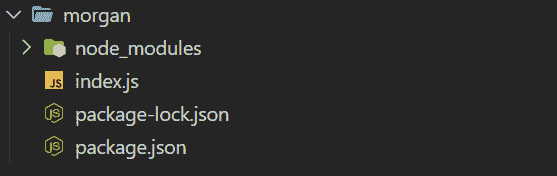
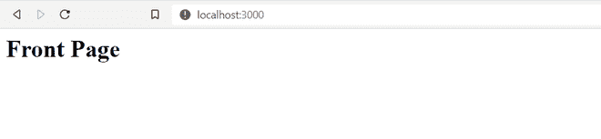
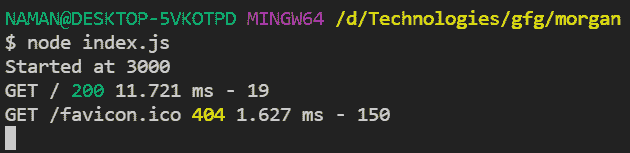
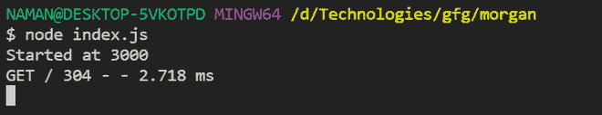

# node . js 中的 MORGAN 是什么？

> 原文:[https://www.geeksforgeeks.org/what-is-morgan-in-node-js/](https://www.geeksforgeeks.org/what-is-morgan-in-node-js/)

[Node.js](https://www.geeksforgeeks.org/introduction-to-nodejs/) 是一个开源的跨平台运行时环境，用于在浏览器之外执行 JavaScript 代码。它被广泛用于从小公司到大公司开发 API 和微服务。这是一个很好的工具，因为它使开发人员能够在服务器端和客户端使用 JavaScript。在本文中，我们将讨论 Nodejs 中的 MORGAN。

**Morgan:** Morgan 是一个 HTTP 请求级中间件。这是一个很好的工具，可以根据配置和使用的预设记录请求和一些其他信息。这证明在调试时非常有帮助，如果您想创建日志文件也是如此。

**先决条件:**对 [Nodejs](https://www.geeksforgeeks.org/introduction-to-nodejs/) 的基本了解。

**创建项目和模块安装:**

*   **步骤 1:** 使用以下命令为项目创建新文件夹:

    ```
    mkdir morgan
    ```

*   **步骤 2:** 使用以下命令导航到我们的文件夹:

    ```
    cd morgan
    ```

*   **步骤 3:** 使用以下命令和服务器文件初始化 npm:

    ```
    npm init -y
    touch index.js
    ```

*   **步骤 4:** 使用以下命令安装所需的软件包:

    ```
    npm i express morgan
    ```

**项目结构:**如下图:



**示例 1:** 在 morgan 中使用 dev 作为预设。

## java 描述语言

```
const express = require('express');
const logger = require('morgan');
const port = 3000;

const app = express();
app.use(logger('dev'));

app.get('/', (req, res) => {
  res.send('<h1>Front Page</h1>');
});

app.listen(port, () => {
  console.log(`Started at ${port}`);
});
```

**运行步骤:**使用以下命令运行应用程序。

```
node index.js
```

**输出:**要发送请求，我们使用浏览器，该请求将由我们的记录器摩根记录。



然后我们将在控制台中看到以下输出。



关于归属路由上的 get 请求的信息以状态代码 200 记录。

**解释:**基本上在上面的代码中，我们设置了 morgan，由于它是一个中间件，所以我们使用了。使用()方法告诉 express 在我们的应用程序中使用它作为中间件。除此之外，我们使用“dev”作为预设。其他一些可用的预设是组合的，常见的，简短的，微小的。每个预置返回不同的信息。

**示例 2:** 在本例中，tiny 被用作 morgan 内部的预设，而不是 dev。

## java 描述语言

```
const express = require('express');
const logger = require('morgan');
const port = 3000;

const app = express();
app.use(logger('tiny'));

app.get('/', (req, res) => {
  res.send('<h1>Front Page</h1>');
});

app.listen(port, () => {
  console.log(`Started at ${port}`);
});
```

**运行步骤:**使用以下命令运行应用程序。

```
node index.js
```

**输出:**要发送请求，我们使用浏览器，该请求将由我们的记录器摩根记录。


然后我们将在控制台中看到以下输出。



**解释:**在这个 304 代码中是有的，原因是因为它是一个简单的静态网页，所以浏览器缓存了它，并返回了它以前的实例，而不是发出新的请求。