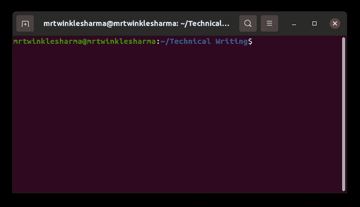

# node . js 中的 package.json 是什么？

> 原文:[https://www . geesforgeks . org/what-is-package-JSON-in-node-js/](https://www.geeksforgeeks.org/what-is-package-json-in-node-js/)

当我们讨论软件、应用、产品等时。我们经常看到所有者提供的描述，以便其他人能够理解该实体，即名称、型号、版本、所有者等。类似地， [NodeJS](https://www.geeksforgeeks.org/nodejs-tutorials/) 提供了一个 [package.json](https://www.geeksforgeeks.org/node-js-package-json/) 文件，该文件讲述了关于应用程序的信息。

**package.json:** 这个文档包含了整个节点应用的各种元数据，它由实际 json 格式的键值对组成。这个文件足以描述整个项目。下面列出了其中包含的细节，

*   **名称:**这是一个项目最重要的字段，**T3】它由包的名称组成。**
*   **版本:**这表示包的当前版本。该名称和版本唯一地标识了包。
*   **描述:**是一个字符串，每个包都有自己一定的功能，简单描述一下就好。
*   **关键字:**包含与包相关的某些关键字的字符串数组。
*   **首页:**是包的首页
*   **许可证:**用于指定许可证，主要用于告诉人们如何使用该包的限制。
*   **main:** 它由打包的入口点组成，就像一开始应该运行哪个文件。
*   **作者/贡献者:**这些是包的作者和贡献者的名字。
*   **存储库:**这包括存储包的存储库。
*   **脚本:**这些是一些对运行包有用的脚本。
*   **配置:**由一些关于包的配置组成。
*   **依赖项:**这些是成功使用包所必需的依赖项集。

**在项目中初始化 package . JSON:**

我们可以使用 npm 或纱线包管理器提供的命令来初始化这个包。

```js
npm init 
```

这将要求上面列出的几个配置，我们可以根据我们的包轻松地填充它们，我们也可以使用-y 标志初始化默认配置。

```js
npm init -y
```

注意:-我们也可以手动更改和创建 package.json，但这不是首选方式。

**示例:-** 这里我们将借助一个电子商务 NodeJS 应用程序的示例来说明这些概念。有了这个，你就可以对上面的讨论有一个清晰的了解了。在执行此操作之前，请确保您的系统上安装了 npm 或纱线卷装管理器。
**解释:-** 首先，我们已经开始用 npm init 初始化包，然后它会询问一些细节，比如根据目录名自动填充的名称、描述、我们的服务器将从哪个入口点启动、与包相关的关键词以及作者的姓名等。下面的 GIF 展示了所有这些过程是如何工作的，并创建了一个 package.json 文件。

