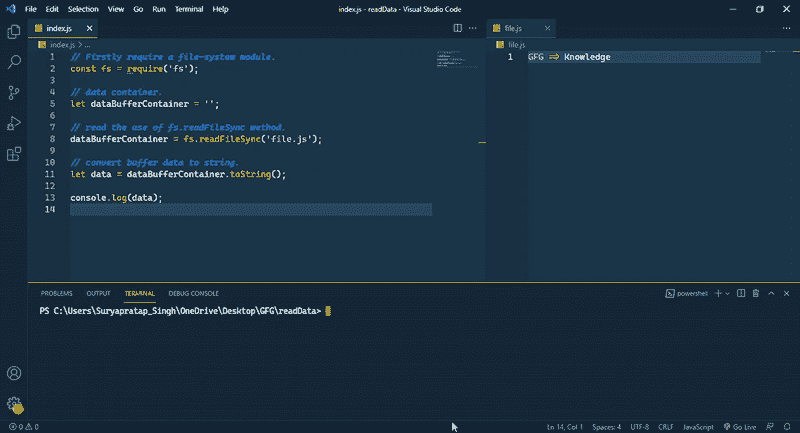

# node . js 中读取文件内容的机制是什么？

> 原文:[https://www . geesforgeks . org/什么是读取节点中文件内容的机制-js/](https://www.geeksforgeeks.org/what-is-the-mechanism-of-reading-the-content-of-a-file-in-node-js/)

在本文中，我们将讨论在 NodeJs 中读取文件的机制。

NodeJS 是最流行的 JavaScript 框架之一，它允许将 JavaScript 用作服务器端语言，并在 JavaScript 的帮助下管理服务器及其网络，还提供了一个用于处理文件的预构建模块。首先我们将了解 NodeJs 如何处理文件，然后我们将讨论如何读取文件的数据及其机制。如果把服务器看成一个服务器，那么处理文件是很常见的，我们在服务器上做的大部分工作都在文件里。处理文件非常容易，也非常方便。如果你寻找一个运行网站的网络服务，那么它一定是在某个地方用文件做的。我们可以非常容易地在 NodeJs 中处理文件 NodeJs 为我们提供了许多处理文件的方法 NodeJs 还具有一些内置模块，在这些模块的帮助下，我们可以处理文件。NodeJs 将文件视为具有内置函数的文档，这些函数用于存储和读取我们可以用来处理文件的必要信息。为开发目的使用文件是非常常见的，因为它使我们的工作更容易。在日常计算机使用中，用户可能希望在各种目录中读取和写入文件和数据，例如保存和下载文件或访问其他应用程序中使用的数据。同样，服务器程序或命令行界面“CLI”工具可能需要写入文件以保存下载的数据，或者数据密集型应用程序也可能需要导出为“JSON”或其他格式。有可能。这些程序需要与运行它们的操作系统的文件系统进行通信，以便服务器中的节点可以管理它。

如果你想了解更多关于 NodeJs 中文件系统的信息，请参考[这篇文章。](https://www.geeksforgeeks.org/node-js-file-system-complete-reference/)

**NodeJS 中读取文件的机制:**在 Node.js 中，可以借助内置的“fs”模块来处理文件，非常简单。这个模块包含了所有帮助你处理文件的功能，并且它可以在本地机器或服务器上处理这两种类型的文件。它为您提供了两种类型的工具，它们具有同步和异步工作的能力，您可以在任何 NodeJs 文件中使用它，为此，不需要任何外部包。

**方法:**必须使用文件系统，因此首先需要‘fs’模块，因此需要我们代码库中的‘fs’模块。“fs”模块的 read 方法返回缓冲区数据，这将需要一个变量来保存。缓冲区将数据存储在变量中。借助 toString()方法将缓冲区数据转换为正常字符串。最后使用 console.log()方法记录数据。

**下面是** **分步实施上述方法的:**

**步骤 1:** 首先，让我们在程序中要求一个文件系统模块，用于从文件中读取数据。

```
const fs = require('fs');
```

在要求“fs”模块移动到第二步后。

**第 2 步:**在这一步中，创建一个变量来包含文件的数据。

```
let dataBufferContainer= '';
```

**第三步:**制作完变量后，使用 readFileSync 或 readFile 方法将文件缓冲区数据存储到变量中。

```
dataBufferContainer = fs.readFileSync('file.js');
```

**步骤 4:** 使用 toString()方法将缓冲区值转换为正常字符串值。

```
let data = dataBufferContainer.toString();
```

**步骤 5:** 使用 console.log()方法记录数据。

```
console.log(data);
```

最后，您已经从文件中读取了数据。

下面是上述方法的实现:

## index.js

```
// Firstly require a file-system module.
const fs = require('fs');

// data container.
let dataBufferContainer = '';

// read the use of fs.readFileSync method.
dataBufferContainer = fs.readFileSync('file.js');

// convert buffer data to string.
let data = dataBufferContainer.toString();

console.log(data);
```

## file.js

```
GFG => Knowledge
```

**运行** **应用程序的步骤:**

```
node index.js
```

**输出:**

