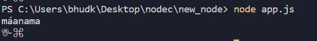

# node . js 中的 Punycode 是什么？

> 原文:[https://www . geesforgeks . org/什么是节点中的 punycode-in-js/](https://www.geeksforgeeks.org/what-is-the-punycode-in-node-js/)

Punycode 是一种特殊的编码语法，专门用于将 Unicode 字符(UTF-8)转换为 ASCII，它只不过是受限制的字符串字符集。

**为什么需要这种类型的具体转换？**主机名只能理解 ASCII 字符。国际域名(IDN)使用 Punycode 对浏览器中键入的网址进行编码/解码。
例如:如果你在浏览器中搜索**mañana.com**，你的内置 IDNA 服务的浏览器会在浏览器中嵌入的 Punycode 转换器的帮助下将其转换为**xn-maana-pta.com**。

现在让我们看看，如何在 Node.js 的帮助下使用 Punycode

**node . js 中的 Punycode:**Punycode 与 node.js v0.6.2 及更高版本捆绑在一起。如果您想使用 Punycode，您需要使用 npm 安装来安装 Punycode 模块。

**npm 安装:**

```js
 npm install punycode --save 
```

**包含 punycode 模块:**

```js
const punycode = require('punycode');
```

**punycode.decode(字符串):**用于将 ASCII 的 punycode 字符串转换为 Unicode 符号。

**示例:**

```js
// Include punycode module
const punycode = require('punycode');

// Decode Punycode strings of ASCII
// to Unicode symbols
console.log(punycode.decode('manama-pta'));
console.log(punycode.decode('--dqo34k'));
```

**输出:**


**punycode.encode(字符串):**用于将 Unicode 字符串转换为 ASCII 符号的 punycode 字符串。

**示例:**

```js
// Include punycode module
const punycode = require('punycode');

// Encode Unicode symbols to
// Punycode ASCII string 
console.log(punycode.encode('máanama'));
console.log(punycode.encode('?-?'));
```

**输出:**

```js
manama-pta
--dqo34k
```

**punycode.toUnicode(输入):**用于将代表域名或电子邮件地址的 punycode 字符串转换为 Unicode 符号。在已经转换的 Unicode 上调用它并不重要。

**示例:**

```js
// Include punycode module
const punycode = require('punycode');

console.log(punycode.toUnicode('xn--maana-pta.com'));
console.log(punycode.toUnicode('xn----dqo34k.com'));
```

**输出:**


**punycode . toasii(输入):**用于将表示域名或电子邮件地址的小写 Unicode 字符串转换为 Punycode 符号。你用一个已经在 ASCII 中的域来调用它并不重要。

**示例:**

```js
// Include punycode module
const punycode = require('punycode');

console.log(punycode.toASCII('mañana.com'));
console.log(punycode.toASCII('?-?.com'));
```

**输出:**

```js
xn--maana-pta.com
xn----dqo34k.com
```

**punycode.ucs2.decode(字符串):**为字符串中的每个 Unicode 代码符号创建一个数字代码点值数组。在内部基于 Javascript 构建的浏览器的幕后，其中的 UCS-2 函数将把一对**代理半部分**转换成一个**单一编码点**。

**示例:**

```js
// Include punycode module
const punycode = require('punycode');

// Decoding strings 
console.log(punycode.ucs2.decode('abc'));
console.log(punycode.ucs2.decode('\uD834\uDF06'));
```

**输出:**

```js
[ 97, 98, 99 ]
[ 119558 ]
```

**UCS-2:** UCS-2 是一个 2 字节通用字符集，通过使用 16 位代码单元产生固定长度的格式。代码点的范围从 0 到 0xFFFF。

**代理对:**BMP 之外的字符，例如 U+1d 306 TETRAGRAM FOR center:，只能使用两个 16 位代码单元进行编码。这被称为“代理对”。代理项对仅代表一个字符。

**punycode . UCS 2 . encode(code points):**用于基于数字代码点值数组创建字符串。

**示例:**

```js
// Include punycode module
const punycode = require('punycode');

console.log(punycode.ucs2.encode([0x61, 0x62, 0x63]));
console.log(punycode.ucs2.encode([0x1D306]));
```

**输出:**

```
abc
𝌆
```

可以看到
[Punycode 转换器](https://www.punycoder.com/)查看直播结果。