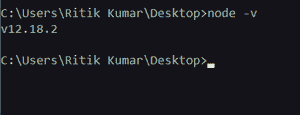
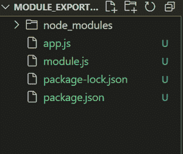
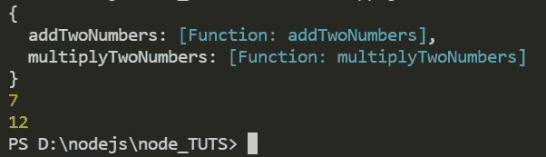

# node . js 中 module.exports 的用途是什么？

> 原文:[https://www . geesforgeks . org/什么是节点中模块导出的目的-js/](https://www.geeksforgeeks.org/what-is-the-purpose-of-module-exports-in-node-js/)

module.exports 实际上是 node.js. module 中模块对象的一个属性。Exports 是返回到 require()调用的对象。通过 module.exports，我们可以从一个文件中导出函数、对象及其引用，并且可以通过 require()方法导入它们来在其他文件中使用它们。

**目的:**

1.  module.exports 的主要目的是实现**模块化编程**。模块化编程是指将程序的功能分成独立的、可互换的模块，这样每个模块都包含只执行所需功能的一个方面所需的一切。由于不使用 module.exports，没有模块化/可重用的代码就很难编写大型程序。
2.  使用 module.exports，我们可以将业务逻辑与其他模块分开。换句话说，我们可以用它来实现**抽象**。
3.  通过使用，在不同的模块中**维护和管理**代码库变得很容易。
4.  **强制分离关注点**。将我们的代码分割成多个文件可以让我们为每个文件都有合适的文件名。通过这种方式，我们可以很容易地识别每个模块做什么以及在哪里找到它(假设我们创建了一个逻辑目录结构，这仍然是您的责任。

**示例:**如何在 node.js 中使用 module.exports，从下面的示例开始，需要在 pc 上安装 node.js。

要验证，请在终端中键入以下命令。它将显示节点的安装版本。你电脑上的 Js。

```js
node -v 
```



**步骤 1:** 创建一个单独的文件夹，然后通过终端或命令提示符导航到该文件夹。

**步骤 2:** 在终端或命令提示符下运行 **npm init -y** 命令，创建 package.json 文件

**步骤 3:** 现在在项目结构的根处创建两个文件，分别名为 **module.js** 和 **app.js** 。

**项目结构:**会是这样的:



**第 4 步:**在**模块. js** 文件中添加以下代码

## java 描述语言

```js
// Module.js file
function addTwoNumbers(a, b) {
  return a + b;
}

function multiplyTwoNumbers(a, b) {
  return a * b;
}

var exportedObject = { addTwoNumbers, multiplyTwoNumbers };

// module.exports can be used to export
// single function but we are exporting
// object having two functions
module.exports = exportedObject;
```

**第五步:**在 **app.js** 文件中添加以下代码

## java 描述语言

```js
// app.js file
const obj = require("./module");

// Getting object exported from module.js
console.log(obj);

// Printing object exported from
// module.js that contains
// references of two functions
const add = obj.addTwoNumbers;

// Reference to addTwoNumbers() function
console.log(add(3, 4));
const multiply = obj.multiplyTwoNumbers;

// Reference to multiplyTwoNumbers() function
console.log(multiply(3, 4));
```

**运行应用程序的步骤:**在项目根路径(例如:module_exports_tut)文件夹内的终端中运行以下命令。

```js
   node app.js
```

**输出:**



有关模块出口的更多信息，请访问[https://www.geeksforgeeks.org/node-js-export-module/](https://www.geeksforgeeks.org/node-js-export-module/)