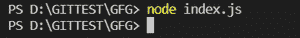
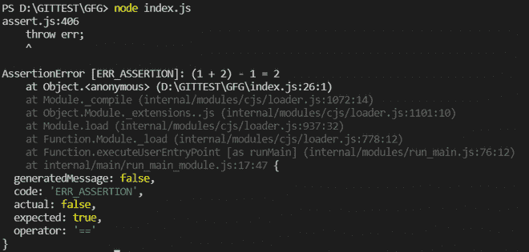

# 断言在 Node.js 中的作用是什么？

> 原文:[https://www . geesforgeks . org/什么是节点中断言的角色-js/](https://www.geeksforgeeks.org/what-is-the-role-of-assert-in-node-js/)

**断言**是一个 Node.js 模块，它为编写测试提供便利，并且在测试过程中不会在终端上提供任何输出，直到测试过程中出现任何断言错误。它提供了各种集合断言函数，可以用来验证常数。Assert 模块主要用于内部使用，我们可以在应用程序中使用它。

**Assert 在 Node.js 中的作用:**Assert 模块的作用是提供测试表达式的功能。在测试任何表达式的计算结果是否为 0 (false)时，会出现断言失败，程序将被终止。

**使用 Assert 模块的优势:**

*   这有助于最大限度地减少调试代码的时间。
*   如果开发时考虑到这一点，它可以在多个项目中重用。
*   它改进了错误检测。
*   它提供了更好的设计监控，并有助于更容易地调试测试失败。
*   它既可用于动态模拟，也可用于设计的形式验证。

**导入模块:**

```
var assert = require("assert");
```

**示例 1:** 下面的示例代码将不提供任何输出，因为断言情况为真。

## index.js

```
// Importing  assert module
var assert = require('assert');  

function expression (a, b, c) {  
  return (a + b) - c;  
} 
// Calling the function
var output = expression (1,2,1);  
assert( output === 2, '(1 + 2) - 1 = 2');
```

使用以下命令运行 **index.js** 文件:

```
node index.js
```

**输出**



**示例 2:** 由于断言条件为假，下面的示例代码将显示一个 AssertionError。

## index.js

```
// Importing the assert module
var assert = require('assert');  

function expression (a, b, c) {  
  return (a + b) - c;  
} 
// Calling the function
var output = expression (1,2,1);  
assert( output === 3, '(1 + 2) - 1 = 2');
```

使用以下命令运行 **index.js** 文件:

```
node index.js
```

**输出**

