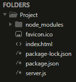

# 来自 Node.js 服务器的 serve favicon 有什么用？

> 原文:[https://www . geeksforgeeks . org/什么是服务使用-fav icon-from-node-js-server/](https://www.geeksforgeeks.org/what-is-the-use-of-serve-favicon-from-node-js-server/)

浏览器第一次加载网站时，会自动请求 **/favicon.ico** ( *GET* )加载 favicon。favicon 是一个小文件，称为网站图标、标签图标、网址图标或书签图标。[服务图标](https://www.npmjs.com/package/serve-favicon)模块用于从 NodeJS 服务器服务图标。

**为什么要使用这个模块？**

*   用户代理经常不加选择地请求 favicon。在记录器中间件之前使用这个中间件，从日志中排除这些请求。
*   favicon.ico 是一个小文件，这个模块将 favicon 缓存在内存中，通过跳过 dick 访问来提供更好的性能。
*   该模块为图标提供了一个 ETag。
*   该模块为图标提供兼容的内容类型。

**项目设置和模块安装:**

*   **步骤 1:** 创建一个 NodeJS 应用程序，并使用以下命令将其命名为*项目*。

    ```
    mkdir Project && cd Project
    npm init -y
    ```

*   **步骤 2:** 使用以下命令安装依赖模块。

    ```
    npm install express serve-favicon
    ```

*   **第三步:**从[这里](https://favicon.io/)生成一个 favicon 或者下载 [GFG favicon](https://media.geeksforgeeks.org/wp-content/cdn-uploads/gfg_favicon.png) 放到你的根目录下。然后在你的*项目*目录中创建*index.html*和*服务器. js* 。

**项目目录:**会是这样的。



项目目录

**示例:**

## index.html

```
<!DOCTYPE html>
<html>

<head>
    <title>GeeksForGeeks</title>
</head>

<body>
    <h1 style="color: green;">
        GeeksForGeeks
    </h1>
</body>

</html>
```

## server.js

```
// Import modules
const favicon = require('serve-favicon');
const express = require('express')
const app = express()

// Returns a middleware to serve favicon
app.use(favicon(__dirname + '/favicon.ico'));

// API endpoint to serve index 
app.get('/', (_, res)=> res.sendFile(__dirname + '/index.html'))

// Start the server
app.listen(8080);
```

**运行应用程序的步骤:**使用以下命令运行*服务器*

```
node server.js
```

**输出:**打开浏览器转到***http://localhost:8080/***，我们会在屏幕上看到如下输出。


**注意:**记住，**发球-favicon** 只是发球*默认，隐含 favicon* ，也就是**GET*****/fav icon . ico**。*对于需要 HTML 标记的供应商特定图标，使用[服务静态](https://www.npmjs.com/package/serve-static)。