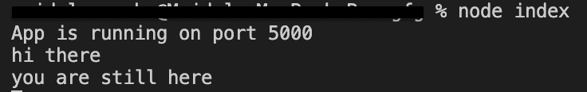
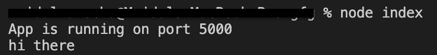

# node . js 中何时使用 next()并返回 next()？

> 原文:[https://www . geesforgeks . org/何时使用下一个节点并返回下一个节点-js/](https://www.geeksforgeeks.org/when-to-use-next-and-return-next-in-node-js/)

在本文中，我们将看到何时在 NodeJS 中使用 **next()** 和 **return next()** 。

**特征:**

*   next() **:** 所有中间件功能完成后将运行或执行代码**。**
*   return next() **:** 通过使用 return next，它将立即跳出回调，并且 return next()下面的代码将不可访问。

**语法:**

```
next()
```

```
return next()
```

```
app.use((req, res, next) => {
//next() or return next()
});
```

在函数 **app.use((req，res，next)中，**我们有三个回调，即**请求、**T4】响应和**下一个**。

所以，如果你想使用 next()，那么只需写 **next()** 如果你想使用 return next，那么只需写 **return next()。**

让我们通过一个例子来理解这两者。

**使用 next():** 如果您有任何中间件功能并且在 **next()** 下面您有一些行或函数想要执行，那么通过使用 **next()** 您可以实际执行这些行或函数，因为它在所有中间件功能完成后运行 **next()** 下面的代码。

**使用 return next():** 如果你有任何中间件功能并且在 **return next()** 下面有一些你想要执行的行，那么在 **return next()** 下面的行将不会被执行，因为它会立即跳出回调，回调中 **return next()** 下面的代码将无法访问。

**示例:**设置环境

```
npm init -y
```

```
npm install express
```

## java 描述语言

```
import express from "express"

const app = express()
// API for the testing of next() 
app.get(
  '/next', function (req,res,next) { 
    console.log('hi there ');
    next();
    console.log('you are still here');
  }
)

// API for the testing of return next() 
app.get(
  '/return-next', function (req,res,next) { 
    console.log('hi there');
    return next(); 
    console.log('you are still here');
  }
)

app.listen(5000,()=> {
  console.log("App is running on port 5000")
})
```

**输出:**

1.  **next():** Hit *‘http://localhost:5000/next’* in your browser.
    

    这里**下一个()**下面的行执行成功，输出中显示“*你还在这里*”。

2.  **return next():** Hit *‘http://localhost:5000/return-next’* in your browser.
    

    这里不执行**返回 next()** 下面的行，输出中不显示“*你还在这里*”。