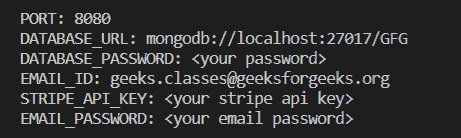

# node . js 应用的密钥应该存储在哪里？

> 原文:[https://www . geesforgeks . org/应为节点存储密钥的位置-js-app/](https://www.geeksforgeeks.org/where-should-secret-keys-should-be-stored-for-a-node-js-app/)

保护敏感数据/凭据(如第三方应用编程接口凭据、会话密钥、数据库连接凭据、安全令牌、加密/解密密钥)非常重要，因为公开这些凭据可能会导致您的帐户受到威胁，从而导致您的帐户产生意外费用。将秘密值放在源代码中(通过硬编码)，或者提交凭证(暴露)您的私钥、密码或其他敏感细节到版本控制中，都可能是灾难性的。用 Node.js 处理配置键或像 API 键这样的凭证的最好方法是使用**环境变量**。

**环境变量:**环境变量能够从应用程序外部配置代码中的值。环境变量是动态名称/值对，可以创建任意数量的环境变量。环境变量存在于应用程序之外，并且驻留在部署应用程序的操作系统或应用程序容器中。在实际部署到生产环境之前，大多数应用程序首先部署在开发环境中。因此，我们必须确保每个环境都已正确配置。环境变量能够为不同的环境提供不同的配置选项。

**环境变量的一些常见示例有:**

1.  数据库连接信息
2.  应用编程接口端点
3.  第三方应用编程接口密钥和秘密
4.  电子邮件 ID 和密码
5.  HTTP 端口/地址

**设置环境变量:**

设置环境变量的语法如下，其中 *ENV_VARIABLE_NAME* 是我们的环境变量的名称， *VALUE* 是该特定变量的值。

```
ENV_VARIABLE_NAME=VALUE
```

Node.js 提供**进程**对象，该对象是提供当前 Node.js 进程的信息和控制的全局对象。作为一个全局变量，它始终对 Node.js 应用程序可用，而无需使用 require()。流程对象有一个属性**。env** 哪个属性返回包含用户环境的对象。

**读取环境变量:**

从 ***读取环境变量。env 文件*** ，我们需要一些解析器来使它工作。解析器逐个读取变量，并将它们解析到环境中。有一个 npm 包叫做[](https://www.npmjs.com/package/dotenv)**是一个零依赖模块，从 ***加载环境变量。env 文件*** 变成 *process.env* 对象。**

****模块安装:**要安装此软件包，请在终端中键入以下命令:**

```
npm install dotenv
```

****要求模块:**要求应用中的 **dotenv** 包使用以下代码:**

```
require('dotenv').config();
```

**现在，我们可以使用**process . ENV【ENV _ VARIABLE _ NAME】**访问任何环境变量。**

****示例:**假设我们正在开发一个电子商务 Node.js 应用程序，其中我们有以下环境变量，如服务器端口号、数据库连接 URL &密码、条带 API 密钥、电子邮件 ID 和密码、会话密钥等。**

****步骤 1:** 创建一个名为**的文件。env'** 在项目的根文件夹中，它将存储我们所有的环境变量。例如，我们的文件如下所示:**

****TEST.env****

```
PORT=8080
DATABASE_URL=mongodb://localhost:27017/GFG
DATABASE_PASSWORD=<your password>
STRIPE_API_KEY=<your stripe api key>
EMAIL_ID=geeks.classes@geeksforgeeks.org
EMAIL_PASSWORD=<your email password>
```

****步骤 2:** 创建一个 *index.js* 文件，我们将在其中访问我们定义的环境变量。**

## **index.js**

```
require('dotenv').config({ path: './TEST.env' })

console.log("PORT:", process.env.PORT);
console.log("DATABASE_URL:", process.env.DATABASE_URL);
console.log("DATABASE_PASSWORD:", process.env.DATABASE_PASSWORD);
console.log("EMAIL_ID:", process.env.EMAIL_ID);
console.log("STRIPE_API_KEY:", process.env.STRIPE_API_KEY);
console.log("EMAIL_PASSWORD:", process.env.EMAIL_PASSWORD);
```

****步骤 3:** 使用以下命令运行**索引. js** 文件:**

```
node index.js
```

****输出:****

****

****注:**始终加 ***。env 文件**T5 至*T7。gitignore* 来避免它提交给版本控制系统。如果你曾经犯过 ***。env 文件*** 误操作，然后尽快生成新的 API 密钥并更改密码，避免造成任何灾难性的影响，并将其从版本控制系统的跟踪中移除。***