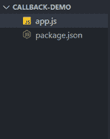
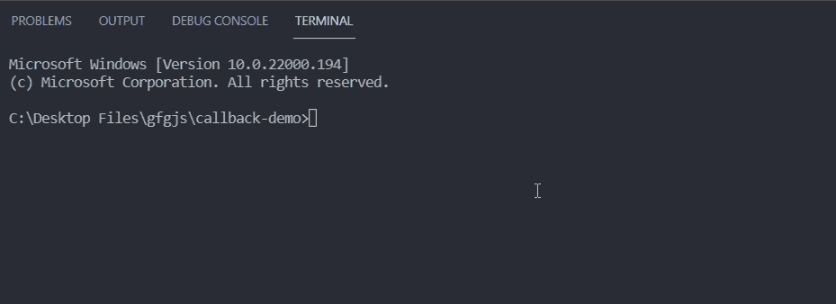

# 通常传递给 Node.js 回调处理程序的第一个参数是什么？

> 原文:[https://www . geesforgeks . org/哪个是第一个参数-通常传递给节点-js-回调-处理程序/](https://www.geeksforgeeks.org/which-is-first-argument-typically-passed-to-a-node-js-callback-handler/)

Node.js 中的[回调](https://www.geeksforgeeks.org/javascript-callbacks/)处理函数是一种在特定操作完成后处理某件事情的方法。这是处理异步代码的方法之一，异步代码需要很长时间才能产生结果，因此我们可以调用带有错误(如果有的话)和异步操作结果的回调处理程序。

回调处理函数遵循错误优先的约定，即:

*   回调处理程序的第一个参数应该是错误，第二个参数可以是操作的结果。
*   在调用回调函数时，如果有错误，我们可以像**回调(err)** 一样调用它，否则我们可以像**回调(null，result)** 一样调用它。

**语法:**

```
const func = (arg1, agr2, ..., argN, callback) => {
    // code logic
}

func(a, b, ..., n, (err, result) => {
    // code logic
})
```

**项目设置**

**第一步:** [如果你还没有安装 Node.js](https://www.geeksforgeeks.org/installation-of-node-js-on-windows/) 。

**第二步:**为你的项目创建一个文件夹，并将 [**cd**](https://www.geeksforgeeks.org/cd-command-in-linux-with-examples/) (更改目录)放入其中。在该文件夹中创建一个名为 app.js 的新文件。现在，使用以下命令用默认配置初始化一个新的 Node.js 项目。

```
npm init -y
```

**项目结构:**按照步骤操作后，您的项目结构将如下所示。



**示例:**在下面提到的代码示例中，我们创建了一个执行除法运算的函数。为了模拟异步操作，我们使用了 setTimeout()方法，该方法在一秒钟后调用回调处理程序。当除数为零时，调用回调处理程序时，错误实例是唯一的参数，否则调用回调时，第一个参数为 null，第二个参数为除法结果。

## app.js

```
const divide = (a, b, callback) => {
  setTimeout(() => {
    if (b === 0) {
      callback(new Error('Division by zero error'));
    } else {
      callback(null, a / b);
    }
  }, 1000);
};

// Our callback handler expects error
// as first argument and the result 
// of division as second argument.
divide(5, 2, (err, result) => {
  // We check if the error exists then we
  // print the error message and return
  if (err) {
    return console.log(err.message);
  }

  // We print the result if there is no error
  console.log(`The result of division is ${result}`);
});

// In this cases our callback handler
// will be called with an error Instance
// as the divisor is zero
divide(5, 0, (err, result) => {
  if (err) {
    return console.log(err.message);
  }

  console.log(`The result of division is ${result}`);
});
```

**运行应用程序的步骤:**您可以在命令行上使用以下命令执行您的 app.js 文件。

```
node app.js
```

**输出:**

