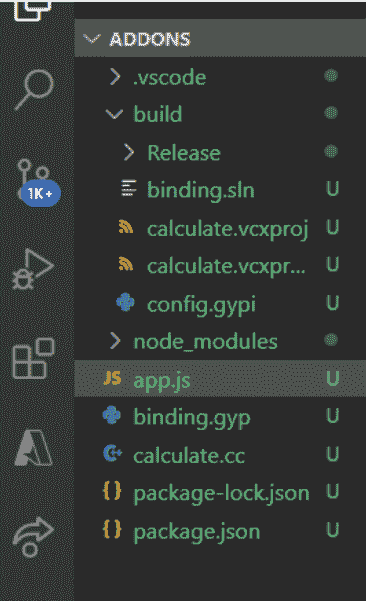

# 为什么 Node.js 中需要 C++插件？

> 原文:[https://www . geesforgeks . org/why-do-we-need-c-addons-in-node-js/](https://www.geeksforgeeks.org/why-do-we-need-c-addons-in-node-js/)

在本文中，我们将看到为什么我们需要 NodeJS 中的 C++插件。

*   Node.js 插件是动态链接的共享对象，用 C++编写。
*   它可以使用 require()函数加载到 Node.js 中，也可以像普通的 Node.js 模块一样使用。
*   它主要用于在 Node.js 中运行的 JavaScript 和 C/C++库之间提供接口。

**为什么我们需要 C++插件？**

*   它提供了进行密集、并行和高精度计算的机会。
*   它还提供了在 NodeJS 中使用 C++库的机会。
*   我们可以集成一个用 C/C++编写的第三方库，直接在 NodeJS 中使用。
*   C++的性能在更大的值或计算上要好得多。

**先决条件:**

*   节点的基本知识。
*   已安装 Node.js(版本 12+)。
*   已安装 Npm(版本 6+)。

**模块安装:**使用以下命令安装所需的模块。

```js
npm i -g  node-gyp
```

**文件夹结构:**会是这样的。



现在用下面的代码创建 binding.gyp、calculate.cc 文件。

**文件名:binding.gyp**

```js
{
  "targets": [
      {
          "target_name": "calculate", // Name of C++ Addons.
          "sources": [ "calculate.cc" ] // Source of C++ file.
      }
  ]
}
```

## calculate.cc

```js
#include <node.h>
#include <iostream>

namespace calculate {
     using v8:: FunctionCallbackInfo;
     using v8 :: Isolate;
     using v8 :: Local;
     using v8 :: Object;
     using v8 :: Number;
     using v8 :: Value;

     // C++ add function.
     void Sum(const FunctionCallbackInfo<Value>&args)
     {
         Isolate* isolate = args.GetIsolate();
         int i;
         double x = 3.141526, y = 2.718;
         for(i=0; i<1000000000; i++)
         {
             x += y;
         }

         auto total = Number::New(isolate,x);
         args.GetReturnValue().Set(total);
     }

     // Exports our method
     void Initialize(Local<Object> exports) {
         NODE_SET_METHOD(exports, "calc", Sum);
     }

     NODE_MODULE(NODE_GYP_ODULE_NAME,Initialize);
 }
```

## app.js

```js
// Require addons
const calculate = require('./build/Release/calculate');

// Javascript add function.
function calc() {

    // Two variables.
    let i, x = 3.141526, y = 2.718;
    for (i = 0; i < 1000000000; i++) {
        x += y;

    }
    let total = x;
    return total;
}

console.time('c++');
calculate.calc();
console.timeEnd('c++');

console.time('js');
calc();

console.timeEnd('js');
```

**运行应用程序的步骤:**要构建和配置，请运行以下命令。

```js
node-gyp configure build 
node app.js
```

**输出:**

```js
c++: 1.184s
js: 1.207s
```