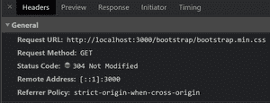

# 为什么 Node.js 没有看到 node_modules 文件夹中的文件？

> 原文:[https://www . geesforgeks . org/why-node-js-nots-see-file-in-node _ modules-folder/](https://www.geeksforgeeks.org/why-node-js-doesnt-see-files-in-node_modules-folder/)

有时候开发人员希望从 *node_modules 服务一些静态资产。* 通常情况下，我们不想把你的任何内部路径暴露给外界。如果你的文件在 ***node_modules*** 目录中，那么你可以在你的服务器中建立一个静态路由，从你指定的任何目录中获取它的文件。

**express.static()** 函数用于服务一个目录中的静态文件，使用 express 中的 express.static()内置中间件功能。

**语法:**

```
express.static(root, [options])
```

**参数:**该函数接受以下两个参数:

*   **根目录:**root 参数指定了您想要为静态文件提供服务的目录。
*   **选项:**是可选参数，包含 etag、dotfiles 等属性。

例如，如果您想从文件夹名称**公共**服务静态资产，那么使用下面的代码。

```
app.use(express.static('public'))
```

现在，你的应用可以在所有的网址上提供静态资源。

```
http://localhost:3000/images/kitten.jpg
http://localhost:3000/css/style.css
```

**示例:**从**节点 _ 模块**目录提供引导 CSS 文件。

**第一步:**首先，创建一个 NodeJS 应用程序，安装需要的模块，如 **Express.js** 和 **bootstrap** 。

```
mkdir Project 
cd Project
npm init -y
npm i express bootstrap
```

**第二步:**创建一个 ***index.js*** 文件，这是我们的基本服务器，代码如下。

**index.js**

## java 描述语言

```
const express = require('express');
const path = require('path');    

const app = express();
const PORT = 3000;

// Static route
// Serve bootstrap CSS file 
app.use('/bootstrap', 
    express.static(path.join(__dirname, 
      'node_modules/bootstrap/dist/css')));

// GET Request
app.get('/', (req,res)=>{
    res.sendFile(path.join(__dirname, 'index.html'));
})

// Start the server
app.listen(PORT, err =>{
    err ? 
    console.log("Error in server setup") :
    console.log("Server listening on Port", PORT)
});
```

**第三步:**在你的根目录下创建一个***【index.html】***文件，代码如下。

**index.html**

## 超文本标记语言

```
<!DOCTYPE html>
<html>

<head>
    <title></title>
    <link rel="stylesheet" 
      href="/bootstrap/bootstrap.min.css"> 
</head>

<body>
    <h1 class="text-success">GeeksforGeeks</h1> 
</body>

</html>
```

**说明:**样式表的 URL 是**/bootstrap/bootstrap . min . CSS**，其中 **/bootstrap** 是虚拟前缀。所以当服务器收到来自这个网址的请求时，服务器会在你指定的静态路径**node _ modules/bootstrap/dist/CSS**上查找指定的文件，并发送给客户端。



**步骤 4:** 使用以下命令运行服务器:

```
node index.js
```

**输出:**你会在终端屏幕上看到如下输出。

```
Server listening on Port 3000
```

现在打开任意浏览器，转到 **http://localhost:3000/** ，会看到如下输出。

